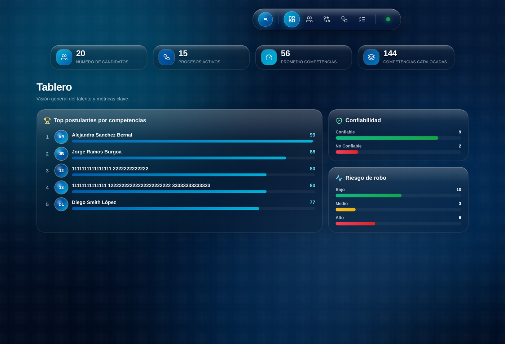

# BDP · Dashboard de Evaluación de Talento — "Liquid Glass"

Dashboard de Recursos Humanos para la evaluación de talento, con una estética
ultra-premium inspirada en iOS (**Advanced Liquid Glassmorphism**), animaciones
físicas (spring) aceleradas por hardware y una integración resiliente con un
backend de Google Apps Script. **Toda la interfaz está en español.**



## ✨ Características

- **Tema dual claro/oscuro** ("Daylight" / "Midnight") conmutable desde el dock
  y persistente, con todo el sistema de diseño impulsado por *CSS custom
  properties* (sin parpadeo gracias a un script anti-FOUC).
- **Efectos reactivos al cursor**: un foco de luz global sigue el puntero por
  toda la página y las tarjetas tienen un *glow* que persigue al cursor.
- **Liquid Glass** real: volumen, reflejos especulares y refracción fluida sobre
  un fondo *mesh gradient* animado (en ambos temas).
- **Floating Dock** estilo iOS con píldora activa de física de resorte, switch de
  tema y punto de estado de sincronización.
- **Módulo — Registro de Postulantes:** "Cuestionario" completo en un modal
  protegido con datos personales, **velocímetros analógicos** (arrastre o
  ingreso manual 0–100 %), arquetipo **DISC**, constructores A1/A2/A3
  (conocimientos, herramientas y competencias), escalas de confiabilidad y
  observaciones por etiquetas. Incluye **autoguardado local**, **recuperación de
  borrador** ante caídas y **confirmación de salida**.
- **Módulo — Comparador:** búsqueda *type-ahead* en vivo (nombre + identificador)
  para añadir columnas, encabezados congelados que no tiemblan y colapsan en una
  barra compacta sólo cuando el encabezado grande sale de pantalla, y un informe
  comparativo seccionado (Resultados, Competencias, Conocimientos, Herramientas,
  Integridad y Observaciones).
- **Impresión institucional** a Carta / Oficio en todos los módulos, con
  banderola de reporte y aplanado de vidrio para máxima legibilidad.
- Módulos adicionales: **Tablero**, **Cara a Cara** (1 vs 1) y **Procesos**.

## 🧱 Stack

- [React 18](https://react.dev/) + [TypeScript](https://www.typescriptlang.org/) (estricto)
- [Vite 5](https://vite.dev/)
- [Tailwind CSS 3](https://tailwindcss.com/) (valores arbitrarios + utilidades `glass`)
- [Framer Motion](https://www.framer.com/motion/) para transiciones con física
- [lucide-react](https://lucide.dev/) para iconos

## 🚀 Desarrollo

```bash
npm install
npm run dev        # servidor de desarrollo
npm run build      # typecheck + build de producción
npm run preview    # previsualizar el build
```

## 🔌 Backend

El dashboard consume un único endpoint de Google Apps Script (definido en
`src/constants.ts`):

```
GET  →  { candidatos: [...], competencias: [...] }
```

> [!IMPORTANT]
> **Regla de producción (Vercel):** toda llamada `fetch()` a este endpoint debe
> incluir `{ redirect: "follow" }`. Google responde con un `302` y, sin seguir el
> redirect, la app falla con `404` en producción. Ver `useTalentData`.

El hook global `useTalentData` (Context API) obtiene, normaliza y distribuye los
datos, gestionando estados de carga y error con reintentos de *backoff*.

## 🎨 Sistema de diseño

La paleta corporativa se construye con `#004a8f` (azul profundo), `#005baa`
(azul núcleo) y `#00b0d8` (cian). La utilidad base de Liquid Glass vive en
`src/index.css` como las clases `.glass` y `.glass-heavy`.

## 📁 Estructura

```
src/
├── components/      # Dock, KPIs, chips, tarjetas, modal, diálogos, formulario
│   └── form/        # Campos, velocímetro (GaugeInput), tags, list builders
├── context/         # useTalentData + useTheme (Context API)
├── hooks/           # usePointerGlow, useFormDraft (autosave/recuperación)
├── lib/             # cálculos, normalización, niveles e impresión
├── modules/         # Tablero, Cara a Cara, Comparador, Procesos, Postulantes
├── App.tsx          # layout + enrutado de módulos
└── index.css        # sistema de diseño Liquid Glass (dual-theme + print)
```
