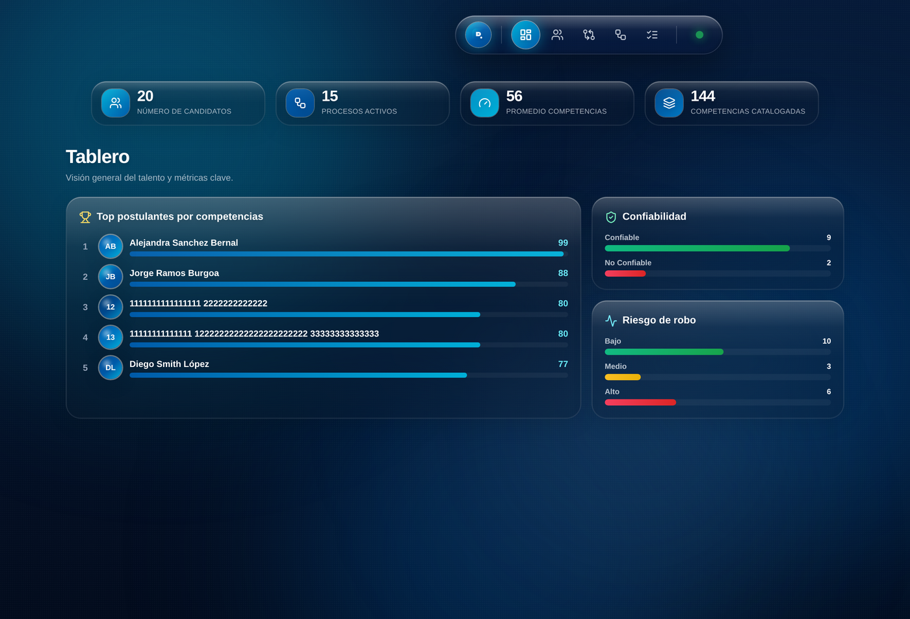

# BDP · Dashboard de Evaluación de Talento — "Liquid Glass"

Dashboard de Recursos Humanos para la evaluación de talento, con una estética
ultra-premium inspirada en iOS (**Advanced Liquid Glassmorphism**), animaciones
físicas (spring) aceleradas por hardware y una integración resiliente con un
backend de Google Apps Script. **Toda la interfaz está en español.**



## ✨ Características

- **Tema dual claro/oscuro** ("Daylight" / "Midnight") conmutable desde el dock
  y persistente, con todo el sistema de diseño impulsado por *CSS custom
  properties* (sin parpadeo gracias a un script anti-FOUC).
- **Efectos reactivos al cursor**: un foco de luz global sigue el puntero por
  toda la página y las tarjetas tienen un *glow* que persigue al cursor.
- **Liquid Glass** real: volumen, reflejos especulares y refracción fluida sobre
  un fondo *mesh gradient* animado (en ambos temas).
- **Floating Dock** estilo iOS **configurable**: se ancla a cualquier borde
  (superior / inferior / izquierda / derecha), tiene tres tamaños y se
  **contrae** a un botón con el logo (y se expande con un clic). Detecta cambios
  de tamaño/orientación de la pantalla para reubicarse cómodamente (se desplaza
  dentro de sí mismo en pantallas pequeñas). Incluye la píldora activa de física
  de resorte, switch de tema y punto de estado de sincronización.
- **Módulo — Registro de Postulantes:** "Cuestionario" completo en un modal
  protegido con datos personales, **velocímetros analógicos** (arrastre o
  ingreso manual 0–100 %), arquetipo **DISC**, constructores A1/A2/A3
  (conocimientos, herramientas y competencias), escalas de confiabilidad y
  observaciones por etiquetas. Incluye **autoguardado local**, **recuperación de
  borrador** ante caídas y **confirmación de salida**.
- **Perfil de Postulante (Vista Completa):** panel a pantalla completa que
  **centraliza toda la información de una persona** en un solo lugar, accesible
  desde **cualquier módulo** (comparador, procesos, postulantes, documentación,
  dashboard). Siete pestañas animadas: **Resumen**, **Trayectoria**
  (académica/laboral visual), **Evaluaciones** (anillos + radar + competencias),
  **Currículum 3D** (motor Three.js con tarjeta que sigue al cursor y respaldo
  estático), **Referencias** (panel de referencias laborales con formulario y
  comentarios estructurados), **Documentación** (flujo del expediente) e
  **Historial** (línea de tiempo unificada). Accesibilidad de primer nivel
  (diálogo, Escape, foco) y escalable para enlazar más fuentes de datos.
- **Edición global de postulantes:** un botón **Editar** disponible en todos los
  lugares donde aparece un postulante abre el cuestionario **precargado**, con el
  identificador bloqueado y los **campos modificados resaltados en ámbar**; al
  **Guardar Cambios** se actualiza Google Sheets (`action:"update"`), se refresca
  toda la base y se registra el cambio (quién, cuándo y qué) en la bitácora.
- **Módulo — Dashboard (personalizable):** tablero *bento* editable — el modo
  **Personalizar** permite **añadir/quitar indicadores**, **redimensionar** cada
  bloque (1–4 columnas) y **arrastrarlos** para reordenarlos; la disposición se
  guarda por navegador y los datos siguen calculándose en vivo.
- **Módulo — Comparador:** arranca **vacío** con una pantalla animada Liquid
  Glass que invita a agregar postulantes; la búsqueda *type-ahead* en vivo
  (nombre + identificador) añade columnas una a una. La comparación (candidatos
  y su orden) y las preferencias de vista **se conservan durante la sesión** al
  cambiar de módulo. Se organiza en tres pestañas:
  - **Comparativa:** informe seccionado con encabezados congelados, orden por
    **Nota CAP** con **filtro ascendente/descendente**, **ranking** configurable
    (chapa **dorada** con efectos para el 1.º y **plateada** para el resto) que
    puede mostrarse en la **tarjeta**, en una **fila** dedicada o en **ambas**, y
    un **chip de perfil** rediseñado — nombres **en mayúsculas**, nivel académico
    y su conector en una línea y la **carrera debajo**. La **columna congelada**
    es opaca (sin solapamiento al desplazar) y sus etiquetas largas se **revelan
    con una marquesina** suave. Un **ayudante de navegación fijo** (d-pad)
    aparece al comparar muchos candidatos. Cada sección se **contrae/despliega**.
  - **Gráficos:** generador **interactivo** — se eligen candidatos y métricas y
    se dibujan **barras agrupadas, barras horizontales, líneas multiserie, radar
    o dona** animados, con leyendas y una tabla de datos de alto contraste.
  - **Configuración (por sesión):** «Ajuste y Brecha», modo compacto, visibilidad
    de secciones y los controles de **ranking, orden y ayudante de navegación**.
- **Módulo — Documentación:** expediente editable por persona contratada (ligado
  al identificador), con **checklist de documentos** por estado (presentado /
  pendiente / con observación / no aplica), páginas, observaciones y prórrogas;
  **anillo de avance**, **análisis inteligente** y un **panel de avisos por
  correo** (Gmail/Outlook) totalmente editable con **recordatorios automáticos
  cada 3 días** y copia al auxiliar a cargo.
- **Módulo — Procesos (ProcessOS):** centro de control de los procesos de
  reclutamiento (no una simple vacante). Vistas **Tabla**, **Tarjetas**,
  **Kanban** (con alternativa por teclado), **Postulantes por proceso** (la vista
  original, preservada) y **Resumen analítico**; filtros combinables y
  persistentes; **editor multi-sección** (Resumen, Cargo, Publicación,
  Evaluaciones, Equipo, Configuración, Historial) con estados internos y de
  publicación separados, vinculación de evaluaciones e historial de cambios.
- **Módulo — Evaluaciones (AssessmentOS):** plataforma de creación de
  evaluaciones con **constructor visual** (biblioteca de +30 tipos de pregunta
  vía registro de *plugins*, lienzo, panel de propiedades, deshacer/rehacer),
  **versionado** con clasificación de cambios estructurales/no estructurales,
  motores de **validación, puntuación y lógica**, **vista previa** multi-
  dispositivo (a través de un DTO público que oculta las respuestas correctas),
  **biblioteca de plantillas** e **importación desde Excel/CSV/ODS** con reporte
  de validación. Ver `docs/ARCHITECTURE.md`, `docs/PROCESS_OS.md` y
  `docs/ASSESSMENT_OS.md`.
- **Módulo — Configuración:** centro de control del sistema — identidad
  institucional, **reglas de evaluación/comparador** (umbral CAP, tolerancia de
  empate, máximo de columnas, orden y ranking), **apariencia y rendimiento**
  (tema y motor gráfico 3D), **dock de accesos directos** (posición, tamaño y
  estado contraído), **integraciones** (Evaluar.com + prueba de conexión)
  y la biblioteca de **Formatos de Correo Activos**, con un formato por etapa del
  proceso; el formato activo de *Documentación* alimenta sus correos automáticos.
- **Diseño responsive integral:** toda la interfaz —dock, KPIs, comparador,
  gráficos, formularios y modales— está optimizada para **móviles y tablets**,
  con cuadrículas que se apilan, controles táctiles y desplazamiento contenido.
- **Motor visual Three.js:** un fondo WebGL optimizado (un solo *quad* con
  *shader* de flujo líquido) que profundiza el Liquid Glass en ambos temas,
  apunta a ~60 fps, se **carga de forma diferida**, se pausa con la pestaña
  oculta y respeta *Reducir movimiento* (con el *mesh* CSS como respaldo).
- **Arquetipo DISC dinámico:** el desplegable y el pop-up de significado se
  alimentan de la hoja «Auxiliar» (columna `arquetipo_disc`); un icono «!» junto
  al arquetipo abre su descripción en todo el sistema (cuestionario y comparador).
- **Impresión institucional** a Carta / Oficio en todos los módulos, con
  banderola de reporte y aplanado de vidrio para máxima legibilidad.
- Módulos adicionales: **Tablero** y **Cara a Cara** (1 vs 1).

## 🧱 Stack

- [React 18](https://react.dev/) + [TypeScript](https://www.typescriptlang.org/) (estricto)
- [Vite 5](https://vite.dev/)
- [Tailwind CSS 3](https://tailwindcss.com/) (valores arbitrarios + utilidades `glass`)
- [Framer Motion](https://www.framer.com/motion/) para transiciones con física
- [Three.js](https://threejs.org/) para el fondo WebGL «Liquid Glass» (carga diferida)
- [lucide-react](https://lucide.dev/) para iconos

## 🚀 Desarrollo

```bash
npm install
npm run dev        # servidor de desarrollo
npm run build      # typecheck + build de producción
npm run preview    # previsualizar el build
```

## 🔌 Backend

El dashboard consume un único endpoint de Google Apps Script (definido en
`src/constants.ts`):

```
GET  →  { candidatos: [...], competencias: [...], arquetipos_disc: [...] }
```

> [!IMPORTANT]
> **Regla de producción (Vercel):** toda llamada `fetch()` a este endpoint debe
> incluir `{ redirect: "follow" }`. Google responde con un `302` y, sin seguir el
> redirect, la app falla con `404` en producción. Ver `useTalentData`.

El hook global `useTalentData` (Context API) obtiene, normaliza y distribuye los
datos, gestionando estados de carga y error con reintentos de *backoff*.

> El módulo **Documentación** persiste sus expedientes en `localStorage` y los
> sincroniza *best-effort* con el backend (`type: "documentacion"`). Para el
> guardado real en Google Sheets, la lectura de `arquetipos_disc`/`carrera` y el
> **envío automático de correos cada 3 días**, despliegue
> [`docs/backend/Documentacion.gs`](docs/backend/Documentacion.gs) (ver
> `docs/backend/README.md`).

## 🎨 Sistema de diseño

La paleta corporativa se construye con `#004a8f` (azul profundo), `#005baa`
(azul núcleo) y `#00b0d8` (cian). La utilidad base de Liquid Glass vive en
`src/index.css` como las clases `.glass` y `.glass-heavy`.

## 📁 Estructura

```
src/
├── components/      # Dock, KPIs, chips, tarjetas, modal, diálogos, formulario
│   ├── doc/         # Módulo Documentación: alta, expediente, correo, ajustes
│   └── form/        # Campos, velocímetro (GaugeInput), tags, list builders
├── context/         # useTalentData + useTheme (Context API)
├── hooks/           # usePointerGlow, useFormDraft (autosave/recuperación)
├── lib/             # cálculos, normalización, niveles, impresión, DISC y docStore
├── modules/         # Tablero, Cara a Cara, Comparador, Procesos, Postulantes, Documentación
├── App.tsx          # layout + enrutado de módulos
└── index.css        # sistema de diseño Liquid Glass (dual-theme + print)
```
