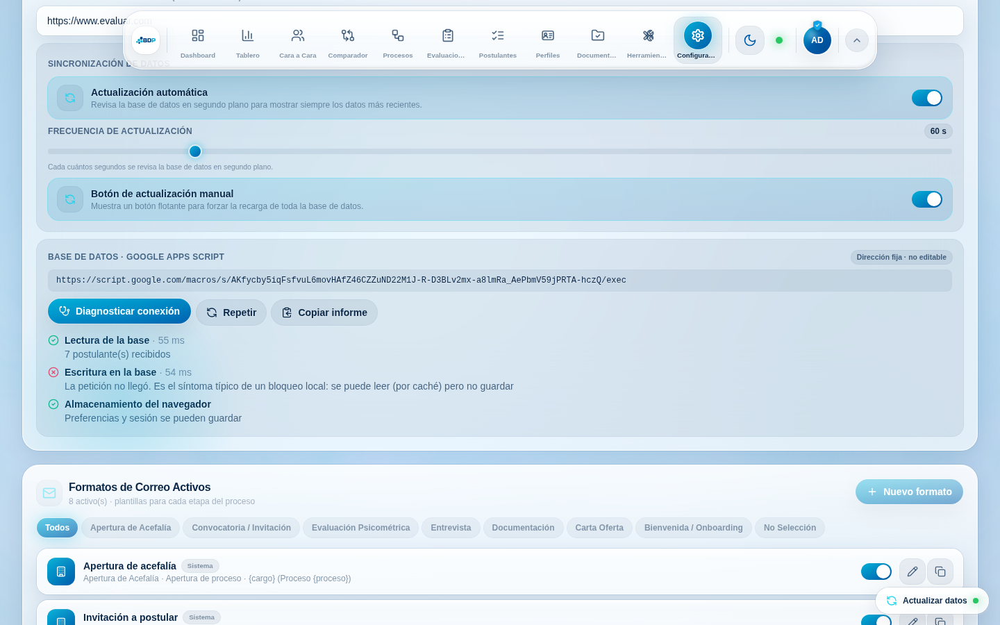
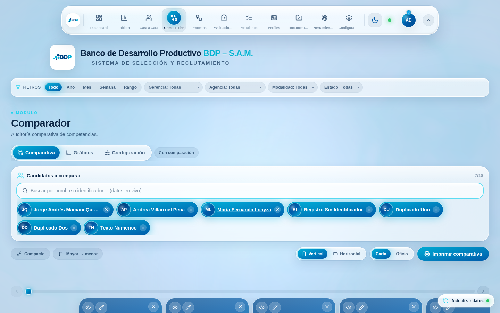
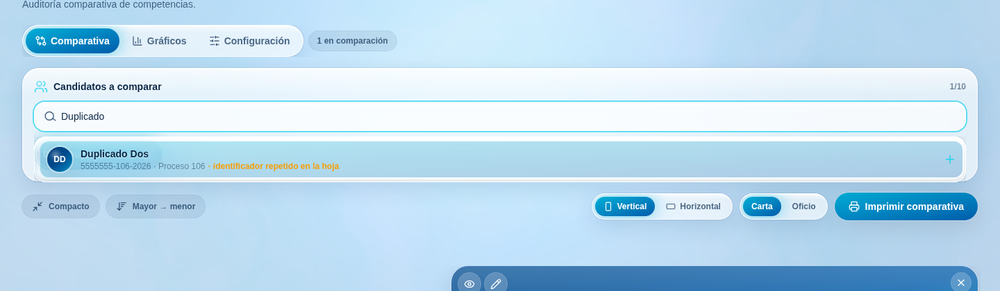
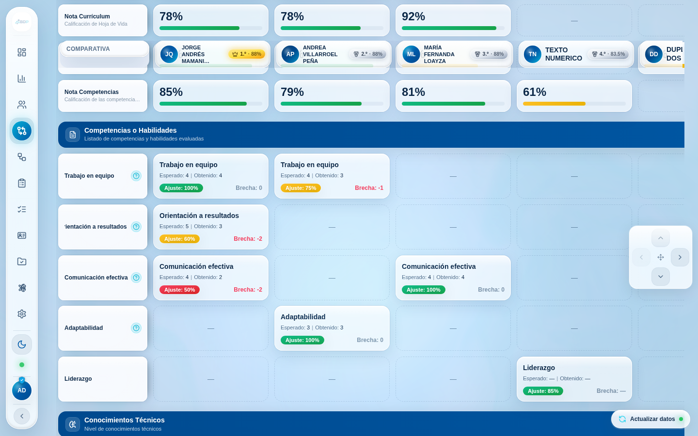
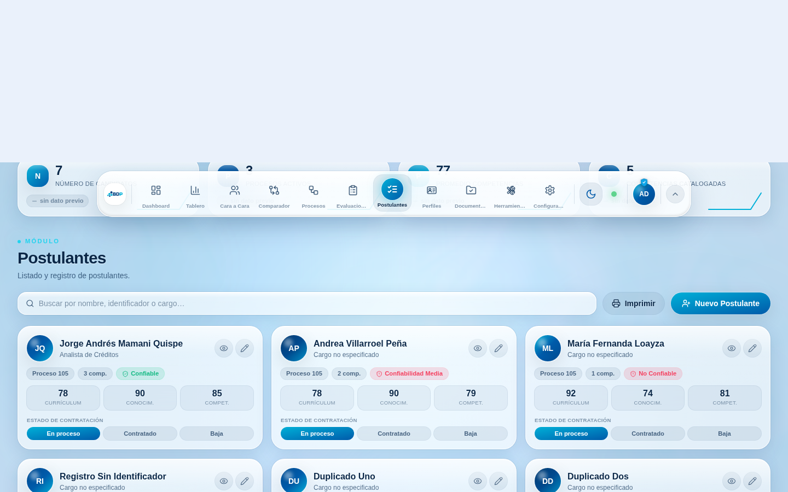
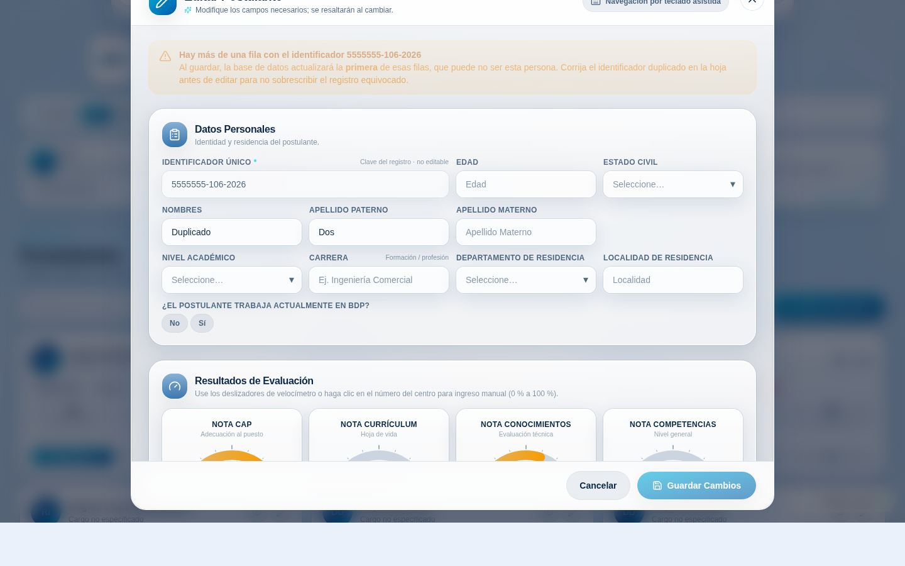
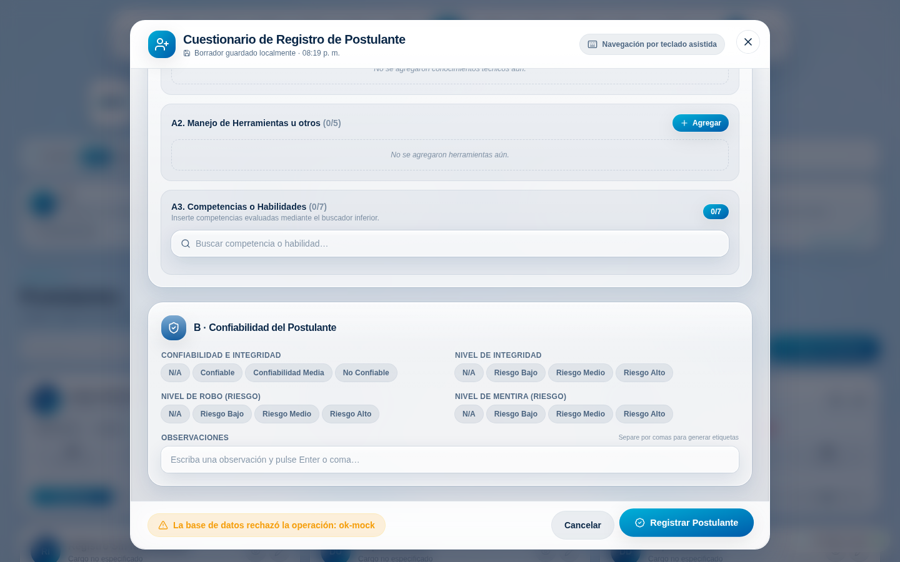
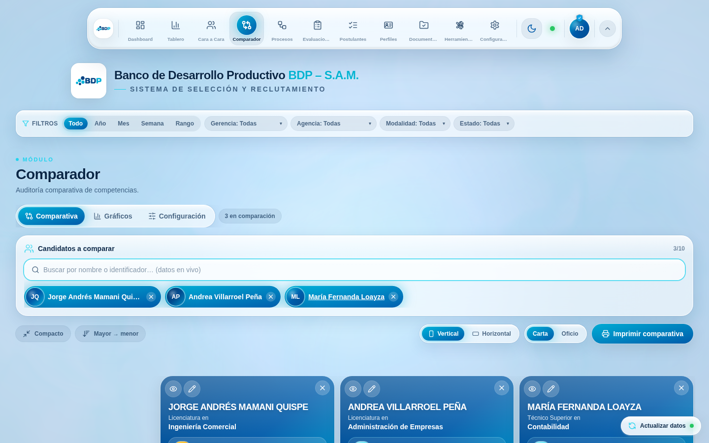
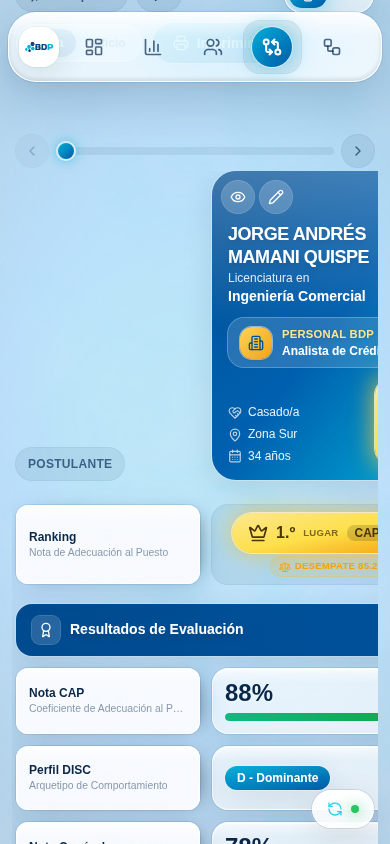

# Auditoría de estabilidad · Comparador y Postulantes

> Qué se revisó, qué estaba roto de verdad, cómo se arregló y cómo comprobarlo.
> Escrito para leerse de arriba abajo sin conocer el código.

---

## Contexto

### Lo básico (sáltelo si ya conoce el sistema)

Esta aplicación no tiene servidor propio. El «backend» es un **libro de Google
Sheets** al que se llega a través de un script publicado como aplicación web
(Google Apps Script). El frontend hace exactamente dos cosas contra él:

- un `GET` que devuelve **todo** de una vez (postulantes, catálogos, perfiles,
  procesos…), y
- unos `POST` que escriben, enrutados por un campo `type` en el cuerpo.

Ese script está versionado —desde esta PR— en
[`apps-script/principal/`](../../apps-script/principal/). Los módulos
**Documentación** y **Evaluaciones** son la excepción: cada uno tiene su propio
libro y su propio script, y se configuran desde su propio módulo.

Del lado del navegador, `TalentDataProvider` (`src/context/TalentDataContext.tsx`)
pide los datos, los normaliza y los reparte. Guarda una copia en `localStorage`
para que la primera pantalla no salga en blanco, y refresca en segundo plano cada
minuto. Los dos módulos de esta auditoría consumen ese mismo contexto:

- **Postulantes** (`src/modules/ListaPostulantes.tsx` +
  `src/modules/RegistrationForm.tsx`): la lista de fichas y el cuestionario de
  alta/edición.
- **Comparador** (`src/modules/NuevoComparador.tsx`): la cuadrícula de auditoría
  lado a lado, con su buscador (`src/components/CandidateSearchSelect.tsx`), su
  ranking (`src/lib/comparatorRanking.ts`) y su catálogo de filas
  (`src/lib/comparatorRows.ts`).

### El contexto que importa para este cambio

Tres detalles del diseño existente explican casi todo lo que sigue:

1. **Cada persona se direcciona por `Candidate.id`.** El comparador guarda esos
   ids en `sessionStorage`; «Ver perfil» y «Editar» los resuelven contra la base;
   React los usa como clave de lista. Ese id era, literalmente, el identificador
   escrito en la hoja.
2. **Las preferencias viajan por usuario.** Además de `localStorage`, la
   configuración de cada perfil se guarda en la columna
   `config_personal_perfil` de la hoja `Perfiles_y_Configuracion`, y al iniciar
   sesión se aplica a la configuración global (`src/lib/profilesStore.ts`).
3. **`fetch` no falla cuando el servidor dice «no».** Sólo rechaza si la petición
   no llega a destino.

> [!IMPORTANT]
> **Regla de oro del backend, por si acaba tocando este código:** todo `fetch` a
> Apps Script necesita `redirect: "follow"` (Google responde `302`) y los `POST`
> deben ir como `text/plain` (con `application/json` el navegador exige una
> comprobación previa de CORS que el despliegue estándar no sabe responder).

---

## Intuición

El reporte era «a un usuario no le funciona el comparador y no puede añadir
postulantes; a mí me funciona en todos mis dispositivos». La auditoría encontró
**cuatro fallos reales y reproducibles**, y ninguno de ellos era invención del
usuario. Los cuatro comparten una forma: *el sistema hacía algo razonable en el
caso feliz y se quedaba callado en el caso torcido*.

### 1 · El buscador no se abría al hacer clic

Al agregar a alguien, la lista de sugerencias se cierra a propósito (para dejar
ver la comparativa) y el **foco se queda en el campo**, de modo que teclear el
nombre siguiente la reabre. La lista se abría en el evento de *foco*… y volver a
hacer clic en un campo que **ya tiene el foco no genera ningún evento de foco**.

Resultado: quien agregaba escribiendo no notó nunca nada. Quien agregaba con el
ratón —clic, elegir, clic para el siguiente— veía que el segundo clic no hacía
absolutamente nada. El comparador «no funciona», y con razón.

```text
Antes:  clic → foco → abre ✓        Después de agregar: clic → (sin foco) → nada ✗
Ahora:  clic → abre ✓               Después de agregar: clic → abre ✓
```

### 2 · Dos personas, un solo identificador

La hoja la llenan personas, y a veces la misma cédula entra dos veces en un
proceso. Como el id de la interfaz *era* el identificador, dos filas distintas
tenían la misma identidad. Con «Duplicado Uno» ya en la comparación:

| Síntoma | Por qué |
|---|---|
| «Duplicado Dos» desaparecía del buscador | El filtro de «ya seleccionados» lo daba por elegido |
| «Editar» abría siempre a «Duplicado Uno» | `find` devuelve la primera coincidencia |
| React omitía o duplicaba tarjetas | Dos hijos con la misma clave |

Lo tercero se ve en la consola de desarrollo; los dos primeros son **silenciosos
y graves**: se edita a la persona equivocada sin ninguna señal.

El arreglo separa dos ideas que estaban confundidas: el **identificador** es la
clave de negocio (lo que la hoja entiende y lo que viaja al backend) y el **id**
es la identidad de la fila en la interfaz. Cuando la clave se repite, el id se
desambigua (`…-2026`, `…-2026#2`) y la fila queda marcada.

```text
Hoja                                    Interfaz
5555555-106-2026  Duplicado Uno   →     id = "5555555-106-2026"     ⚠ repetido
5555555-106-2026  Duplicado Dos   →     id = "5555555-106-2026#2"   ⚠ repetido
8456872-105-2026  Jorge Mamani    →     id = "8456872-105-2026"
```

El backend **no puede** distinguirlas (localiza la fila por identificador y actúa
sobre la primera), así que la interfaz lo dice en voz alta en los tres sitios
donde alguien podría equivocarse: la lista de Postulantes, la sugerencia del
buscador y el propio cuestionario de edición. Silenciarlo habría sido aceptar una
corrupción de datos con buena cara.

### 3 · Una preferencia inservible dejaba el comparador muerto — a una sola persona

Éste es el que explica «a mí me funciona en todos mis dispositivos». La
configuración de cada perfil se aplicaba **tal cual** al iniciar sesión, sin
validar. Basta un `maxComparador` que valga `null` (un `NaN` serializado, una
versión antigua sin ese campo, una celda editada a mano) para que:

```js
state.selectedIds.length >= max   //  0 >= null  →  true
```

…el comparador se declare lleno con cero columnas. La persona veía el buscador
**deshabilitado** con el rótulo «Límite alcanzado (null/null)» y no podía agregar
a nadie. Y como esa preferencia vive en la hoja, la seguía a cualquier equipo,
mientras nadie más notaba nada.

Ahora la configuración pasa por un único saneador (`sanitizeConfig`) en los tres
caminos de entrada: la lectura de `localStorage`, cada `setConfig` y el paquete de
preferencias del perfil. Un valor imposible se sustituye por uno usable en vez de
propagarse.

### 4 · «Postulante registrado correctamente» cuando no se registró nada

El alta hacía `await fetch(...)` y, si no lanzaba excepción, daba la escritura por
buena. Pero *no lanzar* no significa *haber guardado*:

| Lo que pasaba de verdad | Lo que decía la aplicación |
|---|---|
| El script responde `{"status":"error"}` | «Postulante registrado correctamente» |
| El despliegue perdió el permiso «Cualquiera con el enlace» y Google devuelve su pantalla de acceso | «Postulante registrado correctamente» |
| Un `500` de Google | «Postulante registrado correctamente» |
| La red del equipo bloquea `script.google.com` | «Se guardó localmente…» y la ficha aparecía en la lista |

En los tres primeros casos el cuestionario se cerraba y la ficha se añadía a la
copia local, así que **durante un minuto parecía guardada** y luego desaparecía
sola en el refresco. En el cuarto, la ficha fantasma hacía creer que existía.
Desde la silla del analista, las cuatro filas se resumen en una frase: «no puedo
añadir postulantes».

Ahora hay tres desenlaces distintos, y sólo uno cierra el cuestionario:

```text
confirmada     → se refleja en local y se cierra
rechazada      → no se toca nada, se muestra el motivo que dio la hoja
sin confirmar  → no se toca nada, se explica qué mirar (red, proxy, despliegue)
```

### Y para no volver a depender de que alguien nos deje sentarnos en su equipo

Se añadió un **diagnóstico** en *Configuración → Integraciones* que prueba por
separado los tres caminos y produce un informe copiable:



«Lectura ✓ / Escritura ✗» es la huella exacta de un bloqueo local: la aplicación
se ve bien porque lee, y ninguna escritura llega. Con esa captura pegada en un
mensaje se resuelve en un minuto lo que antes era una discusión.

---

## Código

### Identidad de un postulante — `src/lib/candidates.ts`

La normalización pasa a hacerse sobre **la base completa**, que es lo único que
puede saber si una clave está repetida:

```ts
export function normaliseCandidates(rows: RawCandidate[]): Candidate[] {
  // Primera pasada: cuántas filas comparten cada identificador.
  const count = new Map<string, number>();
  for (const row of rows) {
    const ident = asText(row.identificador);
    if (ident) count.set(ident, (count.get(ident) ?? 0) + 1);
  }
  // Segunda pasada: id único y estable por fila.
  const used = new Map<string, number>();
  return rows.map((row) => {
    const ident = asText(row.identificador);
    const base = ident || `sin-id-${rowFingerprint(row)}`;
    const seen = used.get(base) ?? 0;
    used.set(base, seen + 1);
    return normaliseCandidate(row, {
      id: seen === 0 ? base : `${base}#${seen + 1}`,
      identificadorDuplicado: Boolean(ident) && (count.get(ident) ?? 0) > 1,
    });
  });
}
```

El caso de la fila **sin** identificador merece una nota. Antes su id era
posicional (`cand-3`), y la base se relee cada minuto: bastaba con que alguien
insertara una fila más arriba en la hoja para que la comparación en curso pasara a
apuntar a otra persona. Ahora la clave sale del **contenido** de la fila, que no
se mueve:

```ts
function rowFingerprint(c: RawCandidate): string {
  const parts = Object.keys(c).sort().map((k) => `${k}=${String(c[k] ?? "")}`).join("|");
  let hash = 5381;
  for (let i = 0; i < parts.length; i++) hash = ((hash << 5) + hash + parts.charCodeAt(i)) >>> 0;
  return hash.toString(36);
}
```

### El buscador — `src/components/CandidateSearchSelect.tsx`

Dos líneas y un cambio de idea: la lista se abre por **intención del usuario**
(el clic), no por un efecto secundario del foco.

```tsx
onFocus={() => {
  if (skipOpenOnFocus.current) { skipOpenOnFocus.current = false; return; }
  setOpen(true);
}}
// Un clic en el campo siempre abre la lista, incluso si el foco ya
// estaba dentro (el caso de justo después de agregar a alguien).
onPointerDown={() => {
  skipOpenOnFocus.current = false;
  setOpen(true);
}}
```

La bandera `skipOpenOnFocus` se queda, pero ahora sólo protege del foco que la
propia aplicación provoca al devolver el cursor al campo.

### Saneamiento de la configuración — `src/lib/configStore.ts`

Un solo saneador, y tres caminos que lo atraviesan (`load()`, `setConfig()` y —a
través de `setConfig`— el paquete de preferencias del perfil):

```ts
export function sanitizeConfig(base: AppConfig, patch?: Partial<AppConfig> | null): AppConfig {
  const p = (patch && typeof patch === "object" ? patch : {}) as Partial<AppConfig>;
  const pick = <K extends keyof AppConfig>(key: K): unknown => (key in p ? p[key] : base[key]);
  return {
    // El mínimo real es 2: comparar es, por definición, poner a dos personas
    // lado a lado. Un tope menor deja el módulo sin razón de ser.
    maxComparador: num(pick("maxComparador"), 10, 2, MAX_COMPARADOR_LIMIT),
    dockPosition: oneOf(pick("dockPosition"), DOCK_POSITIONS, "top"),
    autoRefreshSeconds: num(pick("autoRefreshSeconds"), 60, 15, 3600),
    /* …el resto de campos, cada uno con su tipo y su rango… */
  };
}

export function setConfig(patch: Partial<AppConfig>): void {
  state = sanitizeConfig(state, patch);
  emit();
}
```

`num` acepta también un número escrito como texto —viene de una hoja de cálculo,
al fin y al cabo— y descarta `NaN`, `null` y objetos.

### Verificación de las escrituras — `src/context/TalentDataContext.tsx`

Un único punto por el que pasan todos los `POST`, con tres desenlaces explícitos:

```ts
type WriteOutcome =
  | { kind: "ok"; message: string }
  | { kind: "rejected"; message: string }
  | { kind: "unreachable"; message: string };

async function postToSheet(body: unknown, okMessage: string): Promise<WriteOutcome> {
  let res: Response;
  try {
    res = await fetch(SCRIPT_URL, { method: "POST", redirect: "follow",
      headers: { "Content-Type": "text/plain;charset=utf-8" }, body: JSON.stringify(body) });
  } catch {
    return { kind: "unreachable", message: "No se pudo contactar con la base de datos. Revise su conexión (o si un antivirus/proxy bloquea script.google.com)…" };
  }
  if (!res.ok) return { kind: "unreachable", message: `La base de datos respondió con un error HTTP ${res.status}…` };

  // Un despliegue sin permiso «Cualquiera con el enlace» devuelve la página de
  // acceso de Google en lugar de JSON: eso no es un éxito, es una advertencia.
  let data: { status?: string; message?: string } | null = null;
  try { data = await res.json(); }
  catch { return { kind: "unreachable", message: "La base de datos respondió algo inesperado…" }; }

  if (data?.status && data.status !== "success") {
    return { kind: "rejected", message: `La base de datos rechazó la operación: ${data.message}` };
  }
  return { kind: "ok", message: okMessage };
}
```

Y el alta deja de inventar filas:

```ts
const outcome = await postToSheet(candidate, "Postulante registrado correctamente.");
if (outcome.kind === "ok") {
  // Reflejo optimista SÓLO cuando la hoja confirmó la escritura.
  setRaw((prev) => [candidate, ...prev]);
}
return { ok: outcome.kind === "ok", message: outcome.message };
```

### Correcciones menores que salieron de la misma revisión

| Archivo | Qué estaba mal |
|---|---|
| `src/shared/hooks.ts` | `useMediaQuery` comprobaba que `matchMedia` **existiera**, no que fuera invocable. En un webview donde está declarado pero no es función, la excepción tumbaba el comparador entero (lo usa `usePrefersReducedMotion`). Ahora se comprueba el tipo y se acepta la API antigua `addListener` (Safari < 14) |
| `src/components/form/GaugeInput.tsx` | El alto del `viewBox` estaba escrito dos veces con dos valores (`116` al dibujar, `120` al leer el puntero): el velocímetro devolvía hasta un punto de más o de menos en los extremos. En un instrumento de auditoría, un punto es un punto |
| `src/lib/candidateEditStore.ts` | `openEdit` no hacía nada si se pedía el mismo id dos veces. Si el modal no llegó a abrirse (fila que ya no está en la base), el botón «Editar» quedaba muerto **para siempre** en ese registro. Ahora vuelve a emitir, y `CandidateEditModal` avisa y cierra si no encuentra la fila |
| `src/lib/kpiHistory.ts` | Dos componentes graban indicadores del mismo mes y cada uno **reemplazaba** el mapa completo: el último en dibujarse borraba los del otro y la historia mes a mes quedaba a medias. Ahora se combinan, y el envío al backend se agrupa en una sola escritura (eran cinco por carga, y el script las ignora) |
| `src/index.css` + `NuevoComparador.tsx` | Al entrar en la cuadrícula, el dock se desplaza al borde izquierdo, pero la compensación de espacio sólo existía desde 1024 px: entre 640 y 1023 px el dock se movía sin que nada se apartara y **tapaba los rótulos de la primera columna**. Ahora el mismo umbral (640 px) decide las dos cosas, y en un teléfono el dock ya no se mueve |
| `NuevoComparador.tsx` | El ayudante de navegación (d-pad) flotaba desde el principio sobre el buscador que se acababa de usar. Ahora aparece cuando el analista ya está dentro de la cuadrícula |
| `src/lib/hiringStore.ts` | El estado de contratación mandaba al backend el id de la interfaz. Con las claves desambiguadas eso podía llevar un sufijo: ahora se manda el identificador de negocio |
| `apps-script/principal/` | **El script del libro compartido no estaba versionado**: vivía en `docs/backend/`, se borró al añadir el backend de Evaluaciones y el README seguía enlazándolo. Se restaura sin cambios de lógica, con su contrato y sus pasos de despliegue |
| `README.md` | Rutas y comandos inexistentes (`apps-script/evaluations/`, `docs/evaluations/`, `npm run check`, `npm run visual-qa`). Quien intente seguirlos hoy no encuentra nada |

---

## Verificación

### Automática

```bash
npm ci
npm run typecheck   # sin errores
npm test            # 297 pruebas en verde (eran 259)
npm run build       # build de producción, tal como lo hará Vercel
npm run backend:check && npm run doc:check
```

Las **38 pruebas nuevas** cubren, una por una, las cuatro causas:

| Archivo | Qué fija |
|---|---|
| `src/lib/candidates.test.ts` | Ids únicos y estables, marca de clave repetida, id que no cambia al reordenar la hoja, tolerancia a datos sucios |
| `src/lib/configStore.test.ts` | `maxComparador` inservible (`null`, `0`, `NaN`, texto, objeto) nunca deja el comparador sin columnas; catálogos y rangos |
| `src/components/CandidateSearchSelect.test.tsx` | El clic reabre la lista tras agregar; las dos filas con clave repetida se pueden elegir por separado |
| `src/context/TalentDataContext.test.tsx` | Los cuatro desenlaces de una escritura, incluida la pantalla de acceso de Google, y que no quede ninguna ficha fantasma |

Cada prueba se comprobó **reintroduciendo el fallo**: sin el arreglo, falla; con
el arreglo, pasa.

### En un navegador de verdad

La auditoría se hizo sobre el `build` de producción servido con `vite preview`,
con el libro de Google **simulado** por intercepción de red: así se puede forzar
un rechazo del servidor o un bloqueo de la escritura sin tocar un solo dato real
del banco (el script de producción nunca recibió una petición).

La base simulada incluye filas deliberadamente hostiles —clave repetida,
identificador vacío, `nota_cap` como `"83,5"`, `conocimientos_tecnicos` que no es
JSON, observaciones con comas sueltas— porque los datos reales de una hoja de
cálculo son así.

**Siete de siete candidatos agregados usando sólo el ratón** (antes: uno):



**La clave repetida se puede agregar y queda marcada:**



**La columna congelada ya no queda debajo del dock:**



**El aviso donde se corrigen los datos, y antes de guardar una edición:**




**Un alta rechazada por la hoja: el cuestionario no se cierra y conserva todo:**



**Con una configuración corrupta (`maxComparador: null`), el comparador vive:**



**Y en móvil, la comparativa sigue siendo usable:**



Además se recorrieron los **diez módulos** en el mismo navegador sin un solo
error de consola ni una sola aparición del `ErrorBoundary`, y se comprobaron el
tema oscuro, la impresión (emulando `media: print` con el ámbito del comparador),
la recuperación de borrador y los anchos 390 / 800 / 1024 / 1280 / 1440.

### Control de calidad manual, paso a paso

1. `npm ci && npm run dev`, entre con cualquier perfil.
2. **Comparador → agregar con el ratón.** Clic en el buscador, elija a alguien,
   **clic otra vez** en el buscador: la lista debe abrirse. Repita hasta llenar
   el tope. *(Antes se detenía en el primero.)*
3. **Claves repetidas.** Si su hoja no tiene ninguna, duplique
   temporalmente una fila de `Registro_Postulantes` con el mismo identificador y
   cambie el nombre. En Postulantes las dos fichas deben mostrar el chip ámbar
   «ID repetido»; en el buscador del comparador las dos deben poder agregarse; al
   pulsar «Editar» en la segunda debe cargarse **la segunda** y aparecer el aviso.
   Borre la fila duplicada al terminar.
4. **Un alta que la hoja rechaza.** Con las herramientas del navegador
   (*Red → Bloquear URL* `script.google.com`), registre a alguien: el
   cuestionario **no** debe cerrarse, debe explicar el problema y conservar todo
   lo escrito. Al desbloquear y pulsar «Registrar» de nuevo, debe guardar.
5. **Diagnóstico.** *Configuración → Integraciones → Diagnosticar conexión*: con
   la URL bloqueada debe decir «Lectura ✓ / Escritura ✗». «Copiar informe» pega
   un resumen con navegador, tope de columnas y tiempos.
6. **Configuración corrupta.** En la consola:
   `localStorage.setItem('bdp-config', JSON.stringify({ maxComparador: null }))`
   y recargue. El comparador debe seguir aceptando candidatos (`0/10`).
7. **Velocímetros.** En el cuestionario, arrastre «Nota CAP» hasta los extremos:
   la aguja debe seguir al puntero y llegar a 0 y a 100 exactos.

---

## Alternativas

### Para la identidad de los postulantes

|  | Desambiguar en el frontend (lo elegido) | Exigir clave única en el backend |
|---|---|---|
| **A favor** | Se despliega con la PR, sin tocar Apps Script ni pedir permisos. Ninguna fila se vuelve invisible. La interfaz nunca miente sobre a quién está editando | Ataca la causa: la hoja dejaría de tener claves repetidas. El `update` sería siempre inequívoco |
| **En contra** | El backend sigue sin poder editar la fila correcta: hay que **avisar** en lugar de resolver | Requiere pegar el script y volver a desplegar (paso manual), y **rechazaría altas** que hoy se aceptan: alguien que hoy trabaja se quedaría bloqueado sin previo aviso |

Se eligió la primera porque el encargo pedía que todo funcione al fusionar, sin
pasos manuales. La segunda sigue siendo la corrección definitiva y está
documentada en [`apps-script/principal/README.md`](../../apps-script/principal/README.md)
para cuando se pueda coordinar el redespliegue.

### Para la configuración inservible

|  | Sanear en el `store` (lo elegido) | Validar con un esquema (Zod) al leer |
|---|---|---|
| **A favor** | Un solo punto que cubre los tres orígenes (`localStorage`, `setConfig`, perfil). Sin dependencias nuevas. Nunca deja al usuario sin aplicación: sustituye el valor imposible y sigue | `zod` ya está en el proyecto. El esquema es declarativo y sirve de documentación del tipo |
| **En contra** | El saneador es código a mano: añadir un campo obliga a añadir su regla (y una prueba) | Un esquema estricto **rechaza** el objeto entero por un campo malo, y entonces habría que decidir qué hacer; en modo laxo acaba pareciéndose bastante a lo que hicimos |

---

## Personas sugeridas para consultar

El historial de `git` de todos los archivos tocados tiene un único autor
(`Claude <noreply@anthropic.com>`): no hay contribuciones humanas a las que pedir
contexto, así que la revisión conviene apoyarla en quien tiene el conocimiento
que **no** está en el código:

- **Quien reportó el fallo** (el analista que decía que el comparador no le
  funcionaba). Es la única persona que puede confirmar cuál de las cuatro causas
  era la suya: pídale que abra *Configuración → Diagnosticar conexión* y envíe el
  informe. Si sale «Lectura ✓ / Escritura ✗», el problema está en su equipo o red
  y esta PR se lo dirá claramente en lugar de fingir que guardó.
- **Quien administra el libro y el despliegue de Apps Script.** Debe confirmar
  que el despliegue vigente coincide con `apps-script/principal/Code.gs` y que
  sigue publicado como «Cualquiera con el enlace»; y decidir si se corrigen los
  identificadores repetidos en `Registro_Postulantes`.
- **La supervisión del equipo**, para la única decisión de producto que hay aquí:
  ¿los identificadores repetidos deben **bloquearse** en el alta (más seguro,
  puede frenar el trabajo del día) o seguir **avisándose** (como en esta PR)?

---

## Cuestionario

<details>
<summary><strong>1.</strong> ¿Por qué el buscador del comparador dejaba de abrirse justo después de agregar a alguien?</summary>

- **a)** El desplegable se cerraba con una animación que bloqueaba los clics.
- **b)** ✅ **La lista se abría en el evento de foco, y el campo ya tenía el foco: un clic sobre un elemento enfocado no vuelve a emitir `focus`.**
- **c)** El límite de columnas se alcanzaba antes de tiempo.
- **d)** El `PortalDropdown` se posicionaba fuera de la pantalla.

**Por qué:** al elegir a alguien, el código cierra la lista y devuelve el foco al
campo para poder seguir escribiendo; además marca una bandera para que ese foco
programado no reabra la lista. Como el foco nunca salía del campo, el clic
siguiente no generaba evento de foco y no quedaba nadie que llamara a
`setOpen(true)`. (a) es falso: el panel ya estaba desmontado. (c) sólo ocurría
con la configuración corrupta, que es otro fallo distinto. (d) se descartó
midiendo la posición del panel en el navegador: era correcta.
</details>

<details>
<summary><strong>2.</strong> Con dos filas que comparten identificador, ¿qué hace hoy la aplicación al guardar una edición de la segunda?</summary>

- **a)** Actualiza la segunda fila, porque el id lleva sufijo `#2`.
- **b)** Falla con un error del backend.
- **c)** ✅ **Actualiza la primera fila —el backend sólo entiende el identificador— y por eso la interfaz avisa antes de guardar.**
- **d)** Crea una fila nueva.

**Por qué:** el sufijo `#2` es identidad *de la interfaz*; al backend viaja el
identificador tal cual, y `handlePostulante_` actúa sobre la primera coincidencia.
De ahí que el arreglo sea doble: desambiguar para poder ver y comparar a las dos
personas, y **avisar** de que guardar puede afectar a la otra. (b) no: el script
encuentra una fila y responde `success`. (d) tampoco: `action:"update"` no crea
filas.
</details>

<details>
<summary><strong>3.</strong> ¿Por qué una preferencia mal guardada afectaba a una sola persona en todos sus dispositivos, y no a un dispositivo?</summary>

- **a)** Porque `localStorage` se sincroniza entre navegadores.
- **b)** ✅ **Porque la configuración de cada perfil también se guarda en la hoja (`config_personal_perfil`) y se aplica al iniciar sesión.**
- **c)** Porque la caché del backend es por usuario.
- **d)** Porque el `sessionStorage` del comparador viaja en la cookie de sesión.

**Por qué:** `applyBundle` aplicaba el paquete de preferencias del perfil a la
configuración global sin validarlo, y ese paquete se guarda tanto en el navegador
como en la hoja. Al entrar desde otro equipo, el valor inservible volvía con la
persona. (a) es falso. (c) la caché del backend es del script, común a todos.
(d) la cookie sólo lleva el identificador del perfil.
</details>

<details>
<summary><strong>4.</strong> ¿Por qué `await fetch(...)` sin mirar la respuesta era el problema, y no una simplificación aceptable?</summary>

- **a)** Porque `fetch` no espera a que el servidor responda.
- **b)** Porque Apps Script nunca devuelve errores.
- **c)** ✅ **Porque `fetch` sólo rechaza si la petición no llega: un `500`, un `{"status":"error"}` o la pantalla de acceso de Google resuelven con normalidad.**
- **d)** Porque faltaba `redirect: "follow"`.

**Por qué:** ésa es exactamente la semántica de `fetch`, y es la razón de que la
aplicación dijera «registrado correctamente» sin haber escrito nada. (a) es
falso: `await` espera la respuesta. (b) el script devuelve `{status:"error"}` en
varios caminos (hoja no encontrada, fila no encontrada). (d) el `redirect` ya
estaba puesto y sigue siendo imprescindible, pero no tiene nada que ver con
interpretar la respuesta.
</details>

<details>
<summary><strong>5.</strong> El diagnóstico prueba la escritura con `type: "kpi_snapshot"`. ¿Por qué no con un `type` inventado?</summary>

- **a)** Porque un `type` desconocido devuelve `404`.
- **b)** ✅ **Porque el enrutador manda cualquier `type` desconocido al caso por omisión, que da de alta un postulante: un diagnóstico no debe escribir en la hoja.**
- **c)** Porque `kpi_snapshot` es el único que responde JSON.
- **d)** Porque los demás tipos exigen autenticación.

**Por qué:** en `doPost`, el `switch (data.type)` termina en `default:
handlePostulante_(...)`, que sin `action` **añade una fila**. `kpi_snapshot` está
explícitamente contemplado y responde `{status:"ignored"}` sin tocar ninguna
hoja: recorre CORS, la redirección 302 y los permisos del despliegue sin dejar
rastro. (a) el script responde 200 a todo. (c) y (d) son falsos.
</details>
