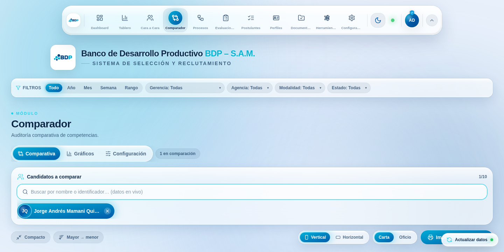
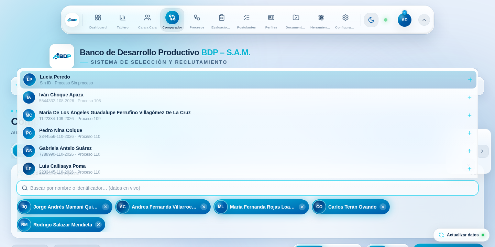
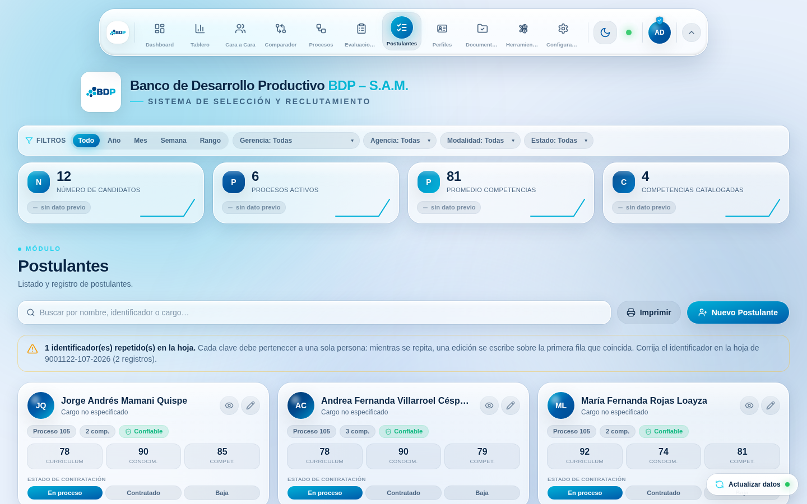
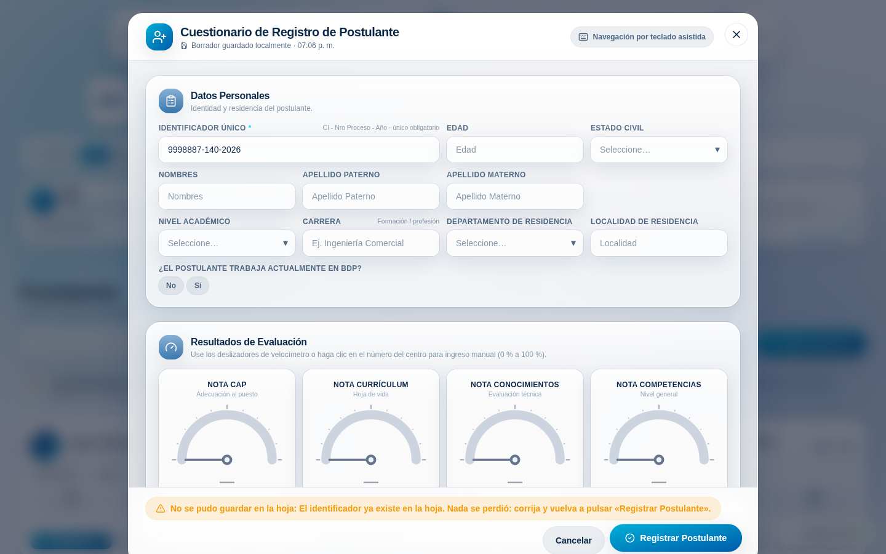
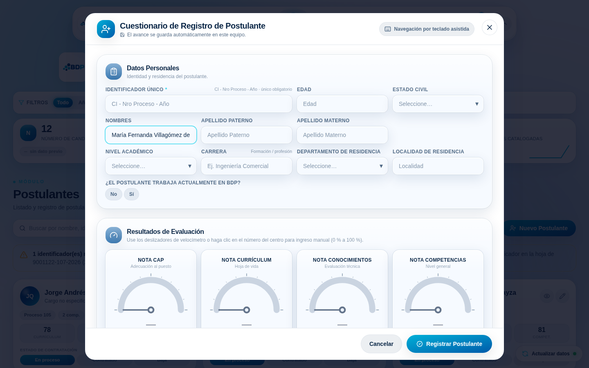
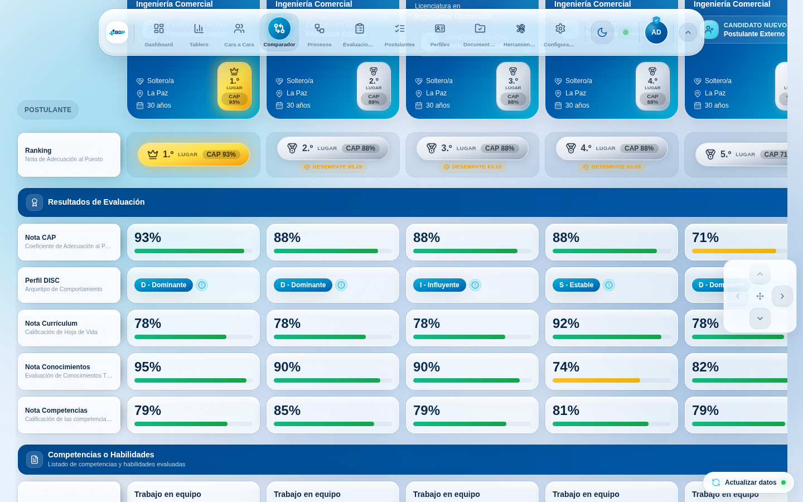
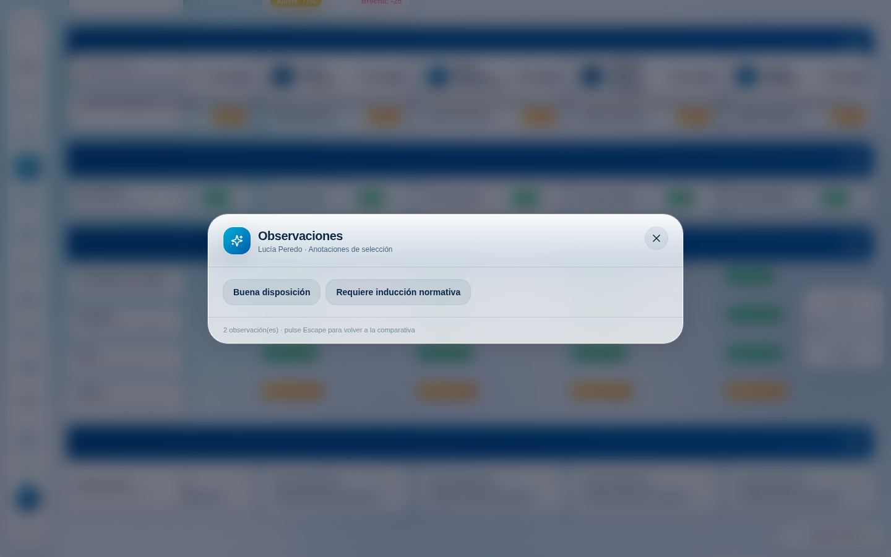
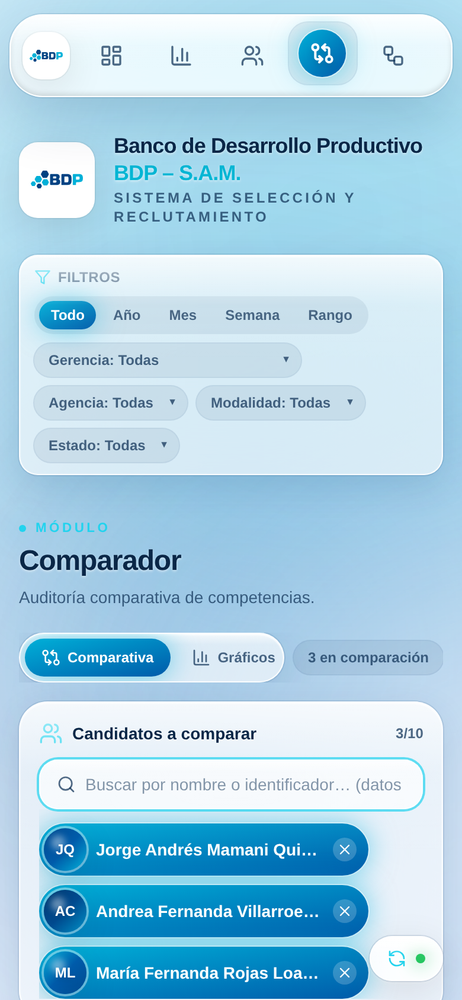
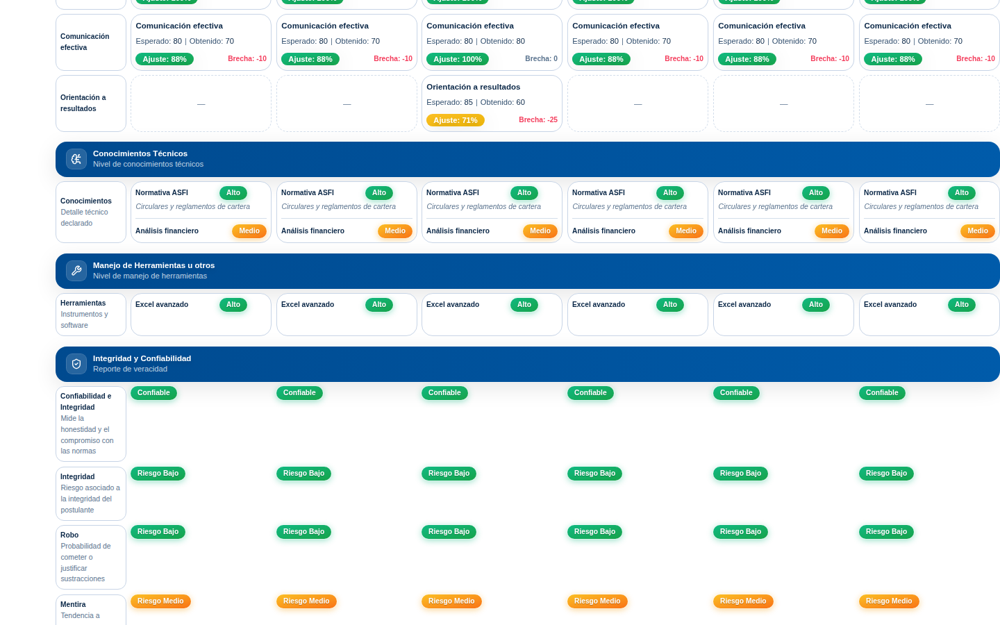

# Auditoría de estabilidad — Comparador y Postulantes

> Documento explicativo del cambio. Escrito para leerse de una vez: primero el
> sistema tal como está, después la intuición de cada corrección, después el
> código, después cómo se verificó.

---

## 1 · Contexto

### 1.1 Qué es este sistema (para quien llega hoy)

El área de Reclutamiento y Selección del BDP lleva su operación completa en esta
página: se abre la **acefalía** cuando alguien deja un cargo, se crea el
**proceso**, se registran los **postulantes** con sus puntajes, y al final un
analista pone a los mejores lado a lado en el **Comparador** para recomendar a
quién contratar.

Técnicamente es una aplicación de una sola página: **React 18 + TypeScript
estricto + Vite 5 + Tailwind**, sin servidor propio. La base de datos es una
**hoja de cálculo de Google** expuesta por un proyecto de **Google Apps Script**
publicado como aplicación web. Hay un único punto de entrada, definido en
`src/constants.ts`:

```ts
export const SCRIPT_URL =
  "https://script.google.com/macros/s/AKfycby.../exec";
```

Todo lo que la aplicación sabe entra por ahí. Un `GET` devuelve el mundo entero
—postulantes, catálogo de competencias, arquetipos DISC, auxiliares, perfiles de
cargo, espejos de procesos— y un `POST` escribe. `TalentDataProvider`
(`src/context/TalentDataContext.tsx`) es el único que habla con esa URL: obtiene,
normaliza, cachea en `localStorage` y reparte por *Context*.

> **Nota sobre el `redirect`.** Google contesta a esa URL con un `302`. Toda
> llamada tiene que llevar `{ redirect: "follow" }` o en producción falla con un
> `404`. Está así en todas las llamadas y este cambio no lo toca.

### 1.2 Las dos piezas que nos ocupan

**Postulantes** (`src/modules/ListaPostulantes.tsx` +
`src/modules/RegistrationForm.tsx`) es la puerta de entrada de los datos. El
cuestionario es un modal de unos cuarenta campos: datos personales, cuatro
velocímetros de nota, arquetipo DISC, tres constructores de listas
(conocimientos, herramientas, competencias), escalas de confiabilidad y
observaciones por etiquetas. Guarda un borrador local mientras se escribe y el
guardado es **siempre explícito** (botón o `Ctrl+Intro`).

**Comparador** (`src/modules/NuevoComparador.tsx`, 1.600 líneas) arranca vacío.
El analista agrega postulantes con un buscador *type-ahead*
(`src/components/CandidateSearchSelect.tsx`) y cada uno se convierte en una
columna de una cuadrícula CSS con la primera columna congelada. El puesto lo
decide `src/lib/comparatorRanking.ts`: mayor **Nota CAP** y, sólo ante empate
exacto, un **Índice de Desempate** ponderado (Conocimientos 40 %, Competencias
35 %, Currículum 25 %, renormalizado si falta alguna).

### 1.3 El síntoma que originó esta auditoría

Un usuario reportaba, de forma insistente y sin poder demostrarlo, dos cosas:

> «el comparador no funciona» y «en postulantes no puedo añadir postulantes»

…mientras el resto del equipo, probando en varios equipos, no reproducía nada.

Ese patrón —«sólo le pasa a una persona»— casi siempre significa una de tres
cosas: **(a)** una diferencia de hardware o navegador, **(b)** un camino de la
interfaz que sólo se recorre con determinado hábito de uso, o **(c)** un fallo
que la propia interfaz oculta. Resultó que había ejemplos de las tres.

---

## 2 · Intuición

Cinco hallazgos. Los tres primeros explican el reporte del usuario; los dos
últimos son fallos latentes que encontramos de camino.

### 2.1 El buscador del Comparador no se podía volver a abrir

Esta es la causa raíz del «el comparador no funciona», y es elegante en lo
equivocada que estaba.

Al elegir una sugerencia, el buscador hace tres cosas: agrega al postulante,
**cierra la lista** (para que la comparativa quede a la vista) y **devuelve el
foco al campo** (para poder escribir el nombre siguiente). El problema es la
combinación de las dos últimas. Para que ese foco devuelto no reabriera la lista
que se acaba de cerrar, había una bandera de un solo uso:

```ts
setOpen(false);
skipOpenOnFocus.current = true;
inputRef.current?.focus();
// …
onFocus={() => {
  if (skipOpenOnFocus.current) { skipOpenOnFocus.current = false; return; }
  setOpen(true);
}}
```

Falla por dos motivos encadenados:

1. Hacer clic en una sugerencia (un `<button>` dentro del portal) **ya había
   quitado** el foco del campo. Así que ese `focus()` dispara `onFocus`
   inmediatamente y **se come la bandera** en el mismo instante.
2. A partir de ahí el campo se queda enfocado. Y **un clic sobre un campo que ya
   tiene el foco no emite ningún evento `focus`**. `setOpen(true)` no volvía a
   ejecutarse nunca. La lista quedaba muerta.

Ahora viene la parte que explica por qué «sólo le pasaba a él». Hay dos maneras
de usar ese buscador:

| Hábito | Qué ocurría |
| --- | --- |
| Escribir el nombre y elegir | **Funcionaba**: `onChange` abría la lista |
| Hacer clic y elegir de la lista | **Se quedaba en un solo candidato** |

Con una base de unas decenas de personas, hacer clic y elegir de la lista es lo
natural: no hace falta escribir nada. Quien tenía ese hábito veía un comparador
roto; quien escribía, no veía nada raro. Medido con un guion idéntico en los dos
builds, con el ratón solamente:

```
antes:   agregados=1, sugerencias visibles=0
después: agregados=5, sugerencias visibles=7
```





La corrección no es reforzar la bandera, es dejar de depender de un solo evento:

- la lista se abre desde `pointerdown`, `click`, `focus` y las teclas de
  navegación (todas idempotentes);
- la bandera **sólo se arma cuando el `focus()` programático va a producir de
  verdad un evento** (es decir, cuando el campo había perdido el foco), y
  cualquier gesto posterior la limpia. Ya no puede quedarse pegada.

### 2.2 Un identificador repetido borraba a una persona del sistema

El `id` de un postulante se tomaba tal cual del **Identificador Único** de la
hoja:

```ts
id: ident || `cand-${index}`,
```

Ese identificador tiene la forma `CI - Nro Proceso - Año` y **lo teclea una
persona**. Se repite: alguien vuelve a registrar al mismo postulante, o dos
analistas escriben el mismo CI. Cuando eso pasa, dos registros distintos
comparten `id` y el sistema se rompe en cuatro sitios a la vez:

1. React avisa `Encountered two children with the same key` —lo capturamos en la
   consola del navegador— y se reserva el derecho de **omitir o duplicar**
   tarjetas de la lista.
2. El buscador excluye de las sugerencias a los ya elegidos comparando `id`. Al
   agregar al primero, **el segundo desaparecía de la lista para siempre**.
3. `candidatos.find(c => c.id === id)` —que usan el comparador, el visor de
   perfil y el modal de edición— devolvía siempre el primero: se abría o se
   **editaba a la persona equivocada**.
4. `hiringStore` guardaba un solo registro de estado para las dos personas.

La corrección tiene dos mitades, y las dos importan:

- **Aguas abajo**, `normaliseCandidates` garantiza unicidad. La primera aparición
  conserva el identificador como `id` —así las comparaciones ya guardadas en la
  sesión siguen resolviéndose— y las siguientes reciben `#2`, `#3`…
- **Aguas arriba**, el cuestionario **impide crear el duplicado**: antes de
  enviar comprueba si la clave ya existe y dice de quién es. Es donde nacen los
  duplicados y es donde tiene sentido cortarlos.

Y como en la hoja ya puede haber duplicados de antes, el módulo los denuncia en
lugar de disimularlos:



### 2.3 «Registro postulantes y no se guardan»

Este es el más grave, y era invisible por diseño:

```ts
await fetch(SCRIPT_URL, { method: "POST", /* … */ });
setRaw((prev) => [candidate, ...prev]);
return { ok: true, message: "Postulante registrado correctamente." };
```

`fetch` sólo rechaza cuando **la red** falla. Un `500` de Apps Script, una cuota
agotada, un `302` a la pantalla de acceso de Google o el propio
`{status:"error"}` que el script devuelve cuando no pudo escribir la fila: todos
llegan aquí como éxito. La secuencia completa era:

1. cartel verde «Postulante registrado correctamente»;
2. `clearDraft()` **borra el borrador** —el único respaldo de lo escrito—;
3. `resetForm()` vacía el cuestionario y el modal se cierra;
4. la fila optimista se muestra… hasta el siguiente refresco en segundo plano
   (cada 60 s, o al volver a la pestaña), que la hace desaparecer.

El analista ve una confirmación, cierra, y media hora después el postulante no
está. Eso es literalmente «no puedo añadir postulantes».

Ahora se comprueban las dos señales que el backend puede dar —el código HTTP y
el sobre `{status, message}` que el resto del código ya honraba— y el fallo se
cuenta tal cual, con el motivo del servidor, **sin cerrar el cuestionario ni
borrar el borrador**:



Un detalle que costó una segunda iteración: al principio manteníamos la inserción
optimista también en el camino de error. Eso creaba una fila fantasma que, además
de mentir, hacía que **el propio reintento** chocara contra la nueva comprobación
de identificador repetido. Un alta fallida ahora no toca la base local: nada se
pierde, porque el cuestionario sigue lleno y el borrador sigue guardado.

### 2.4 La página podía quedarse sin desplazamiento, para siempre

Nueve superficies distintas —el modal, el visor de perfil, el visor ampliado del
comparador, el expediente, el panel de herramientas…— congelaban el
desplazamiento con el mismo patrón:

```ts
const previo = document.body.style.overflow;
document.body.style.overflow = "hidden";
return () => { document.body.style.overflow = previo; };
```

Ese patrón sólo es correcto si nunca hay dos superficies solapadas. En cuanto la
segunda se abre encima de la primera guarda `"hidden"` como su valor «anterior»
y, al cerrarse, lo **restaura**: la página se queda sin desplazamiento y no hay
forma de recuperarlo salvo recargar. El camino más corto para provocarlo existe
en los dos módulos auditados: abrir el perfil de un postulante y, desde dentro,
pulsar **Editar**.

Se reemplazan los nueve por un **contador de referencias** (`lib/scrollLock.ts`):
el valor original se guarda al pasar de 0 a 1 y se restaura sólo al volver a 0, y
cada liberación es idempotente.

De paso apareció un segundo defecto en `Modal`: su efecto dependía de
`onRequestClose`, que en el cuestionario cambia de identidad en cada dibujado. El
efecto se desmontaba y se volvía a montar **en cada pulsación de tecla**,
reescribiendo `body.style.overflow` y forzando un recálculo de estilo de todo el
documento por letra escrita. Ahora depende sólo de `open`.

### 2.5 Y el «va pesado en su computadora»: sí, era real, y no era React

Aquí conviene mirar los números en lugar de opinar. Medimos el retardo entre
pulsar una tecla en el cuestionario y ver la letra en pantalla:

| Qué se mide | Tiempo por tecla |
| --- | --- |
| Trabajo de JavaScript (React) | **1,2 ms** |
| Hasta que la letra aparece | **141 ms** |
| Lo mismo, con `backdrop-filter` apagado | **75 ms** |
| Lo mismo, además sin animaciones | **43 ms** |

React cuesta **el 0,8 %** del total: el trabajo de memorización que ya había en
el módulo está bien hecho. El otro 99 % es el navegador **componiendo vidrio**.
El panel del modal difumina 40 px sobre un área de casi toda la ventana en cada
dibujado; cuando el equipo no acelera ese filtro por hardware —una GPU integrada
antigua, un controlador que Chrome pone en su lista negra, una sesión de
escritorio remoto— ese trabajo cae en la CPU.

**Eso explica el «sólo en su computadora» sin culpar a nadie**: depende del
hardware y del controlador, no del código ni del usuario.

Así que el sistema gana un modo **«Vidrio ligero»** en *Configuración →
Apariencia y rendimiento*, que cambia el desenfoque por un color sólido. Medido
de punta a punta en el mismo build:

```
vidrio completo (por omisión): 150,7 ms por tecla   (p95 289 ms)
vidrio ligero:                  30,2 ms por tecla   (p95  39 ms)
mejora: 4,99×
```

Se conserva el color, el borde, la sombra y el reflejo, así que el sistema sigue
siendo reconocible; se pierde la refracción. También se activa solo si el sistema
operativo pide menos transparencia, y el preajuste **«Modo ligero»** ya existente
ahora lo incluye.



### 2.6 Y si nada de lo anterior fuera el caso

Queda una cuarta posibilidad que el código no puede descartar: que
`script.google.com` esté bloqueado en ese equipo (proxy corporativo, antivirus
con inspección TLS, una extensión). El síntoma es inconfundible y ahora se
nombra: la aplicación mostraba «Failed to fetch», que no dice nada a nadie. Ahora
dice **«no hay conexión con Google (revise su red, proxy o antivirus)»**.

---

## 3 · El código

### 3.1 Buscador del Comparador — `src/components/CandidateSearchSelect.tsx`

```diff
-  const skipOpenOnFocus = useRef(false);
+  const ignoreNextFocus = useRef(false);

+  /** Abre la lista por una acción deliberada. Desarma la bandera. */
+  const openList = useCallback(() => {
+    ignoreNextFocus.current = false;
+    setOpen(true);
+  }, []);
+
+  /** El foco puede llegar solo (tras agregar); ahí sí hay que discriminar. */
+  const onFocus = useCallback(() => {
+    if (ignoreNextFocus.current) { ignoreNextFocus.current = false; return; }
+    setOpen(true);
+  }, []);

   function choose(c: Candidate) {
     setOpen(false);
-    skipOpenOnFocus.current = true;
-    inputRef.current?.focus();
+    const input = inputRef.current;
+    // Sólo se arma si ese focus() va a emitir un evento de verdad.
+    if (input && document.activeElement !== input) ignoreNextFocus.current = true;
+    input?.focus();
   }
```

Y en el campo, tres vías redundantes a propósito:

```diff
-  disabled={full}
-  onFocus={() => { /* bandera de un solo uso */ }}
+  onPointerDown={openList}   // clic sobre un campo YA enfocado
+  onClick={openList}         // teclados en pantalla sin eventos de puntero
+  onFocus={onFocus}          // llegada por teclado
```

El `disabled` desaparece a propósito. Al llegar al máximo de columnas el campo
quedaba muerto y el único aviso era un *placeholder* atenuado que nadie lee; eso
también se leía como «el buscador dejó de funcionar». Ahora el campo sigue vivo y
un panel explica qué pasó y cómo seguir:

> Ya hay **10** postulantes en la comparación, el máximo configurado. Quite a
> alguien con su ✕ o amplíe el límite en **Configuración → Evaluación y
> comparador**.

### 3.2 Unicidad de los postulantes — `src/lib/candidates.ts`

```ts
export function normaliseCandidates(list: RawCandidate[]): Candidate[] {
  const seen = new Map<string, number>();
  return list.map((raw, index) => {
    const candidate = normaliseCandidate(raw, index);
    const previous = seen.get(candidate.id) ?? 0;
    seen.set(candidate.id, previous + 1);
    if (previous === 0) return candidate;
    return { ...candidate, id: `${candidate.id}#${previous + 1}`, duplicado: true };
  });
}
```

Tres decisiones deliberadas:

- **La primera aparición no cambia de `id`.** Las comparaciones guardadas en
  `sessionStorage` siguen resolviéndose al recargar.
- **`identificador` no se toca.** Es la clave con la que el backend localiza la
  fila; alterarla rompería el guardado.
- **`duplicado: true`** deja que la interfaz lo diga en vez de disimularlo.

Y el corte en el origen, en `RegistrationForm.save()`:

```ts
if (!isEdit) {
  const clave = form.identificador.trim().toLowerCase();
  const existente = candidatos.find(
    (c) => asText(c.identificador).toLowerCase() === clave,
  );
  if (existente) {
    setFeedback({
      kind: "warn",
      message: `Ya existe un postulante con ese identificador: ${existente.fullName}. Use «Editar» sobre su ficha o corrija el identificador.`,
    });
    identificadorRef.current?.focus();
    return;
  }
}
```

### 3.3 Verificación del guardado — `src/context/TalentDataContext.tsx`

Un solo punto de escritura, compartido por el alta y la edición:

```ts
const postCandidate = useCallback(async (body: Record<string, unknown>) => {
  const res = await fetch(SCRIPT_URL, {
    method: "POST",
    redirect: "follow",
    headers: { "Content-Type": "text/plain;charset=utf-8" },
    body: JSON.stringify(body),
  });
  if (!res.ok) throw new Error(`El servidor respondió HTTP ${res.status}.`);
  const text = await res.text().catch(() => "");
  let envelope: { status?: string; message?: string } = {};
  try {
    envelope = text ? JSON.parse(text) : {};
  } catch {
    /* texto plano: los despliegues antiguos del script no devuelven JSON */
  }
  if (envelope.status && envelope.status !== "success") {
    throw new Error(envelope.message || "El servidor rechazó la operación.");
  }
}, []);
```

Lo importante de este bloque es lo que **no** hace: un cuerpo que no es JSON no
se considera un fallo. Hay despliegues del script que contestan texto plano y
seguirían funcionando; endurecer eso habría roto una instalación que hoy va bien
para arreglar una que va mal.

### 3.4 Bloqueo de desplazamiento — `src/lib/scrollLock.ts`

```ts
let depth = 0;
let previousOverflow = "";

export function lockBodyScroll(): () => void {
  if (typeof document === "undefined") return () => {};
  if (depth === 0) {
    previousOverflow = document.body.style.overflow;
    document.body.style.overflow = "hidden";
  }
  depth += 1;
  let released = false;
  return () => {
    if (released) return;      // idempotente: un efecto que se repite no descompensa
    released = true;
    depth = Math.max(0, depth - 1);
    if (depth === 0) document.body.style.overflow = previousOverflow;
  };
}
```

Se consume con un hook de una línea, `useBodyScrollLock(activo)`, y sustituye a
las nueve copias del patrón anterior.

### 3.5 Modo «Vidrio ligero» — `src/index.css` + `configStore` + `App.tsx`

```css
.reduce-transparency .glass,
.reduce-transparency .glass-heavy,
.reduce-transparency [class*="backdrop-blur"] {
  backdrop-filter: none !important;
  -webkit-backdrop-filter: none !important;
}
/* Sin desenfoque detrás, un fondo al 10 % deja ver el texto de abajo. */
.reduce-transparency.dark  { --glass-bg: #12233d; --glass-bg-heavy: #162946; }
.reduce-transparency.light { --glass-bg: #f6faff; --glass-bg-heavy: #ffffff; }
```

```ts
const flatGlass = reduceTransparency || prefersReducedTransparency;
useEffect(() => {
  document.documentElement.classList.toggle("reduce-transparency", flatGlass);
}, [flatGlass]);
```

### 3.6 Correcciones menores encontradas de camino

| Dónde | Qué estaba mal |
| --- | --- |
| `NuevoComparador` | La columna de rótulos era `0.8fr`: con uno o dos candidatos crecía a ~600 px y empujaba las tarjetas al borde. Ahora tiene techo fijo (`224px` / `168px` en compacto). |
| `NuevoComparador` | El d-pad flotante se montaba con >4 candidatos aunque no hubiera nada que desplazar, capturaba clics del buscador que quedaba debajo y tapaba la última columna. Ahora sólo aparece si hay desborde real, no intercepta el puntero y en reposo es translúcido. |
| `comparator-motion.css` | `.cmp-strip-scroll` estaba en el marcado pero **no existía en ninguna hoja**: la tira congelada no tenía fondo y las filas se leían a través de los chips. |
| `GaugeInput` | El puntero se mapeaba con un `viewBox` de alto 120 sobre un `<svg>` de alto 116: ~3 % de sesgo al arrastrar la aguja. |
| `configStore` | La «migración» reescribía a 10 cualquier `maxComparador` igual a 5, así que quien elegía 5 lo perdía en cada recarga. Ahora se sanea (recorte al rango válido) en lugar de sobreescribir; se saneen también el umbral CAP y el intervalo de refresco. |
| `shared/hooks` | `useMediaQuery` comprobaba `"matchMedia" in window`, no que fuera invocable. En un entorno donde la propiedad existe pero no es una función, tiraba el árbol de React entero. También se admite la API antigua `addListener` (Safari < 14). |
| `README.md` | Documentaba `npm run check` y `npm run visual-qa` (no existen) y enlazaba a `docs/evaluations/`, `apps-script/evaluations/` y `docs/backend/` (tampoco). Corregido y verificado: los 10 enlaces relativos del README existen. |

### 3.7 Despliegue

- **`vercel.json`** nuevo y explícito: `framework: vite`, `npm ci`, salida en
  `dist`, reescritura al `index.html` para cualquier ruta que no sea `/assets/…`,
  y cabeceras de caché (inmutable para los activos con huella, `no-cache` para el
  HTML). Antes el despliegue dependía de la autodetección.
- **`vite.config.ts`**: `manualChunks` separa React y Framer Motion, que cambian
  mucho menos que nuestro código y así se cachean entre despliegues. `lucide-react`
  **no** se separa a propósito: nombrarlo desactiva el sacudido de árbol y
  empaqueta los ~1.500 iconos de la biblioteca (777 kB) en lugar de los que se
  usan. Lo comprobamos midiendo.
- **`tsconfig.node.json`** incluye ahora los tipos del DOM, que es lo que
  `vitest.setup.ts` necesita: sin eso, `tsc -b` fallaba y con él el `npm run
  build` de Vercel.

---

## 4 · Verificación

### 4.1 Lo automático

```
tsc -b --noEmit          sin errores
npm test                 294 pruebas en 23 archivos, todas en verde (+35 nuevas)
npm run build            correcto
npm run backend:check    ✅ Todo en orden
npm run doc:check        8 comprobaciones superadas
```

Las 35 pruebas nuevas cubren cada fallo:

| Archivo | Qué fija |
| --- | --- |
| `components/CandidateSearchSelect.test.tsx` | La lista se reabre al hacer clic tras agregar; se pueden agregar cinco seguidos sólo con el ratón; las dos fichas con identificador repetido son seleccionables; el límite se explica en vez de dejar el campo muerto. |
| `lib/candidates.test.ts` | Unicidad de `id` con claves repetidas y con claves vacías; `identificador` intacto; recuento de duplicados. |
| `lib/scrollLock.test.ts` | Dos superficies solapadas; liberación doble; orden de cierre arbitrario. |
| `context/TalentDataContext.test.tsx` | `{status:"error"}`, HTTP 500 y caída de red se reportan como fallo; texto plano y respuesta vacía siguen siendo éxito; un alta fallida no deja fila fantasma. |
| `modules/RegistrationForm.test.tsx` | Identificador ya usado: no se envía y se dice de quién es; comparación insensible a mayúsculas y espacios; en edición no estorba su propia clave. |

**Las pruebas se validaron contra el fallo.** Al revertir sólo la corrección del
buscador (dejando la lista abriéndose únicamente desde `onFocus`), dos de las
ocho pruebas fallan; al restaurarla, las ocho pasan. Una prueba de regresión que
no falla con el código antiguo no está probando nada.

### 4.2 Lo manual, en un navegador real

Se levantó un arnés con Chromium 141 sirviendo el **build de producción** y con
el endpoint de Google interceptado por un doble determinista. El juego de datos
imita a propósito la realidad sucia de la hoja: números donde la interfaz espera
texto, notas vacías, decimales con coma, competencias como texto plano, nombres
larguísimos, un identificador **vacío** y **dos personas distintas con el mismo
identificador**.

**24 comprobaciones de extremo a extremo, todas en verde**, entre ellas: agregar
seis postulantes sólo con clics; las dos fichas duplicadas seleccionables; la
columna de rótulos acotada; ranking con desempate; el visor ampliado bloqueando y
liberando el desplazamiento; perfil + edición apilados y cerrados en el orden que
antes congelaba la página; el alta rechazada por la hoja mostrando el motivo y
manteniendo el cuestionario abierto; el reintento saliendo bien; el recorrido de
los diez módulos sin pantallas en blanco; la etiqueta de observaciones a medio
escribir guardándose al pulsar «Registrar»; la impresión ocultando el cromo y
cabiendo a lo ancho; y **móvil táctil** (390×844) agregando tres postulantes a
toques.

La consola del navegador termina la sesión **sin un solo error ni advertencia**.
Antes aparecía el `Encountered two children with the same key`.









### 4.3 Cómo comprobarlo a mano, paso a paso

**A · El fallo del buscador (2 minutos).**

1. Abra **Comparador**.
2. Haga clic en «Buscar por nombre o identificador…». Se abre la lista.
3. Elija a cualquiera **haciendo clic en la sugerencia** (no escriba nada).
4. Vuelva a hacer clic en el mismo campo. **La lista debe abrirse otra vez.**
5. Repita hasta cinco postulantes sin escribir nunca.

**B · El identificador repetido.**

1. Abra **Postulantes** → **Nuevo Postulante**.
2. En «Identificador Único» escriba uno que ya exista y pulse **Registrar
   Postulante**. Debe aparecer, en ámbar, el nombre de quien ya lo usa, y **no**
   debe salir ninguna petición.
3. Si la hoja ya trae duplicados, arriba del listado hay un aviso con las claves
   afectadas y las fichas involucradas llevan el distintivo «ID repetido».

**C · El guardado que miente.**

1. Con el cuestionario lleno, desconecte la red (o bloquee `script.google.com`).
2. Pulse **Registrar Postulante**. Debe aparecer «No se pudo guardar en la hoja:
   no hay conexión con Google (revise su red, proxy o antivirus)», el
   cuestionario **debe seguir abierto** y nada debe haberse borrado.
3. Reconecte y vuelva a pulsar. Ahora sí confirma y cierra.

**D · El desplazamiento bloqueado.**

1. En **Comparador** o **Postulantes**, abra el perfil de alguien (el ojo).
2. Desde dentro del perfil, pulse **Editar**.
3. Cierre la edición y después el perfil. **La página debe volver a
   desplazarse.** Antes se quedaba congelada hasta recargar.

**E · Para el equipo que va pesado.**

1. **Configuración → Apariencia y rendimiento**.
2. Active **«Vidrio ligero (sin desenfoque de fondo)»**, o pulse directamente
   **«Modo ligero»**, que ahora lo incluye.
3. Escriba en el cuestionario: la diferencia se nota con las manos, y está medida
   en ~5×.

---

## 5 · Alternativas consideradas

### 5.1 Para el buscador: ventana de tiempo en lugar de bandera condicional

La primera versión de la corrección suprimía la apertura durante 250 ms tras
agregar. Funcionaba en el navegador, pero:

| A favor | En contra |
| --- | --- |
| Una sola línea, sin razonar sobre el foco | 250 ms de campo muerto tras cada alta |
| Imposible que la bandera «se quede pegada» | Depende del reloj: la prueba de regresión, que corre en milisegundos, fallaba |
|  | Frágil ante un usuario rápido o un equipo lento |

Se descartó. La versión final —armar la bandera **sólo si el `focus()` va a
emitir de verdad**— es determinista y no tiene ventana muerta. Que la prueba
obligara a mejorar el diseño es, precisamente, para lo que sirven las pruebas.

### 5.2 Para el `id`: usar el índice de fila, o un hash del registro

| A favor | En contra |
| --- | --- |
| Unicidad garantizada sin sufijos | El índice cambia al insertar o borrar filas: las comparaciones guardadas en la sesión apuntarían a otra persona |
| El hash es estable frente al orden | El hash cambia en cuanto se **edita** al postulante, y toda referencia guardada se rompe |

El sufijo `#2` conserva la estabilidad del caso normal —que es el 99 % de las
filas— y sólo desvía las colisiones. Es la opción que menos cambia el
comportamiento existente.

### 5.3 Para el rendimiento: dividir los módulos en paquetes diferidos

Se planteó cargar en diferido también Dashboard, Comparador, Documentación y
Perfiles (hoy sólo lo hacen Procesos y Evaluaciones).

| A favor | En contra |
| --- | --- |
| El paquete de entrada bajaría de ~744 kB | El cuello de botella medido **no es la descarga, es la composición del vidrio**: no arregla el problema reportado |
| Menos memoria en equipos modestos | Exige fronteras de `Suspense` nuevas en el enrutado, con riesgo real de pantallas en blanco |

Se descartó para este cambio: el objetivo era estabilidad, y el modo «Vidrio
ligero» resuelve el síntoma con 5× de mejora medida y una superficie de riesgo
muy inferior. Queda anotado como trabajo separado.

---

## 6 · Personas con quienes conviene hablar

El historial de estos archivos tiene un solo autor (`AlexD5427`) en todas las
confirmaciones recientes, así que no hay más contexto humano que repartir. Aun
así, dos conversaciones valen la pena antes de fusionar:

- **Con el usuario que reportaba el fallo.** Es la única persona que puede
  confirmar el punto 2.1: pregúntele si agrega postulantes **haciendo clic en la
  lista** en vez de escribiendo. Si dice que sí, el caso está cerrado y no estaba
  mintiendo. Pídale también que active **«Vidrio ligero»** y que diga si la
  escritura mejora.
- **Con quien administra la hoja de cálculo.** Los identificadores repetidos ya
  existentes hay que limpiarlos **en la hoja**: la aplicación ahora los detecta y
  los muestra, pero no puede decidir cuál de los dos registros es el bueno. Y
  mientras se repitan, una edición se escribe sobre la primera fila que coincida
  —esa parte vive en el Apps Script, que no está en este repositorio.

---

## 7 · Cuestionario

<details>
<summary><strong>1.</strong> ¿Por qué el fallo del buscador del Comparador sólo lo reportaba una parte del equipo?</summary>

- **a)** Porque dependía del navegador: fallaba en Firefox y no en Chrome.
- **b)** ✅ **Porque dependía del hábito de uso: la lista se reabría al *escribir* (`onChange`) pero no al *hacer clic* en un campo ya enfocado, que no emite `focus`.**
- **c)** Porque sólo ocurría con más de diez postulantes en la base.
- **d)** Porque la caché de `localStorage` de ese usuario estaba corrupta.

**a** es incorrecta: es comportamiento estándar del DOM en todos los navegadores.
**c** es incorrecta: ocurre desde el primer postulante agregado.
**d** es incorrecta: no interviene ningún almacenamiento en este camino.
**b** es la clave del caso: quien tecleaba el nombre nunca veía el fallo, y quien
elegía de la lista se quedaba con un solo candidato.
</details>

<details>
<summary><strong>2.</strong> ¿Por qué `normaliseCandidates` deja el `id` de la primera aparición sin sufijo, en lugar de numerar todas (`clave#1`, `clave#2`)?</summary>

- **a)** Por ahorrar caracteres en el `sessionStorage`.
- **b)** Porque el backend rechaza los identificadores con `#`.
- **c)** ✅ **Porque el comparador guarda los `id` elegidos en `sessionStorage`; numerar todas invalidaría cualquier comparación guardada al recargar la pestaña.**
- **d)** Porque React exige que la primera clave de una lista sea estable.

**a** es trivial y no fue el motivo. **b** es incorrecta: el `id` nunca viaja al
backend, lo que viaja es `identificador`, que no se toca. **d** no existe como
regla. **c** es el motivo: el caso normal —una clave que no se repite— conserva
exactamente el `id` que tenía antes del cambio.
</details>

<details>
<summary><strong>3.</strong> `postCandidate` trata una respuesta que **no** es JSON como éxito. ¿Por qué no se endurece y se exige el sobre `{status:"success"}`?</summary>

- **a)** Porque `JSON.parse` es lento y conviene evitarlo.
- **b)** ✅ **Porque hay despliegues del Apps Script que contestan texto plano; exigir JSON rompería una instalación que hoy funciona para arreglar una que no.**
- **c)** Porque Apps Script nunca devuelve JSON en un `POST`.
- **d)** Porque el `redirect: "follow"` impide leer el cuerpo.

**a** es irrelevante a esta escala. **c** es falso: el script sí devuelve
`{status, message}`, y `postPerfilCargo` ya lo honraba. **d** es falso. **b** es
el razonamiento: el fallo que se corrige es *no detectar* los rechazos
explícitos, no *exigir* un formato que quizá no esté desplegado todavía.
</details>

<details>
<summary><strong>4.</strong> El patrón antiguo de bloqueo del desplazamiento (`guardar el previo` / `restaurar el previo`) es correcto con una sola superficie. ¿Qué exactamente lo rompe con dos?</summary>

- **a)** Que React ejecuta los efectos de limpieza en orden aleatorio.
- **b)** Que `document.body.style.overflow` no se puede escribir desde un portal.
- **c)** ✅ **Que la segunda superficie guarda `"hidden"` como su valor «anterior» y al cerrarse lo restaura, dejando la página bloqueada aunque ya no haya nada abierto.**
- **d)** Que `overflow: hidden` no se hereda a los hijos con `position: fixed`.

**a** es falso: la limpieza sigue un orden definido, y el problema aparece igual
en el orden más natural. **b** y **d** son falsos. **c** es el fallo: el valor
«anterior» que la de arriba captura ya está contaminado por la de abajo. Por eso
la solución es un contador, no un orden de cierre.
</details>

<details>
<summary><strong>5.</strong> Se midió 1,2 ms de JavaScript y 141 ms hasta que la letra aparece. ¿Qué conclusión se sigue, y cuál **no**?</summary>

- **a)** Que hay que memorizar más componentes del cuestionario.
- **b)** Que conviene dividir el paquete en más trozos diferidos.
- **c)** ✅ **Que el coste está en la composición del navegador (`backdrop-filter`), no en React; y que por tanto la palanca útil es apagar el desenfoque, no optimizar más el árbol.**
- **d)** Que la máquina de pruebas es demasiado lenta y la medición no sirve.

**a** atacaría el 0,8 % del total: es la trampa clásica de optimizar lo que se
sabe medir en lugar de lo que domina. **b** no toca el retardo por tecla, que
ocurre mucho después de la descarga. **d** es tentador, pero el desglose (141 →
75 → 43 ms al ir apagando efectos) aísla la causa **dentro de la misma máquina**,
así que la comparación es válida — y además reproduce con fidelidad el escenario
de un equipo sin aceleración por hardware, que es el caso reportado. **c** es la
lectura correcta, y es la que orientó la corrección.
</details>
