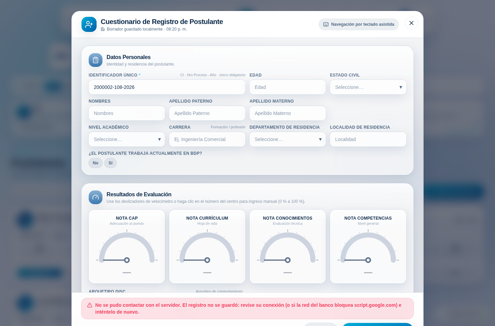
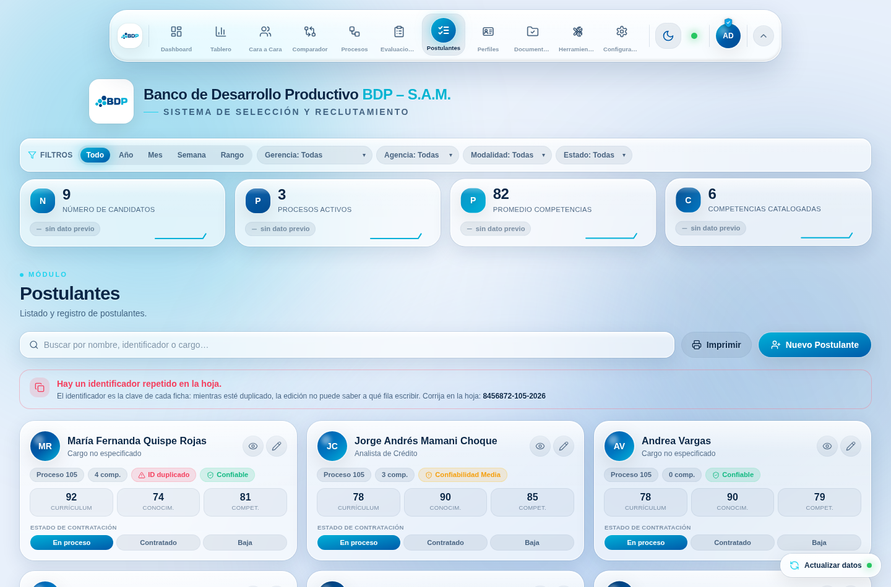
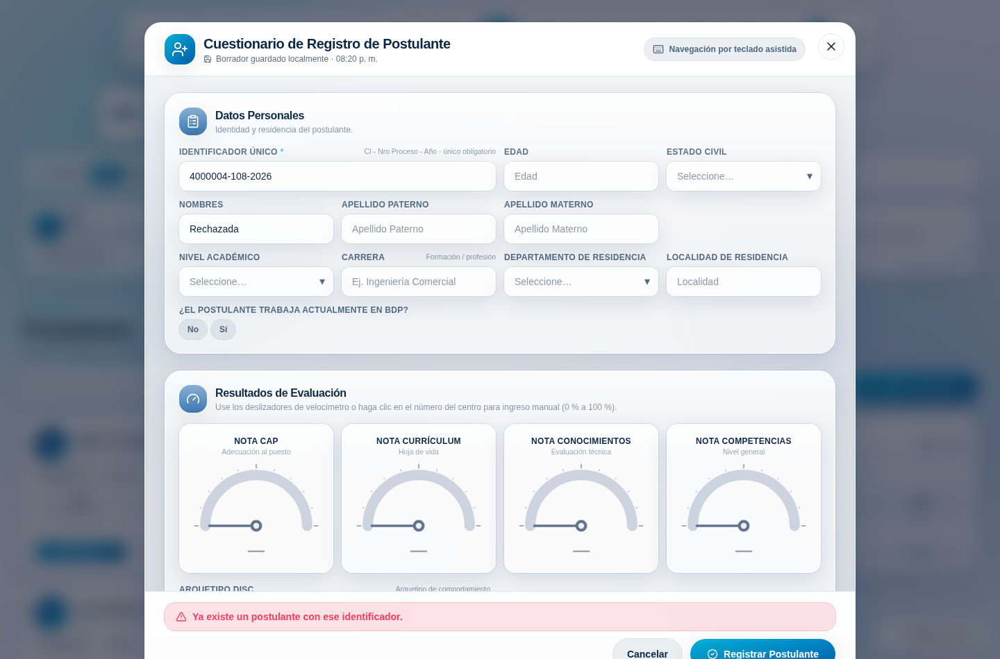
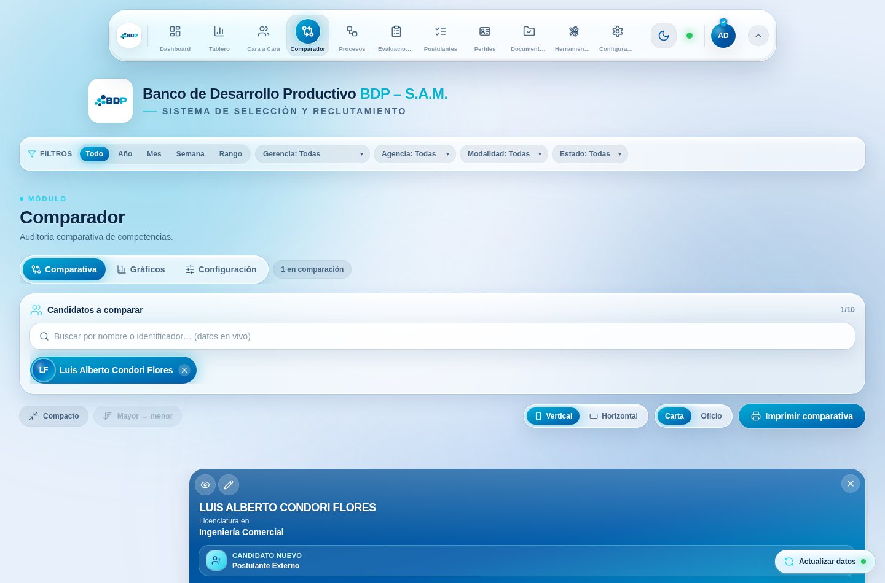
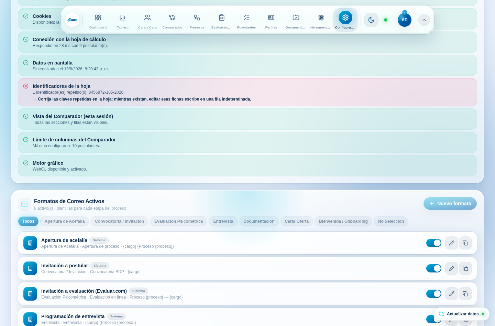

# Auditoría de estabilidad — Comparador y Postulantes

> [!NOTE]
> Este documento explica, de arriba abajo, qué se revisó, qué estaba roto y cómo
> quedó. Está escrito para leerse sin haber visto antes el código. Si ya conoce el
> sistema, puede saltar directamente a [Intuición](#intuición).

El punto de partida no fue un error en la consola, sino una frase: *«un usuario
siempre dice que el comparador no funciona, o que en Postulantes no puede añadir
postulantes»*. Todos los demás equipos funcionaban. Esa asimetría es la pista más
valiosa que puede dar un reporte, porque acota el problema a las tres cosas que
cambian de una máquina a otra: **la respuesta que da el servidor a ese equipo**,
**los datos que ese equipo tiene delante** y **lo que su navegador le permite
hacer**.

La auditoría encontró fallos reales en las tres. Ninguno se manifestaba como una
pantalla roja; los tres se manifestaban como *«a mí no me funciona»*.

---

## Contexto

### Lo básico (sáltelo si ya conoce el sistema)

La aplicación es un frontend de React sin servidor propio. Todo su estado
persistente vive en un libro de Google Sheets, y el puente es un **único
despliegue de Google Apps Script** cuya URL está en `src/constants.ts`:

```ts
export const SCRIPT_URL =
  "https://script.google.com/macros/s/AKfycby.../exec";
```

De ahí salen dos caminos, y conviene tenerlos separados en la cabeza:

| Camino | Cómo viaja | Quién lo usa |
| ------ | ---------- | ------------ |
| **Lectura** | `GET` → un JSON con todo (`candidatos`, `competencias`, `arquetipos_disc`, `auxiliares`, `perfiles`, `perfiles_cargo`, `espejo_*`) | `TalentDataProvider`, una sola vez, y lo reparte a todos los módulos |
| **Escritura** | `POST` con cuerpo `text/plain` | Alta y edición de postulantes, perfiles de cargo, bitácora, estado de contratación |

Dos detalles del transporte que parecen manías y no lo son:

- `redirect: "follow"` es **obligatorio**. Google responde con un `302` hacia
  `script.googleusercontent.com`; sin seguirlo, producción (Vercel) devuelve 404.
- El cuerpo va como `text/plain` a propósito. Con `application/json` el navegador
  dispara una petición `OPTIONS` de CORS que un despliegue estándar de Apps
  Script no sabe responder.

El proveedor de datos aplica *stale-while-revalidate*: al arrancar pinta lo que
haya en la caché de `localStorage` (`bdp-talent-cache`) y refresca por detrás.
Eso es lo que hace que la aplicación abra al instante… y también, como veremos,
lo que le permitía **aparentar estar viva estando desconectada**.

Sobre esa base, los dos módulos auditados:

- **Postulantes** (`src/modules/ListaPostulantes.tsx` + `RegistrationForm.tsx`):
  la lista de fichas y el cuestionario de registro de ~40 campos, con
  autoguardado del borrador y recuperación ante caídas.
- **Comparador** (`src/modules/NuevoComparador.tsx`): la tabla comparativa por
  mérito, sus gráficos y sus ajustes de sesión.

### El detalle que lo explica casi todo: `Candidate.id`

Cada fila de la hoja se normaliza a un objeto `Candidate`. Ese objeto lleva un
campo `id` que es **la identidad de la persona para toda la aplicación**: la
clave de React en las listas, el argumento de «Ver perfil» y «Editar», lo que el
Comparador guarda como «postulantes en comparación», y la clave del estado de
contratación. Antes se calculaba así:

```ts
id: ident || `cand-${index}`,   // ident = identificador de la hoja
```

Es decir: **el identificador de la hoja era la identidad**. Y el identificador lo
escribe una persona a mano, con el formato `CI - Nro Proceso - Año`.

---

## Intuición

Los tres fallos de fondo son tres suposiciones que el código daba por ciertas y
que la realidad no respeta.

### 1. «Si el `fetch` no lanza, se guardó»

El alta de un postulante hacía esto:

```ts
await fetch(SCRIPT_URL, { method: "POST", body: JSON.stringify(candidate) });
setRaw((prev) => [candidate, ...prev]);
return { ok: true, message: "Postulante registrado correctamente." };
```

No hay ningún `if`. **Nadie miraba la respuesta.** Con eso, el aviso verde de
«registrado correctamente» aparecía siempre; el cuestionario se cerraba, borraba
el borrador local y añadía la ficha a la lista. Segundos después, el refresco en
segundo plano traía la hoja real —sin esa fila— y la ficha desaparecía.

Apps Script tiene al menos cuatro formas de decir «no», y las cuatro pasaban por
buenas:

| Lo que pasó de verdad | Lo que respondía Google | Lo que veía la analista |
| --- | --- | --- |
| La hoja rechazó la fila (regla de negocio) | `{"status":"error","message":"…"}` | ✅ «Registrado correctamente» |
| El despliegue exige iniciar sesión | Una página HTML de Google | ✅ «Registrado correctamente» |
| El script falló al ejecutarse | HTTP 500 | ✅ «Registrado correctamente» |
| El proxy del banco bloquea el dominio | El `fetch` rechaza | ⚠️ «Se guardó localmente» (y no se guardó en ningún lado) |

El tercer y el cuarto caso son *específicos de un equipo*. Un despliegue
publicado como «Cualquier persona **con cuenta de Google**» funciona para quien
tenga la sesión de Google correcta y falla para quien no; y como la lectura se
sirve de la caché local, ese equipo ve la aplicación llena de datos mientras
ninguna de sus escrituras llega. Eso es, palabra por palabra, «no puedo añadir
postulantes».

### 2. «El identificador de la hoja es único»

No lo es. Basta un copiado y pegado, un proceso reabierto o un CI mal teclado.
Cuando dos filas comparten identificador, las dos fichas tenían el **mismo `id`**,
y a partir de ahí:

- El buscador del Comparador excluye de las sugerencias a quien ya está
  comparado. Agregada la primera persona, **la segunda desaparecía del buscador**.
  No es que fallara al agregarla: es que no se podía ni encontrar.
- «Ver perfil» y «Editar» resuelven con `find(c => c.id === id)`, así que abrían
  siempre a la primera de las dos. Se editaba a la persona equivocada.
- React recibía dos hijos con la misma `key` en la lista de Postulantes.

Reprodujimos exactamente eso en el arnés de QA con dos personas distintas y el
identificador `8456872-105-2026`: el buscador devolvía **cero sugerencias** para
la segunda.

### 3. «El navegador siempre deja guardar»

`window.localStorage` parece una propiedad inofensiva, pero **leerla puede
lanzar**. Con la política «Bloquear todas las cookies» de Chrome/Edge, con un
perfil corporativo administrado o en navegación privada, ese acceso levanta un
`SecurityError`. Había dos lecturas sin protección, y las dos en sitios caros:

```ts
// ThemeContext.tsx — al construir el proveedor de tema, por encima de
// cualquier ErrorBoundary: pantalla en blanco.
const stored = window.localStorage.getItem(STORAGE_KEY);

// profilesStore.ts — captureBundle() se ejecuta en CADA cambio de
// configuración: los interruptores del Comparador dejaban de responder.
const theme = window.localStorage.getItem("bdp-theme");
```

Y un tercer caso, hermano de este: `useMediaQuery` sólo usaba
`MediaQueryList.addEventListener`, que Safari expone a partir de la versión 14.
En un motor anterior lanza un `TypeError` dentro del efecto… y ese hook lo usan
el buscador del Comparador y sus celdas de texto largo, así que el módulo entero
caía en el `ErrorBoundary`. «A mí el comparador no funciona.»

> [!IMPORTANT]
> Ninguno de los tres fallos deja rastro para quien mira desde otro equipo. Por eso
> el trabajo incluye, además de las correcciones, **dos instrumentos de evidencia**:
> un panel de Diagnóstico dentro de la aplicación y un arnés de QA que reproduce
> los cuatro «no» del servidor a voluntad. Con eso, «a mí no me funciona» pasa de
> ser una discusión a ser un informe.

---

## Código

### 1 · Una sola puerta para escribir: `src/lib/appsScript.ts`

Toda escritura pasa ahora por una función que **mira la respuesta** y la
clasifica:

```ts
export type ResultadoEscrituraTipo = "ok" | "rechazada" | "sin_red" | "respuesta_invalida";

export async function escribirEnHoja(cuerpo: unknown): Promise<ResultadoEscritura>
```

Las tres decisiones que la hacen útil:

```ts
// 1 · Una página web nunca es un guardado correcto.
if (pareceHtml(texto)) {
  return { ok: false, tipo: "respuesta_invalida", message: diagnosticoHtml(texto), … };
}

// 2 · Si el backend se pronuncia, se le cree.
const estado = (sobre?.status ?? "").toLowerCase();
if (estado && estado !== "success" && estado !== "ok") {
  return { ok: false, tipo: "rechazada", message: sobre?.message ?? "…", … };
}

// 3 · Un despliegue antiguo que contesta vacío se acepta, pero se anota que
//     nadie confirmó nada (`confirmado: false`).
return { ok: true, tipo: "ok", confirmado: estado === "success" || estado === "ok", … };
```

Y el diagnóstico traduce la página de Google a algo accionable, en lugar de a un
«error inesperado»:

```ts
if (t.includes("accounts.google.com") || t.includes("iniciar sesión")) {
  return "El servidor pidió iniciar sesión en Google en lugar de guardar. Vuelva a " +
         "publicar el Apps Script con acceso «Cualquier persona» (Implementar → " +
         "Administrar implementaciones).";
}
```

> [!TIP]
> El punto 3 es deliberadamente conservador. No tenemos el código del Apps Script
> de candidatos en este repositorio, así que no podemos exigir que confirme: si lo
> exigiéramos, un despliegue que hoy funciona empezaría a dar errores falsos. Lo
> que sí podemos es no llamar «éxito» a un HTML ni a un `status: "error"`.

### 2 · El contexto deja de mentir

```ts
const submitCandidate = useCallback(async (candidate: RawCandidate) => {
  const res = await escribirEnHoja(candidate);
  if (!res.ok) return { ok: false, message: res.message };
  // Sólo cuando la hoja aceptó la fila la reflejamos en pantalla.
  setRaw((prev) => [candidate, ...prev]);
  return { ok: true, message: "Postulante registrado correctamente." };
}, []);
```

Desaparece la «ficha fantasma»: antes se añadía en el camino de éxito **y en el
de error**, así que la fila aparecía, el analista la daba por guardada y el
siguiente refresco se la llevaba.

El otro silencio que se rompe es el del refresco en segundo plano:

```ts
.catch((err) => {
  setSyncing(false);
  setSyncError(mensaje);      // ← antes esto no existía
  if (hasData.current) return; // seguimos mostrando la caché…
  setError(mensaje);           // …pero ya no en silencio
  setStatus("error");
});
```

`stale` (caché a la vista + último refresco fallido) alimenta un aviso único en
la cabecera de todos los módulos y pone en rojo el punto de estado, que antes
seguía verde:



### 3 · Identidad única de la ficha: `normaliseCandidates`

```ts
// Hoja:  [ "8456872-105-2026", "8456872-105-2026", "" ]
// Claves: "8456872-105-2026", "8456872-105-2026#2", "sin-id-3"
```

La primera fila **conserva su identificador como clave** —para no invalidar lo que
ya está guardado en el equipo: estado de contratación, expedientes, referencias— y
las repetidas reciben un sufijo. Las tres quedan marcadas con
`identificadorDuplicado`, y con eso la interfaz puede pedir lo único que
realmente arregla el problema: corregir la hoja.



Editar una ficha con la clave repetida está ahora **bloqueado con explicación**, y
no por prudencia excesiva: el backend localiza la fila por identificador, así que
guardar escribiría en una de las dos al azar.

### 4 · El cuestionario ya no cierra los ojos

```ts
// Antes de enviar: el identificador es la clave de la fila en la hoja.
const yaExiste = candidatos.find(
  (c) => asText(c.identificador).toLowerCase() === clave,
);
if (yaExiste) {
  setFeedback({ kind: "error", message:
    `Ya hay una ficha con el identificador ${identificador} (${yaExiste.fullName}). ` +
    `Ábrala con «Editar» para modificarla; registrarla de nuevo duplicaría la clave.` });
  return;                       // no se envía nada
}
```

Y cuando el servidor dice «no», el cuestionario **se queda abierto con todo lo
escrito** y el borrador intacto, con el mensaje real del servidor en un
`role="alert"` a todo el ancho del pie. Nada de cerrar el modal y perder media
hora de trabajo.



### 5 · Robustez del navegador: `src/shared/storage.ts`

```ts
export const almacenLocal = {
  get: (clave: string) => leer("local", clave),   // nunca lanza
  set: (clave: string, valor: string) => escribir("local", clave, valor),
  remove: (clave: string) => borrar("local", clave),
};
export function storageDisponible(tipo = "local"): boolean  // prueba escribiendo
export function cookiesDisponibles(): boolean
```

Con eso se corrigen las tres lecturas desprotegidas (tema, `captureBundle`,
borrador del constructor de evaluaciones) y `useMediaQuery` gana el respaldo de
la API antigua:

```ts
if (typeof mql.addEventListener === "function") { … }
else legacy.addListener?.(onChange);   // Safari ≤ 13
```

### 6 · Comparador: lo que se veía como «dejó de funcionar»

- **Todas las filas apagadas.** Los interruptores de secciones y filas viven en la
  sesión: se podían apagar, cambiar de módulo, volver y encontrar las tarjetas con
  *nada* debajo. Ahora se cuenta lo que va a dibujarse y, si no queda nada, se
  explica con un botón de vuelta.

  

- **Gráficos que ignoraban a los recién llegados.** La selección guardaba los
  *elegidos*, así que en cuanto se tocaba un chip quedaba congelada y los
  postulantes agregados después no aparecían. Ahora se guardan los **excluidos**:
  lo nuevo entra por omisión.

- **El aviso de desempate cortado.** La celda de ranking tenía un alto mínimo de
  64 px y su contenido medía unos 78: se desbordaba y la banda azul de la sección
  siguiente —que se dibuja después— le pasaba por encima. Justo el dato que hay
  que leer cuando dos personas empatan.

- **La cuadrícula descuadrada con pocas columnas.** La primera columna era `0.8fr`,
  o sea que crecía con el espacio libre: comparando a una sola persona se comía
  media pantalla. Ahora tiene techo en píxeles y el espacio sobrante va a las
  columnas de postulantes.

- **Rendimiento de las celdas de texto largo.** El efecto de medición dependía de
  `items`/`tags`, que llegan como arreglos nuevos en cada dibujado, así que se
  destruían y recreaban ~40 `ResizeObserver` por render. Ahora depende de una
  firma de texto que sólo cambia con el contenido.

- Y dos aserciones `!` a nivel de módulo (la fila de ranking, el mapa de orden)
  sustituidas por respaldos: un renombrado del catálogo no puede vaciar el módulo.

### 7 · Detalles del formulario

| Sitio | Qué pasaba |
| --- | --- |
| `GaugeInput` | El `viewBox` declaraba 116 de alto y el mapeo del puntero dividía por 120: el valor que se fijaba al hacer clic no era el del punto donde se hizo clic (el desvío crecía hacia los extremos). |
| `TagInput` | La coma sólo se detectaba en `keydown`. Pegando «a, b, c» quedaba **una** etiqueta con comas dentro; ahora se separan también al pegar o al escribir desde un teclado móvil. |
| `Modal` | El efecto dependía de `onRequestClose`, que casi siempre es una función anónima nueva por render: en cada tecla del cuestionario restauraba y volvía a fijar `body.overflow`. Ahora depende sólo de `open`. |
| Ficha de Postulantes | «Confiabilidad Media» se pintaba de rojo, igual que «No Confiable». Ahora usa la misma escala de tres tonos que el Comparador. |

### 8 · Diagnóstico del sistema (Configuración)

Un panel que comprueba, **en el equipo de quien lo ejecuta**, las cuatro cosas que
hacen que la aplicación se comporte distinto de una máquina a otra:
almacenamiento local y de sesión, cookies, llegada real a la hoja (con latencia
medida), frescura de lo que hay en pantalla, identificadores repetidos, ajustes
de sesión del Comparador, límite de columnas y WebGL. El informe se copia en
texto plano, sin ningún dato personal de postulantes, para pegarlo en un correo o
un ticket.



---

## Verificación

### Automática

| Comprobación | Resultado |
| --- | --- |
| `npm run typecheck` (TypeScript estricto, proyecto completo) | ✅ sin errores |
| `npm test` (Vitest) | ✅ **290** pruebas, 22 archivos |
| `npm run build` (`tsc -b && vite build`) | ✅ build de producción |
| `npm run qa` (arnés end-to-end, 15 escenarios) | ✅ **46** comprobaciones, 0 errores de consola |

Pruebas nuevas, todas escritas contra el fallo concreto que documentan:

- `src/lib/candidates.test.ts` — claves únicas con identificadores repetidos,
  vacíos, con distinta capitalización y con sufijos que ya vienen en la hoja.
- `src/lib/appsScript.test.ts` — los cuatro «no» del backend, más el contrato del
  transporte (`text/plain`, `redirect: "follow"`).
- `src/context/TalentDataContext.test.tsx` — `submitCandidate` no puede informar
  éxito cuando la hoja rechaza, cuando Google devuelve HTML o cuando no hay red;
  y `stale` se enciende cuando el refresco falla con caché en pantalla.
- `src/modules/RegistrationForm.test.tsx` — el duplicado se detecta antes de
  enviar; tras un rechazo el cuestionario sigue abierto **con los datos**; una
  ficha con clave duplicada no se puede editar.

### El arnés de QA

`scripts/qa-e2e.mjs` levanta el build real, suplanta el endpoint de Apps Script
con datos de hoja controlados y recorre los módulos como lo haría una analista.
Lo que lo hace distinto de «abrir el navegador y mirar»:

1. **Escenarios de fallo a voluntad.** `modo: "duplicado" | "html" | "caido"`
   reproducen el rechazo del backend, la página de error de Google y la red
   cortada.
2. **Un juego de datos sucio** (`--only=datos-sucios`, `stress`): identificadores
   repetidos, filas sin nombre, `edad: "treinta"`, `nota_cap: "77,5"`, JSON roto.
3. **Cero tolerancia a la consola.** Cualquier `console.error` o excepción no
   capturada tumba la ejecución.
4. **Capturas** de cada paso en `docs/qa/`, incluidas la vista de impresión
   (`emulateMedia`), el tema oscuro y el móvil de 390 px.

```bash
npm run build
npm i -D playwright && npx playwright install chromium   # una sola vez
npm run qa
```

### Control de calidad manual, paso a paso

1. **Reproducir el fallo original** (con el código anterior, `git stash`):
   `npm run qa -- --only=postulantes-backend-rechaza`. Falla con
   *«el modal se cerró como si hubiera guardado»*. Con este cambio, pasa.
2. **Alta normal.** Postulantes → «Nuevo Postulante» → identificador
   `9999999-108-2026` → Registrar. Debe cerrarse con el aviso verde y aparecer en
   la lista.
3. **Alta duplicada.** Repetir con un identificador que ya exista. No debe salir
   ninguna petición y el aviso debe invitar a usar «Editar».
4. **Sin red.** Con las herramientas del navegador en «Offline», registrar. El
   cuestionario **no** debe cerrarse y el mensaje debe decir que no se guardó.
5. **Comparativa.** Comparador → agregar tres postulantes. Verificar que el 1.º
   es el de mayor Nota CAP y que, ante empate, aparece la chapa «Desempate» con
   su índice **completo y sin cortar**.
6. **Vista vaciada.** Pestaña Configuración del Comparador → apagar todas las
   secciones → volver a Comparativa. Debe aparecer la explicación y «Mostrar
   todo».
7. **Gráficos.** Con dos postulantes, quitar uno de los chips, volver a
   Comparativa, agregar un tercero y regresar a Gráficos: el nuevo debe estar
   incluido.
8. **Diagnóstico.** Configuración → «Ejecutar diagnóstico». Debe medir la
   conexión en milisegundos. Bloquee las cookies del sitio y repita: los dos
   primeros chequeos deben ponerse en rojo con la instrucción para arreglarlo.
9. **Impresión.** Comparador → Imprimir comparativa. Sin dock ni barra de
   herramientas, con las filas completas.

---

## Alternativas

### A · Dejar la detección de duplicados sólo en el backend

| Ventajas | Desventajas |
| --- | --- |
| Una sola fuente de verdad; imposible saltarse la regla desde otro cliente. | Requiere editar y volver a publicar el Apps Script, que no está en este repositorio. |
| El frontend no necesita conocer la base completa. | El aviso llega **después** de enviar y depende de que la red funcione. |
| Cubre también las escrituras hechas a mano en la hoja. | No resuelve las filas duplicadas que ya existen: la interfaz seguiría sin poder distinguir a dos personas. |

Se descartó como *sustituto* y se recomienda como *complemento*: la validación
del cliente evita el viaje y explica qué hacer; la del servidor cerraría la
puerta del todo.

### B · Cola local de escrituras con reintento (offline-first)

| Ventajas | Desventajas |
| --- | --- |
| Nada se pierde aunque la red caiga a mitad de un registro. | Convierte «guardado» en «guardado *algún día*»: en selección de personal, eso es peor que un error claro. |
| El equipo puede seguir trabajando desconectado. | Necesita resolución de conflictos: el mismo identificador podría enviarse dos veces desde dos equipos. |
| El módulo de Documentación ya tiene una cola parecida (`lib/doc/docApi.ts`). | Oculta precisamente el síntoma que había que hacer visible (el proxy o el despliegue rotos). |

Se descartó para esta entrega. Con la corrección actual el borrador local ya
sobrevive al fallo y el reintento es un clic, sin prometer nada que no haya
ocurrido.

---

## Personas sugeridas para consultar

- **AlexD5427** (dueño del repositorio). Es el único humano con contexto continuo
  sobre estos archivos: el historial de `NuevoComparador.tsx`,
  `RegistrationForm.tsx` y `TalentDataContext.tsx` es enteramente suyo y de
  cambios generados con asistencia de IA que él integró. Es la persona a la que
  preguntar por el criterio de negocio del ranking y por el formato del
  identificador.
- **Quien administra el despliegue de Apps Script.** La corrección del contrato de
  escritura hará visible cualquier problema de publicación (acceso «Cualquier
  persona», autorización caducada, cuota). Conviene revisar con esa persona la
  configuración de *Implementar → Administrar implementaciones* antes de dar por
  cerrado el incidente.
- **La analista que reportó el fallo.** Es la única que puede ejecutar el
  Diagnóstico en *su* equipo. Su informe copiado decidirá en un minuto si el
  problema era el proxy de la red, la política de cookies de su navegador o una
  fila duplicada en la hoja.

---

## Cuestionario

<details>
<summary><strong>1.</strong> ¿Por qué una respuesta HTML del endpoint no puede tratarse como un guardado correcto?</summary>

- **a)** Porque el HTML pesa más que el JSON y agota la cuota. — *Incorrecto: el
  tamaño no tiene nada que ver.*
- **b) Porque Apps Script sólo devuelve HTML cuando no ejecutó la lógica: pide
  iniciar sesión, perdió la autorización o Google muestra su página de error.** —
  **Correcto.** El endpoint de datos siempre responde texto/JSON; un HTML
  significa que la petición no llegó a la hoja.
- **c)** Porque el navegador no puede leer HTML con `fetch`. — *Incorrecto: se lee
  perfectamente; el problema es interpretarlo como éxito.*
- **d)** Porque falta `redirect: "follow"`. — *Incorrecto: ese ajuste evita el 404
  tras el 302, pero un despliegue mal publicado devuelve HTML aun siguiéndolo.*

</details>

<details>
<summary><strong>2.</strong> Dos filas de la hoja comparten el identificador <code>8456872-105-2026</code>. Antes del cambio, ¿qué le ocurría a la segunda persona en el Comparador?</summary>

- **a)** Aparecía en el buscador pero al agregarla no pasaba nada. — *Casi: el
  efecto visible era peor.*
- **b) No aparecía en el buscador: al estar la primera en la comparación, el
  filtro de «ya seleccionados» la excluía por tener el mismo `id`.** —
  **Correcto.** Por eso el reporte era «no me deja comparar a esta persona».
- **c)** Se mostraba con los datos de la primera. — *Ocurría en «Ver perfil» y
  «Editar», no en el buscador.*
- **d)** Rompía el módulo con un error. — *Incorrecto: fallaba en silencio, que es
  lo que lo hacía difícil de creer.*

</details>

<details>
<summary><strong>3.</strong> ¿Por qué la primera ficha de un identificador duplicado conserva el identificador como clave, en lugar de dar <code>#1</code>, <code>#2</code> a las dos?</summary>

- **a)** Por ahorrar caracteres. — *Incorrecto.*
- **b) Porque hay estado guardado en el equipo indexado por esa clave (estado de
  contratación, expedientes, referencias): renumerarlas a todas lo dejaría
  huérfano.** — **Correcto.** El cambio es compatible con lo ya guardado.
- **c)** Porque React exige que la primera clave no cambie. — *Incorrecto: React
  sólo exige unicidad entre hermanos.*
- **d)** Porque el backend rechaza claves con `#`. — *Incorrecto: el sufijo nunca
  viaja al backend; es identidad interna de la interfaz.*

</details>

<details>
<summary><strong>4.</strong> Con el almacenamiento del sitio bloqueado, ¿por qué el fallo se veía como «los interruptores del Comparador no hacen nada» y no como un error?</summary>

- **a)** Porque los interruptores estaban deshabilitados. — *Incorrecto: se podían
  pulsar.*
- **b) Porque cada cambio de configuración dispara `captureBundle()`, que leía
  `localStorage` sin protección; la excepción interrumpía la notificación del
  store y la interfaz no se repintaba.** — **Correcto.**
- **c)** Porque `sessionStorage` guardaba la vista antigua. — *Incorrecto: ahí se
  guardan las preferencias, pero no era la causa del bloqueo.*
- **d)** Porque el `ErrorBoundary` los ocultaba. — *Incorrecto: el error ocurría
  en un `emit` fuera del árbol de React.*

</details>

<details>
<summary><strong>5.</strong> ¿Qué comprueba el arnés en el escenario <code>postulantes-sin-red</code> que ninguna prueba unitaria puede comprobar igual de bien?</summary>

- **a)** Que la petición viaja como `text/plain`. — *Eso lo cubre la prueba
  unitaria de `appsScript`.*
- **b) Que, con la petición realmente abortada por el navegador, el modal sigue
  abierto y muestra el aviso: el comportamiento integrado del transporte, el
  contexto, el formulario y el DOM juntos.** — **Correcto.**
- **c)** Que el borrador se guarda en `localStorage`. — *Se puede probar en
  unitaria y además no es lo que verifica ese escenario.*
- **d)** Que el ranking se calcula por mérito. — *Eso vive en
  `comparatorRanking.test.ts`.*

</details>
