# Comparador y Postulantes — mejoras de agosto de 2026

Esta entrega toca dos módulos: el **Comparador** (la cuadrícula de auditoría
donde el analista pone a los postulantes lado a lado) y el **cuestionario de
registro** del módulo de **Postulantes** (la puerta por la que entran todos los
datos del sistema). Son los dos extremos del mismo proceso: si el cuestionario
pierde información, el comparador compara aire.

- [1. El puesto ya no lo decide el orden de llegada](#1-el-puesto-ya-no-lo-decide-el-orden-de-llegada)
- [2. Filas configurables una por una](#2-filas-configurables-una-por-una)
- [3. Celdas de texto largo: revelado y visor ampliado](#3-celdas-de-texto-largo-revelado-y-visor-ampliado)
- [4. Un solo bloque en la primera columna](#4-un-solo-bloque-en-la-primera-columna)
- [5. Movimiento](#5-movimiento)
- [6. El cuestionario ya no pierde el avance](#6-el-cuestionario-ya-no-pierde-el-avance)
- [7. El cuestionario escribe fluido](#7-el-cuestionario-escribe-fluido)
- [8. Verificación](#8-verificación)

---

## 1. El puesto ya no lo decide el orden de llegada

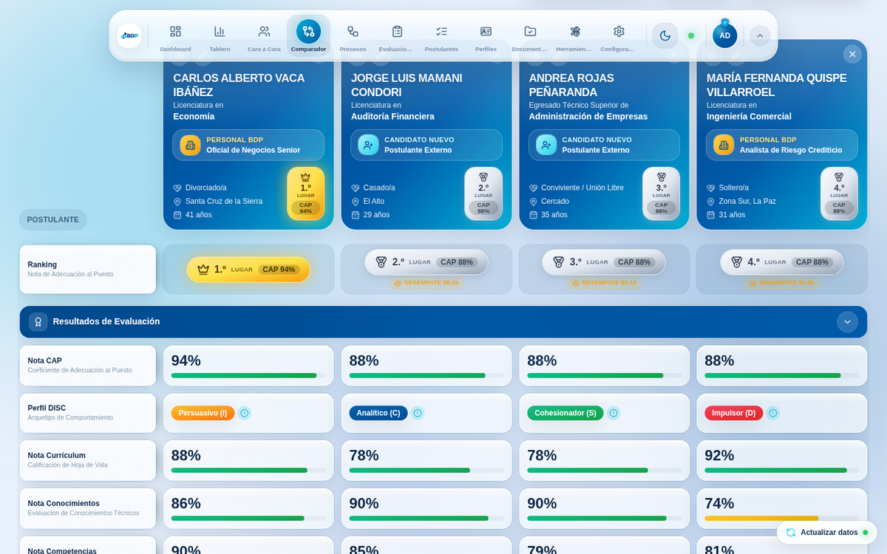

El chip de datos personales pierde el `Ref: 5033853-163-2026` de su pie y se
reajusta el alto; la fila de ranking pasa a llamarse **«Ranking / Nota de
Adecuación al Puesto»** y su chapa se dibuja en grande, con el CAP dentro.

Lo importante, sin embargo, no se ve a primera vista. El módulo ordenaba las
columnas con un `sort` por **Nota CAP** y repartía los puestos según la posición
resultante. `Array.prototype.sort` es estable, así que ante un empate conservaba
el orden previo: **el orden en que el analista fue agregando a la gente**. Con
tres personas al 88 % —lo normal en un proceso masivo— el 2.º lugar podía quedar
para quien tenía 74 % en conocimientos por delante de quien tenía 90 %.

Ahora el criterio principal sigue intacto (más CAP, mejor puesto) y **sólo al
empatar** entra el **Índice de Desempate (IDD)**, una media ponderada de las tres
notas de respaldo que el cuestionario ya captura:

| Campo | Peso | Por qué |
| --- | --- | --- |
| Nota Conocimientos | 40 % | Evidencia técnica medida con prueba |
| Nota Competencias | 35 % | Conducta observada frente al perfil del cargo |
| Nota Currículum | 25 % | Trayectoria declarada y verificable |

Los pesos se **renormalizan sobre los campos presentes**: a quien le falte la
nota de currículum se le calcula el índice con los otros dos pesos reescalados a
100 %, en vez de castigarlo con un cero que el proceso nunca le puso. Si el IDD
también empata, la decisión sigue una cascada explícita —conocimientos,
competencias, currículum, cobertura del expediente y, como último recurso
determinista, el nombre—, de modo que la misma comparación siempre se dibuja
igual, sin importar en qué orden se agregó a nadie.

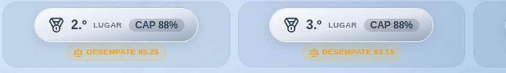

Cuando un puesto sale de un empate, la celda lo dice: una chapa ámbar con el
índice y, en el tooltip, el desglose de las tres notas con su peso. Nadie tiene
que adivinar por qué ese orden.

Un efecto colateral que conviene conocer: **el puesto ya no depende de cómo se
dibujen las columnas**. Antes, invertir el orden («Menor → mayor») convertía al
último en «1.er lugar», con su chapa dorada incluida. Ahora invertir cambia sólo
la vista.

El algoritmo vive en [`src/lib/comparatorRanking.ts`](../../src/lib/comparatorRanking.ts)
con 17 pruebas en `comparatorRanking.test.ts`.

## 2. Filas configurables una por una

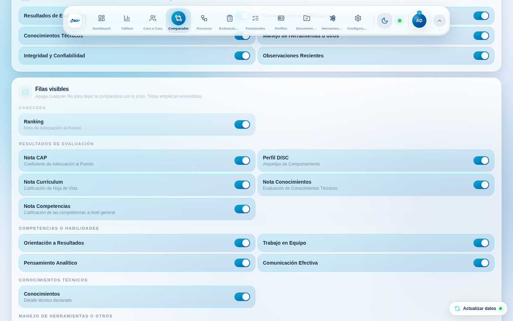

La pestaña **Configuración** del comparador podía ocultar secciones enteras, pero
no filas: no existía ninguna lista de filas que enumerar, porque cada bloque
vivía dentro del JSX. Ahora hay un catálogo,
[`src/lib/comparatorRows.ts`](../../src/lib/comparatorRows.ts), del que se dibuja
la cuadrícula **y** se alimentan los interruptores. Una sola fuente de verdad.

Las filas de competencias son dinámicas (dependen de los postulantes
comparados), así que se listan a partir de la comparación en curso. Todas
empiezan encendidas y el estado de sesión guarda **sólo lo que se apagó**, de
modo que cualquier fila nueva aparece visible sin migrar nada.

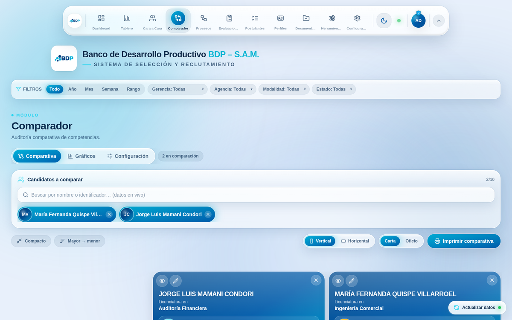

En la sección de Integridad, además, dos rótulos se acortan a petición del
equipo: «Riesgo de robo» → **Robo** y «Riesgo de Mentira» → **Mentira**.

## 3. Celdas de texto largo: revelado y visor ampliado

Conocimientos, Herramientas y Observaciones guardan párrafos, no etiquetas. En
un monitor grande caben; en un portátil de 13" la celda los recorta y el analista
no puede leer lo que está evaluando. Hay dos salidas, y las dos conviven:

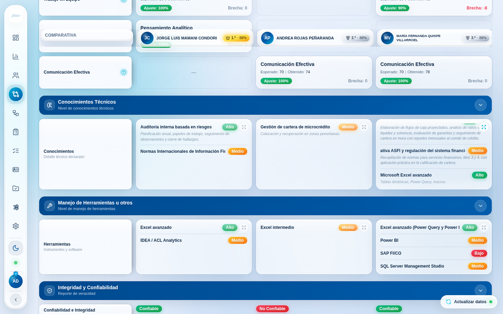

**Revelado al pasar el puntero (o el dedo).** La celda mantiene su alto y, sólo
mientras hay puntero encima, el contenido se desliza dentro de sus límites hasta
el final y vuelve al principio, en bucle y con descansos en los extremos. Los
nombres largos hacen lo mismo en horizontal. Sin puntero, la celda se ve
exactamente como antes: **nada se mueve solo**. El recorrido es una animación CSS
de `transform`, así que la resuelve el compositor y no cuesta un solo redibujado
de React.

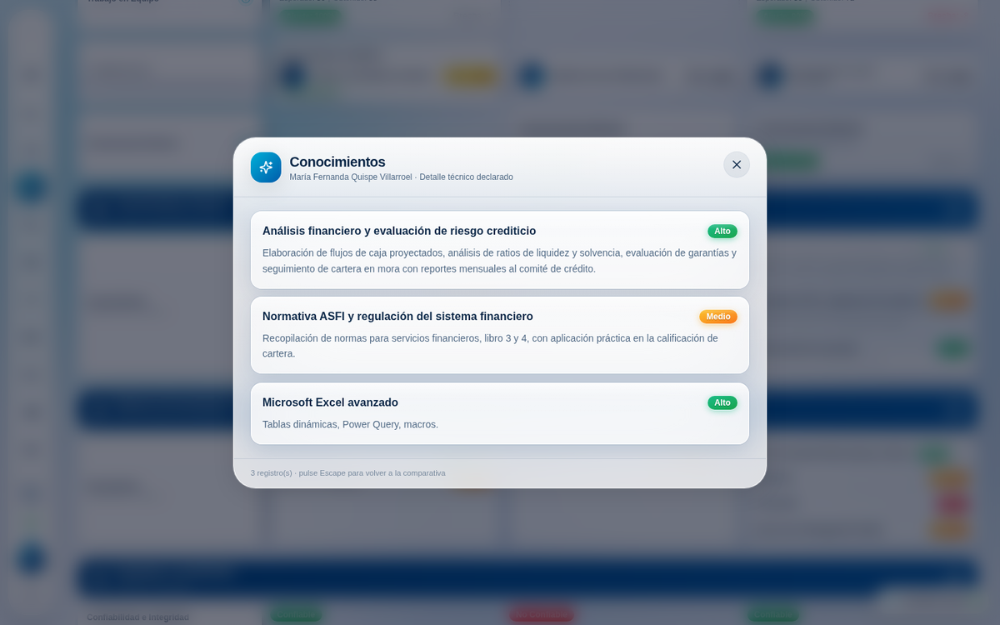

**Visor ampliado.** Un botón sobre la celda abre el contenido completo en un
panel de vidrio que **nace de la propia celda** (se calcula su rectángulo al
abrir), revela los bloques de texto escalonados con un desenfoque que se despeja,
y al cerrarse **vuelve a la celda** sin mover el desplazamiento de la página. Se
cierra con Escape, con el fondo o con la ✕.

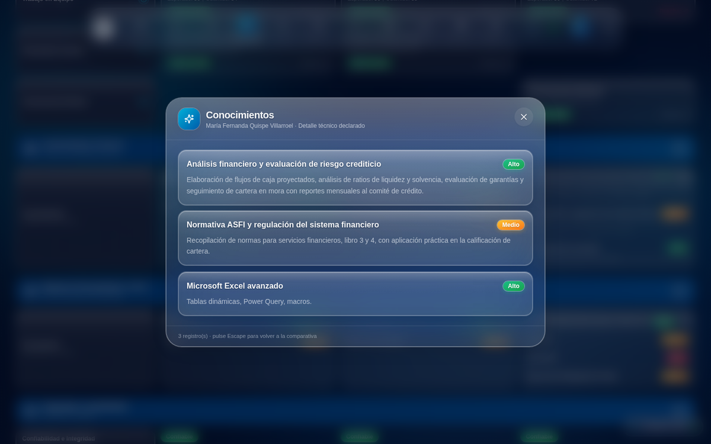

En papel no hay puntero ni visor, así que la hoja impresa desactiva el recorte y
muestra el texto completo (ver §8).

## 4. Un solo bloque en la primera columna

La columna congelada dibujaba **dos** cuadros superpuestos: un fondo opaco que se
estiraba con el alto de la fila y, dentro, una pastilla de vidrio del tamaño del
texto. Con filas altas —competencias, conocimientos— se veía como un recuadro
flotando dentro de otro. Ahora el vidrio ocupa todo el alto disponible: el bloque
sigue adaptándose a la fila, pero se lee como uno. Verificado midiendo en el
navegador (`outer` e `inner` coinciden al píxel en las seis primeras filas).

## 5. Movimiento

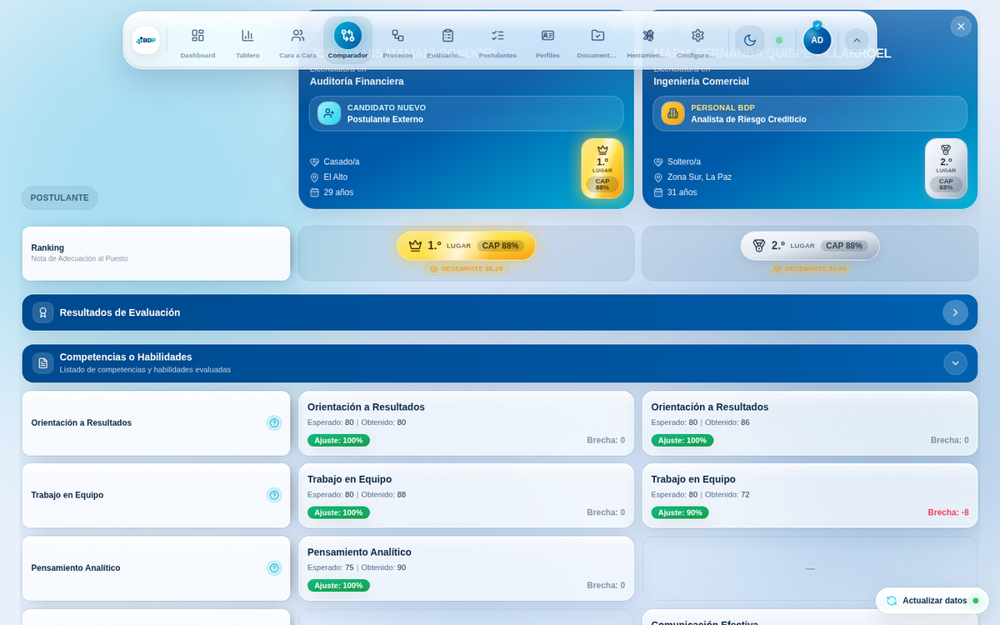

Contraer una sección era instantáneo y brusco. El problema es estructural: las
filas son **celdas sueltas de la cuadrícula** y no se pueden envolver en un
contenedor sin romper la alineación de las columnas. La solución usa
`display: contents` (un envoltorio que no genera caja pero sí sirve de ancla al
selector CSS) y un pequeño *hook* que mantiene las filas montadas mientras se
reproduce su animación de salida; cada celda lleva su propio retardo por fila, y
el resultado es el plegado escalonado de una lista de iOS.

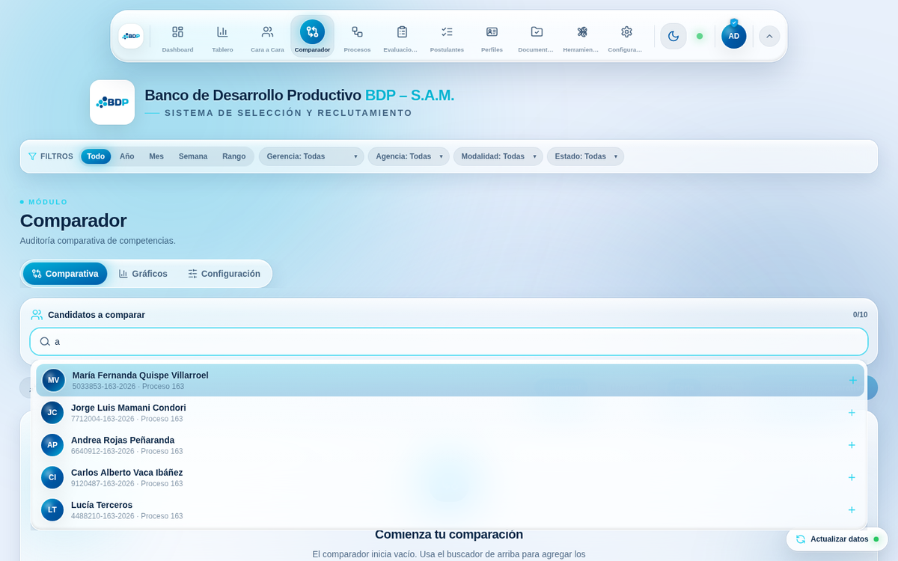

El buscador también se rehízo: el desplegable entra con resorte desde el campo,
las sugerencias aparecen escalonadas, la fila activa se desplaza y su «+» gira,
y las fichas de los ya elegidos entran y salen con física. Y lo más pedido: **al
agregar a un postulante el desplegable se cierra** (devolviendo el foco al campo
para escribir el siguiente nombre, sin que ese foco vuelva a abrir la lista).

Por último, el desplazamiento de toda la aplicación pasa a ser suave
(`scroll-behavior: smooth` en el elemento raíz), con gesto contenido en la
cuadrícula y barra fina acorde al vidrio. Todo el movimiento respeta
`prefers-reduced-motion` y el interruptor «Reducir movimiento» de Configuración.

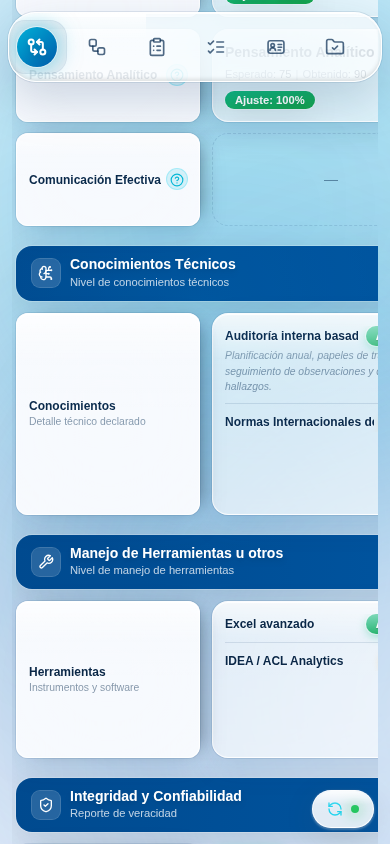

## 6. El cuestionario ya no pierde el avance

Este era el fallo grave: *«llenando la sección A, de la nada el progreso se borra
y se reinicia»*. Cuatro causas distintas, todas reales.

**1 · El envío implícito de HTML.** El cuestionario era un `<form>` con un botón
`type="submit"`. En HTML eso significa que pulsar **Intro** en cualquier campo de
texto —o en el `<select>` de «Nivel…» de A1— envía el formulario como si se
hubiera pulsado «Registrar Postulante». Y como el único campo obligatorio es el
identificador, que se llena primero, el envío **tenía éxito**: la ficha se
guardaba a medio llenar en la hoja, `resetForm()` vaciaba el formulario y el
modal se cerraba. Reproducido en el navegador contra la versión anterior: un solo
Intro tras el identificador **envió cuatro fichas** y cerró el cuestionario.

Se cierra por tres sitios a la vez:

1. La acción principal es un `<button type="button">`: el formulario ya no tiene
   botón de envío, así que no hay envío implícito que provocar.
2. `onKeyDown` en el `<form>` anula la acción por omisión de Intro salvo en áreas
   de texto y botones, y `Ctrl/⌘+Intro` queda como atajo explícito de guardado.
3. `onSubmit` siempre llama a `preventDefault()`: si algún navegador inventara un
   envío, no llega a la red.

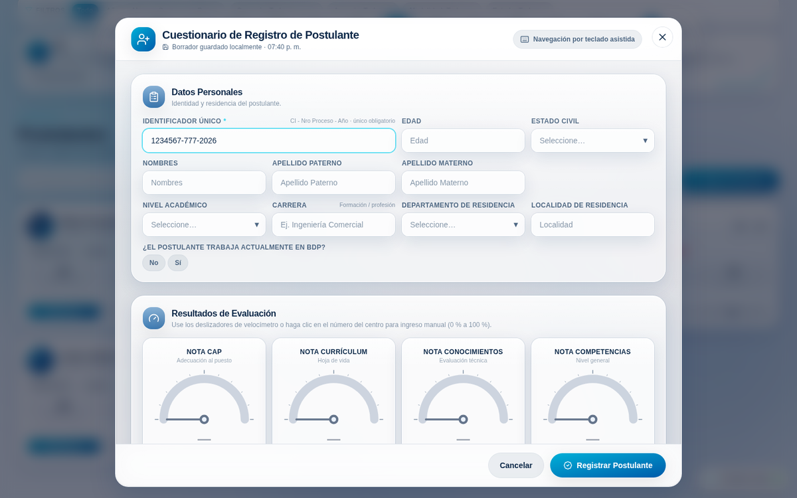

**2 · El resaltado ámbar desmontaba el campo.** `EditHL` devolvía
`<>{children}</>` cuando el campo no había cambiado y un `motion.div` cuando sí.
Al escribir la primera letra, el envoltorio cambiaba de tipo y React
**desmontaba y volvía a montar el input**: el foco se perdía y el resto de lo
teclado no llegaba a ninguna parte. En modo edición sólo se podía escribir una
letra por campo. Ahora el envoltorio es siempre el mismo `
` y el halo es una
clase con transición CSS.

**3 · El refresco en segundo plano.** La base se recarga sola cada 60 segundos y
al volver a la pestaña. Cada refresco produce un objeto `Candidate` nuevo con los
mismos datos, y el efecto de precarga del modo edición —que dependía del
objeto— reescribía el formulario encima. Ahora la precarga se ancla al
**identificador del registro**, no a la identidad del objeto.

**4 · El enfoque automático.** Al abrir, el identificador se enfocaba y se
**seleccionaba** 260 ms después. Quien empezaba a escribir antes de ese instante
veía cómo la siguiente tecla reemplazaba la selección. Ahora el foco sólo se
mueve si nadie se ha adelantado.

## 7. El cuestionario escribe fluido

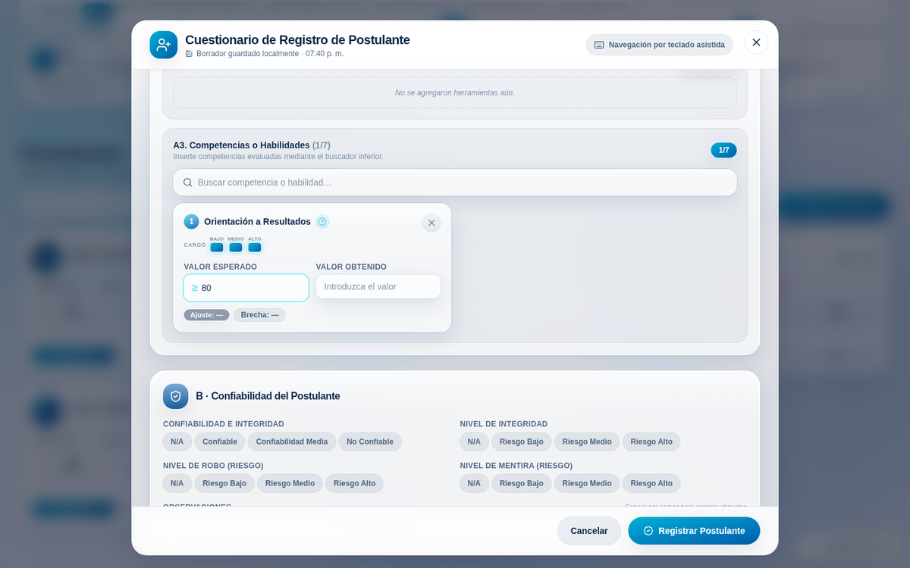

Cada pulsación redibujaba **el cuestionario entero**: los cuatro velocímetros
(SVG con marcas y aguja), los constructores de listas y hasta siete tarjetas de
competencia con su cálculo de ajuste. Sin tocar el aspecto:

- El cuestionario se divide en **cuatro secciones memorizadas** que reciben sólo
  sus datos; escribir en una no toca a las otras tres.
- Las tarjetas de competencia reciben el **catálogo por props** en vez de
  suscribirse al contexto: un refresco de la base ya no las redibuja.
- Desaparecen las mediciones de `layout` de framer-motion en las listas (medían
  cada fila en cada redibujado) y los 24 componentes animados del resaltado.
- El velocímetro sólo avisa **cuando el valor cambia de verdad**; antes emitía
  decenas de actualizaciones por segundo con el mismo número.
- La comparación de campos modificados dejó de serializar a JSON en cada tecla.
- El vidrio interior del modal deja de desenfocar por segunda vez
  (`.glass-flat`): el panel ya difumina la página, y cuarenta capas de
  `backdrop-filter` apiladas cuestan GPU sin aportar nada visible.

Medido en el navegador con el *build* de producción y la sección A llena
(tres conocimientos, dos herramientas, tres competencias), escribiendo un párrafo
en un campo de detalle:

| | antes | después |
| --- | --- | --- |
| Tecleo | 5.63 ms/carácter | **3.84 ms/carácter** |
| Peor muestra | 7.49 ms | **4.42 ms** |

## 8. Verificación

- `npm run typecheck` y `npm run build`: sin avisos nuevos.
- `npm test`: **259** pruebas (25 nuevas: 17 del ranking y 8 del cuestionario).
- Navegador (Chromium, arnés de Playwright con un backend simulado): once
  escenarios sobre la rama y sobre `main`, sin un solo error de consola.
  - `bug-intro`: pulsar Intro tras el identificador. En `main`, cuatro envíos y
    formulario vacío; en la rama, **cero envíos** y el avance intacto.
  - `formulario-stress`: el llenado real de la sección A con Intro por medio;
    verifica identificador, nombres, tres conocimientos y sus tres niveles.
  - `celdas`: revelado al pasar el puntero, visor ampliado y **la misma posición
    de desplazamiento al cerrarlo** (1876 px → 1876 px).
  - `filas-ocultas`: apagar «Perfil DISC» la retira de la comparativa y
    «Mostrar las ocultas» la devuelve.
  - `impresion`: con `media: print`, **cero** celdas con texto oculto.
  - `secciones`, `buscador`, `oscuro`, `movil` (390 × 844), `denso` y `smoke`
    (los diez módulos, uno tras otro).
- El *lockfile* estaba desincronizado con `gsap`, lo que rompía `npm ci` y con él
  el despliegue en Vercel; queda arreglado en esta rama.

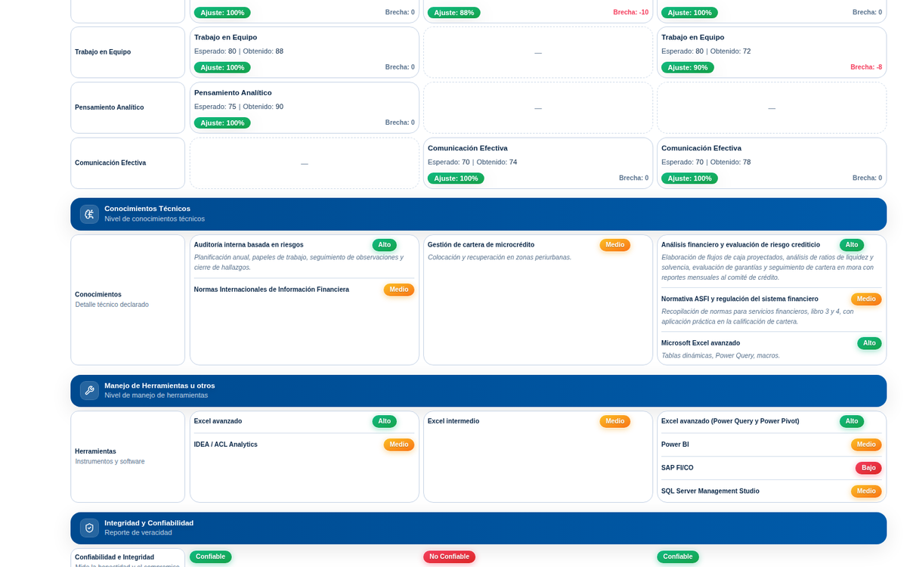

> Un fallo latente encontrado durante la verificación de impresión: al ocultarse
> el dock con `display: none`, sus iconos animados seguían midiendo su contorno
> con `getTotalLength()`, que en Chrome lanza «non-rendered element». Como no hay
> frontera de error por encima del dock, el fallo se llevaba por delante toda la
> aplicación. Corregido aquí, porque «Imprimir comparativa» es una acción del
> propio comparador.
