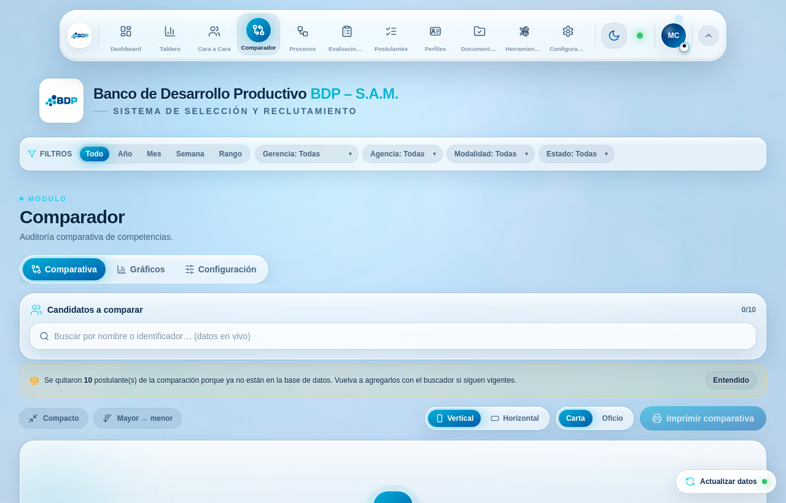
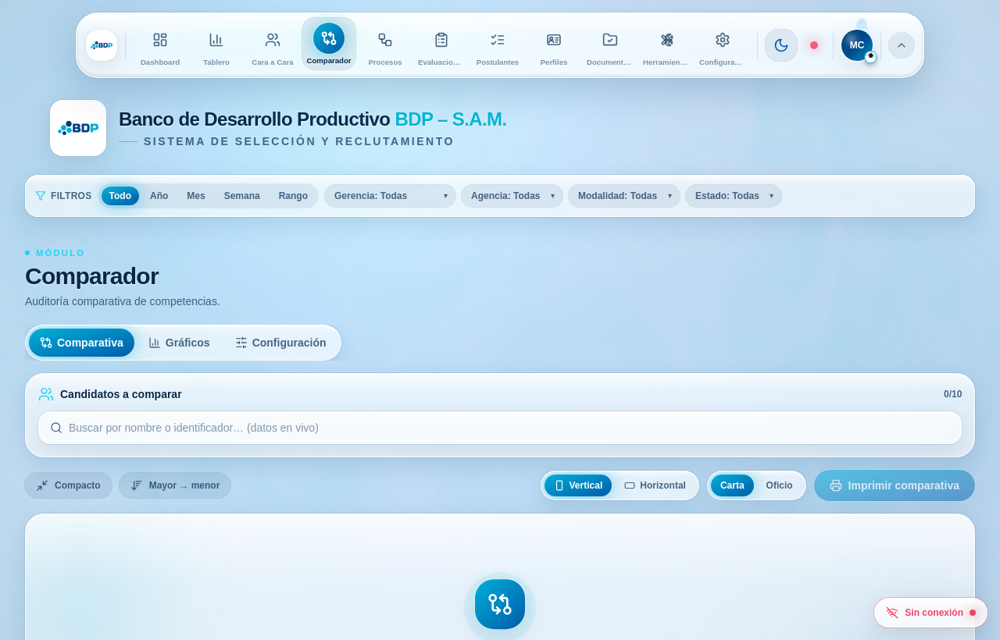
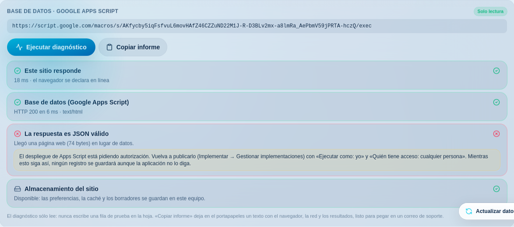

# Auditoría de estabilidad · Comparador y Postulantes

> Investigación del reporte «el comparador no funciona» y «en Postulantes no puedo
> añadir postulantes», con las correcciones que salieron de ella.
>
> **Veredicto corto:** el usuario no estaba mintiendo. Se reprodujeron **siete**
> defectos, y tres de ellos producen exactamente esas dos frases en un equipo
> concreto mientras el resto del equipo no ve nada raro. Además había un fallo de
> pérdida de datos silenciosa que afecta a **todos** los equipos y que nadie
> estaba notando: el sistema decía «Postulante registrado correctamente» sin
> haber escrito una sola celda en la hoja de cálculo.

---

## Contexto

### Para quien llega de nuevo (sáltese esta parte si ya conoce el sistema)

La aplicación es un ATS —un sistema de seguimiento de postulantes— para el equipo
de Reclutamiento y Selección del **Banco de Desarrollo Productivo S.A.M.** No
tiene servidor propio: es una aplicación de una sola página (React + Vite) que se
despliega en Vercel y habla directamente con **una hoja de cálculo de Google** a
través de un **Google Apps Script** publicado como aplicación web.

Todo el diálogo con los datos cabe en dos frases:

- Un **GET** a la URL del script devuelve el libro entero en un JSON:
  `candidatos`, `competencias`, `arquetipos_disc`, `auxiliares`, `perfiles`,
  `perfil_cargo_bdp` y las dos hojas espejo de los procesos.
- Un **POST** con un cuerpo JSON da de alta una fila (`{ identificador, … }`), la
  edita (`{ action: "update", … }`) o toca otras hojas (`{ type: "perfil_cargo" }`).

Ese diálogo vive en un único sitio, `src/context/TalentDataContext.tsx`, que lo
expone al resto de la aplicación mediante un contexto de React. Los dos módulos de
esta auditoría se apoyan en él:

- **Postulantes** (`src/modules/ListaPostulantes.tsx` +
  `src/modules/RegistrationForm.tsx`) lista a las personas y abre el
  «Cuestionario de Registro», un formulario largo con datos personales, cuatro
  velocímetros de nota, arquetipo DISC y tres constructores de listas.
- **Comparador** (`src/modules/NuevoComparador.tsx`) pone a varios postulantes uno
  al lado del otro en una cuadrícula con encabezado congelado, ordenada por **Nota
  CAP** y con desempate por el **Índice de Desempate**.

### Lo que hace falta saber para entender los cambios

Tres decisiones de diseño previas son el escenario donde ocurren los fallos:

**Uno · Caché primero.** El GET se guarda en `localStorage` (`bdp-talent-cache`) y
al arrancar la aplicación se pinta con esa copia antes de pedir datos frescos. Es
una buena idea —la página abre al instante— pero convierte «sin red» en un estado
*invisible*: hay datos en pantalla, así que nada parece ir mal.

**Dos · La sesión del comparador.** Los postulantes elegidos se guardan en
`sessionStorage` como una **lista de identificadores** (`bdp-comparador-session`),
no como una copia de sus datos. Al volver al módulo, cada identificador se resuelve
contra la base recién cargada.

**Tres · El identificador es la identidad.** `Candidate.id` es el `identificador`
de la hoja («CI - Nro Proceso - Año»). Es la clave de React, la clave del buscador
del comparador y la clave de la edición. La hoja **no impone que sea único**.

> [!NOTE]
> **Un detalle de Apps Script que lo explica casi todo.** Cuando a un despliegue de
> Apps Script se le caducan los permisos, **no** responde 401. Responde **HTTP 200
> con una página HTML** de autorización. Para `fetch` eso es un éxito: la promesa
> se resuelve, `res.ok` es `true`. Cualquier código que no mire el cuerpo de la
> respuesta dará por escrito algo que nunca se escribió.

---

## Intuición

### El método: reproducir antes de arreglar

No se puede depurar un «a mí no me pasa». Así que lo primero fue montar un entorno
donde **sí** pasa: un backend falso que imita el contrato del Apps Script
(`qa/mock-backend.mjs`), la aplicación compilada servida en local, y Chromium
conducido por Playwright con el tráfico a `script.google.com` interceptado
(`qa/run.mjs`, `qa/sondas.mjs`). Cada sonda aísla **un** síntoma e imprime hechos
en lugar de capturas, para poder razonar sobre el fallo sin abrir una imagen.

Con eso, «el comparador no funciona» dejó de ser una queja y se convirtió en cuatro
fallos distintos y medibles.

### Fallo 1 · El guardado mentía (afecta a todo el mundo)

Este era el alta de un postulante, tal cual:

```ts
await fetch(SCRIPT_URL, { method: "POST", body: JSON.stringify(candidate) });
setRaw((prev) => [candidate, ...prev]);
return { ok: true, message: "Postulante registrado correctamente." };
```

Ni `res.ok`, ni el cuerpo, ni el sobre `{ status }`. Con el despliegue sin permisos
la secuencia era:

| Paso | Lo que veía el analista | Lo que pasaba de verdad |
| ---- | ----------------------- | ----------------------- |
| 1 | Rellena el cuestionario | — |
| 2 | «Postulante registrado correctamente» | El script devolvió HTML; no se ejecutó |
| 3 | El cuestionario se cierra | El borrador local se borra |
| 4 | La ficha aparece en la lista | Sólo existe en memoria |
| 5 | *(60 s después)* la ficha desaparece | El refresco trae la hoja real |

La sonda lo confirma sin lugar a dudas: modal cerrado, ficha en pantalla, **cero**
peticiones recibidas por el backend. Desde la silla del analista eso es, literal,
«no puedo añadir postulantes».

### Fallo 2 · El refresco borraba el alta (afecta a todo el mundo)

Apps Script sirve el `doGet` desde su propia caché. Al guardar, el cuestionario
llamaba a `refetch()`, ese GET devolvía el listado **sin la fila nueva** y
`setRaw(payload)` reemplazaba el arreglo completo. Resultado medido: el postulante
recién dado de alta no llegaba a ser visible **ni un instante**.

### Fallo 3 · El comparador se cerraba con llave (un equipo, una sesión)

El límite de columnas se medía contra la lista de identificadores guardada, no
contra los postulantes que de verdad se encontraban. Con diez identificadores que
ya no existen —una fila corregida en la hoja, un registro borrado— el buscador
quedaba **deshabilitado** con «Límite alcanzado (10/10)» mientras la pantalla decía
«Comienza tu comparación». Imposible agregar a nadie, y sin un solo mensaje.

### Fallo 4 · Dos filas con el mismo identificador

Basta con que dos analistas registren a la misma persona en el mismo proceso. Con
el `id` repetido, React advertía por consola que «puede duplicar u omitir
componentes», y —lo importante— el buscador del comparador excluye a los ya
elegidos comparando el `id`: **al agregar al primero, el segundo desaparecía de las
sugerencias**. Otra vez, «el comparador no me deja agregarlo».

### Fallo 5 · Pantalla en blanco cuando el navegador bloquea los datos del sitio

`window.localStorage` no es un objeto inocuo: **acceder a la propiedad** lanza
`SecurityError` cuando el navegador tiene bloqueados los datos del sitio (Chrome
con «Bloquear todas las cookies», Edge estricto, una política corporativa, la
página incrustada en un iframe con almacenamiento particionado). Había dos lecturas
sin proteger, y una de ellas es el estado inicial del proveedor más externo del
árbol. Medido: `#root` con **cero** hijos. No «el comparador no funciona»: la
página entera en blanco.

### Fallo 6 · Un navegador antiguo se llevaba **sólo** esos dos módulos

Este es el hallazgo que encaja con una precisión incómoda. Hay tres API modernas en
juego, y su reparto por la aplicación no es casual:

| API | Dónde se usa | Consecuencia si falta |
| --- | ------------ | --------------------- |
| `matchMedia` | Buscador del comparador, celdas de texto largo | Comparador |
| `ResizeObserver` | Marquesina de **cada** fila, tira de nombres, celdas | Comparador |
| `ResizeObserver` | Navegación asistida del cuestionario | Postulantes |
| `IntersectionObserver` | Barra congelada del comparador | Comparador |

Es decir: **las únicas dos zonas de la aplicación que dependían de esas API sin
protegerlas son, exactamente, el Comparador y el cuestionario de Postulantes.** La
comprobación que había era `"matchMedia" in window`, que es cierta en entornos que
exponen la propiedad **sin la función** —varios WebView corporativos, y también
jsdom, como descubrió una prueba nueva—. Comparado contra `origin/main` en ese
perfil de navegador:

```
ANTES  (origin/main)   hijos de #root: 0   ·  TypeError: window.matchMedia is not a function
DESPUÉS (esta rama)    hijos de #root: 1   ·  0 errores, alta registrada en el backend
```

### Fallo 7 · El punto verde mentía

Con datos en caché, un refresco fallido se descartaba en silencio (`if
(hasData.current) return`) y el estado seguía valiendo `"success"`. El punto del
dock se quedaba en **verde «Sincronizado»** mientras la aplicación llevaba horas sin
poder hablar con la hoja. El analista trabajaba sobre una copia vieja y sus altas
no llegaban a ninguna parte.

---

## Código

### 1 · Una única puerta de escritura que valida de verdad

`src/lib/backendWrite.ts` (nuevo) es ahora el único camino de escritura, y aplica
las tres comprobaciones que faltaban:

```ts
if (looksLikeHtml(contentType, text)) {
  // Apps Script devuelve 200 + HTML cuando el despliegue perdió permisos.
  return fail("permisos-backend", `HTTP ${response.status} · HTML (${text.length} bytes)`);
}
if (!response.ok) return fail("http", `HTTP ${response.status} · ${text.slice(0, 200)}`);

if (text.trim() === "") return { ok: true, message: "", data: null };  // doPost sin return

const status = typeof data.status === "string" ? data.status : "";
if (status && status !== "success" && status !== "ok") {
  return fail("rechazado", `status="${status}"`, remote || MESSAGES.rechazado);
}
```

Cada fallo lleva una **causa** y un texto que dice qué hacer. Ya no hay un
«se guardó localmente» que suene a que algo se salvó:

| Causa | Lo que lee el analista |
| ----- | ---------------------- |
| `red` | «…si el resto de internet funciona, es probable que la red del banco esté bloqueando script.google.com.» |
| `permisos-backend` | «El despliegue de Google Apps Script necesita volver a publicarse con acceso “Cualquier persona”.» |
| `tiempo` | «…no hay confirmación de que se haya guardado. Actualice la base antes de reintentar para no duplicar el registro.» |

Y el alta ya no se refleja localmente si el servidor la rechazó:

```ts
const result = await postToBackend(candidate);
if (!result.ok) {
  // Mostrar la ficha como si existiera era precisamente lo que hacía creer
  // que el alta había funcionado.
  return report(result, "");
}
```

### 2 · Escrituras pendientes: el payload deja de ser la verdad absoluta

Una escritura confirmada se queda «pendiente» y **se superpone** al payload del
servidor hasta que éste la incorpora. Con caducidad, para que un borrado hecho
desde la hoja no quede enmascarado para siempre:

```ts
if (index === undefined) {
  // El servidor todavía no devuelve la fila.
  if (!expired) { prepend.push(write.row); survivors.set(ident, write); }
  continue;
}
if (write.kind === "update") {
  const stillStale = Object.keys(write.row).some(
    (key) => String(server[key] ?? "") !== String(write.row[key] ?? ""),
  );
  if (stillStale && !expired) { merged[index] = { ...server, ...write.row }; … }
}
// Un alta cuya fila ya llegó del servidor está confirmada: se descarta.
```

La comparación es **como texto** a propósito: la hoja devuelve los números como
cadenas, y comparar `88` con `"88"` mantendría la superposición pegada para siempre.

### 3 · Identidad de un postulante: única y estable

```ts
export function normaliseCandidates(rows: RawCandidate[]): Candidate[] {
  const seen = new Map<string, number>();
  return rows.map((row, index) => {
    const candidate = normaliseCandidate(row, index);
    const previous = seen.get(candidate.id) ?? 0;
    seen.set(candidate.id, previous + 1);
    if (previous === 0) return candidate;
    return { ...candidate, id: `${candidate.id}#${previous + 1}`, duplicadoDe: candidate.identificador };
  });
}
```

Las filas repetidas **no se esconden** —son datos reales que alguien debe corregir—
sino que reciben identidad propia y quedan marcadas, y la lista de Postulantes lo
avisa con los identificadores concretos.

De paso, el `id` de emergencia de las filas sin identificador dejó de ser
`cand-<índice>`. El índice es la posición en el arreglo, y al dar de alta a alguien
la fila entra al principio: todos los índices se corrían uno y cada `cand-N`
empezaba a apuntar a **otra persona**. Ahora es un resumen del contenido de la fila,
estable frente a reordenamientos.

### 4 · El comparador ya no puede cerrarse con llave

```ts
export function pruneMissing(existing: Iterable<string>): number { … }
```

Se llama en cuanto llegan los datos; es idempotente y no emite si no hay nada que
limpiar, así que vive dentro de un efecto sin provocar ciclos. Y el buscador mide
el límite contra los postulantes que **de verdad se encontraron**:

```ts
const count = selected.length;   // antes: selectedIds.length
const full = count >= max;
```



### 5 · Almacenamiento y API del navegador que degradan en lugar de tumbar

`src/lib/safeStorage.ts` y `src/lib/observers.ts` (nuevos). El primero tantea el
almacén de verdad —hay navegadores que exponen el objeto y fallan al escribir— y,
si no está, degrada a una copia en memoria que dura lo que la pestaña. El segundo
convierte la ausencia de un observador en una degradación:

```ts
export function observeResize(targets, callback) {
  if (typeof ResizeObserver === "undefined") {
    // Sin ResizeObserver, el redimensionado de la ventana es la mejor
    // aproximación disponible, y cubre el caso que más se nota.
    window.addEventListener("resize", callback);
    return () => window.removeEventListener("resize", callback);
  }
  …
}
```

Y la comprobación de `matchMedia` pasó de `"matchMedia" in window` a
`typeof window.matchMedia === "function"`, con el `addListener` obsoleto como
respaldo para Safari anterior al 14.

### 6 · El estado de la conexión, dicho en voz alta

```ts
export type ConnectionHealth = "desconocida" | "en-linea" | "sin-conexion";
```

Se marca caída **siempre**, tenga o no datos en pantalla: es justo el caso en el que
el analista necesita saber que lo que ve es una copia local. El punto del dock tiene
un tercer estado en rojo y el botón flotante pasa a «Sin conexión» con un mensaje
sin rodeos.



### 7 · Un diagnóstico que responde «¿es mi equipo o es el sistema?»

El «Probar conexión» anterior decía sí o no, y ese sí o no no distinguía las tres
causas reales, que tienen remedios distintos. El nuevo panel (Configuración →
Integraciones) las separa:



Fíjese en la separación: **el endpoint responde** (HTTP 200, en verde) y sin embargo
**la respuesta no es JSON** (en rojo), con la instrucción exacta para arreglarlo.
Sólo lee: nunca escribe una fila de prueba en la hoja. Y «Copiar informe» deja en el
portapapeles el navegador, la red y los resultados, listo para pegar en un correo.

### 8 · Correcciones menores encontradas por el camino

- **Una nota no se podía borrar.** La firma de `GaugeInput` era
  `(value: number) => void` y el texto vacío se descartaba: al limpiar el campo el
  velocímetro volvía al número anterior. Ahora admite `null`.
- **La comparativa en blanco se explica.** Apagar las seis secciones dejaba las
  tarjetas y nada debajo. Ahora hay un aviso con el remedio en el sitio.
- **Un bucle de dibujado en la bitácora.** `useAuditTrail` filtraba dentro del
  selector del store; `useSyncExternalStore` compara con `Object.is` y un arreglo
  nuevo en cada lectura provoca el aviso de «getSnapshot debería memorizarse».
- **El permiso de registro no se consultaba.** La regla «analista o superior» estaba
  escrita en `permisosDe` y nunca se usaba: un perfil de pasantía llenaba el
  cuestionario completo para toparse con el rechazo al final. Ahora se dice antes y
  con el motivo.
- **Doble petición al guardar.** El contexto refresca la base tras un alta aceptada;
  hacerlo también desde el módulo lanzaba dos GET y el segundo cancelaba al primero.
- **Reparto de paquetes.** React y Framer Motion salen a paquetes propios: ~85 kB
  comprimidos que el navegador reutiliza entre despliegues en lugar de volver a
  descargar por cambiar una línea. `lucide-react` se dejó **fuera** a propósito:
  agruparlo anula su sacudida de árbol y pasa de unos pocos iconos a los 777 kB de
  la biblioteca completa (medido).

---

## Verificación

### Pruebas automatizadas

De **259** a **315**, todas en verde, con 56 nuevas que fijan cada corrección:

| Archivo | Qué fija |
| ------- | -------- |
| `src/lib/backendWrite.test.ts` (9) | Las cinco formas de fallar del backend, incluida la de HTML 200 |
| `src/lib/candidates.test.ts` (6) | Identidad única y estable; detección de duplicados |
| `src/lib/comparatorStore.test.ts` (8) | `pruneMissing` libera el límite; conserva el orden |
| `src/lib/safeStorage.test.ts` (8) | No lanza con el almacenamiento bloqueado; degrada a memoria |
| `src/lib/observers.test.ts` (5) | Degradación sin `ResizeObserver`/`IntersectionObserver` |
| `src/context/TalentDataContext.test.ts` (8) | Superposición de escrituras pendientes y su caducidad |
| `src/modules/NuevoComparador.test.tsx` (5) | Límite fantasma, comparativa oculta, desempate |
| `src/modules/ListaPostulantes.test.tsx` (4) | Permiso de registro y aviso de duplicados |
| `src/modules/RegistrationForm.test.tsx` (+3) | El guardado no cierra el modal si el servidor rechaza |

```
npx tsc -b --noEmit   →  sin errores
npm test              →  27 archivos · 315 pruebas · 315 en verde
npm run build         →  ✓ built in 7.8s
```

### Antes y después, medido en el navegador

Cada fila es una sonda de `qa/sondas.mjs` ejecutada contra `origin/main` y contra
esta rama, con el mismo backend falso:

| Sonda | Antes | Después |
| ----- | ----- | ------- |
| `guardado-mentiroso` | modal cerrado, ficha en pantalla, **0 POST** | modal abierto con el motivo, sin ficha |
| `carrera-optimista` | el alta **no llega a verse** | visible al instante y 4 s después |
| `limite-fantasma` | buscador **deshabilitado**, «10/10» | buscador libre, «0/10» + aviso |
| `almacenamiento-bloqueado` | `#root` con **0 hijos** | entra al sistema, 0 errores |
| `navegador-antiguo` | `matchMedia is not a function`, app en blanco | Comparador y alta funcionando, 0 errores |
| `punto-sincronizacion` | «Sincronizado» sin red | «Sin conexión con la base de datos…» |
| `secciones-apagadas` | comparativa en blanco sin explicación | aviso + botón que restaura 15 filas |
| `duplicados-comparables` | la segunda fila era **inalcanzable** | ambas comparables, 0 avisos de React |

Y los recorridos completos (`qa/run.mjs base` y `qa/run.mjs movil`, 390×844 con
eventos táctiles) terminan sin un solo error de JavaScript ni aviso de React —antes
había **nueve** avisos de clave duplicada—. El único ruido restante son avisos de
WebGL del renderizado por software del entorno sin GPU, ajenos a la aplicación.


### Control de calidad manual, paso a paso

**A · El alta ya no puede mentir** (el más importante)

1. Abra **Configuración → Integraciones** y pulse **Ejecutar diagnóstico**. Las
   cuatro comprobaciones deben salir en verde.
2. Vaya a **Postulantes → Nuevo Postulante**, ponga un identificador y guarde. La
   ficha aparece y **sigue ahí** un minuto después (antes desaparecía).
3. Para ver el camino del fallo sin tocar el despliegue real: con las herramientas
   del navegador, bloquee `script.google.com` (pestaña Red → Bloquear URL) y guarde
   otro postulante. El cuestionario **no** se cierra, muestra el motivo con el
   remedio y la ficha **no** aparece en la lista.
4. Con el bloqueo puesto, mire el punto del dock: rojo. Y el botón flotante: «Sin
   conexión».

**B · El comparador no puede cerrarse con llave**

1. **Comparador**, agregue tres postulantes, confirme los puestos y las chapas.
2. En la consola del navegador:
   `sessionStorage.setItem("bdp-comparador-session", JSON.stringify({selectedIds:Array.from({length:10},(_,i)=>"x"+i)}))`
   y recargue. El buscador debe quedar **habilitado** en «0/10» y aparecer el aviso
   de los diez descartados.
3. Pestaña **Configuración** del módulo, apague las seis secciones y vuelva a
   **Comparativa**: debe verse el aviso y el botón **Mostrar todas las secciones**.

**C · Identificadores repetidos**

1. Duplique una fila en la hoja (mismo identificador) y actualice la base.
2. **Postulantes** avisa arriba con el identificador concreto y marca las tarjetas
   con **ID repetido**.
3. En el **Comparador**, busque ese nombre: deben salir **las dos** filas y poder
   agregarse ambas.

**D · Navegador restringido** (reproduce el equipo del usuario)

En la consola, antes de navegar: `delete window.ResizeObserver;
delete window.IntersectionObserver;` y recargue. El Comparador y el cuestionario
deben seguir usables, sin marquesina ni barra congelada.

---

## Alternativas

### Para el guardado que mentía

| A favor de lo hecho (validar la respuesta en el cliente) | A favor de la alternativa (un proxy en Vercel) |
| --- | --- |
| Cero infraestructura nueva; el despliegue sigue siendo estático | El navegador nunca habla con `script.google.com`, así que un proxy corporativo no puede bloquearlo |
| El diagnóstico corre en el equipo del analista, que es donde está el problema | Se pueden reintentar y encolar las escrituras del lado del servidor |
| Se despliega hoy, sin secretos ni funciones serverless | La URL del script deja de estar en el paquete del navegador |
| **En contra:** si la red del banco bloquea Google, la aplicación sólo puede *explicarlo*, no evitarlo | **En contra:** una función serverless más que mantener, con su latencia, sus límites y sus registros |

El proxy resolvería de raíz la clase de fallo «la red del banco bloquea Google».
Merece la pena como paso siguiente, pero es un cambio de arquitectura: exige una
decisión sobre credenciales y sobre quién opera esa función. Validar la respuesta es
condición previa en cualquier caso —sin ello el proxy heredaría la misma ceguera—.

### Para la identidad de los postulantes

| A favor de lo hecho (sufijo determinista + aviso) | A favor de la alternativa (una columna `uuid` en la hoja) |
| --- | --- |
| No exige tocar la hoja ni el Apps Script | La identidad deja de depender de un dato que las personas escriben a mano |
| Las filas repetidas siguen visibles y editables: alguien puede ir a corregirlas | Renombrar un identificador dejaría de romper las referencias guardadas |
| Funciona con los datos que ya existen | Elimina la clase de fallo, no sólo sus síntomas |
| **En contra:** el sufijo es posicional; si se reordena la hoja, la fila «#2» puede ser otra | **En contra:** hay que migrar el libro, el script y los expedientes de Documentación, que hoy se enlazan por identificador |

---

## Personas sugeridas para consultar

El historial de estos archivos es casi por completo de generaciones asistidas por
IA, así que el conocimiento humano está concentrado en muy pocas manos:

- **AlexD5427** (47 *commits*, dueño del repositorio) — es quien fusionó todo el
  trabajo de estos dos módulos y quien conoce el contrato real de la hoja de
  cálculo y el estado del despliegue de Apps Script. **La consulta más importante es
  para él**, y muy concreta: comprobar en *Implementar → Gestionar
  implementaciones* que el despliegue vigente está publicado con «Ejecutar como:
  yo» y «Quién tiene acceso: cualquier persona», porque el fallo 1 sólo se dispara
  cuando eso se rompe.
- **Alex Jhonson** (7 *commits*) — el segundo contribuyente humano con más
  presencia; útil para validar que el aviso de identificadores repetidos encaja con
  cómo el equipo usa la hoja en la práctica (¿son errores a corregir o casos
  legítimos?).
- **AlexRCM** (4 *commits*) — aportes menores; conviene consultarle sólo si toca
  alguna de las partes que él escribió.

Nadie más aparece con cambios sustantivos en el contexto de datos, el comparador o
el cuestionario, de modo que la revisión humana de esta rama recae sobre el dueño
del repositorio.

---

## Cuestionario

<details>
<summary><strong>1.</strong> ¿Por qué el código anterior mostraba «Postulante registrado correctamente» cuando el despliegue de Apps Script había perdido los permisos?</summary>

- **A)** Porque `fetch` lanzó una excepción y el `catch` devolvía éxito.
- **B)** Porque Apps Script responde **HTTP 200 con HTML** en ese caso, y el código no miraba `res.ok` ni el cuerpo. ✅
- **C)** Porque el POST se enviaba con `Content-Type: text/plain` y eso desactiva la validación.
- **D)** Porque el navegador guardaba la respuesta en caché.

**B es correcta.** Es el detalle que lo explica todo: para `fetch`, un 200 es un
éxito, y el código se limitaba a hacer `await fetch(...)` sin leer nada. El
`catch` sólo se activa con fallos de red — y ahí sí devolvía `ok: false`, aunque
también insertaba la fila localmente.

**A es falsa**: el `catch` devolvía `{ ok: false }`; el problema es que en este caso
nunca se ejecutaba. **C es falsa**: `text/plain` existe para evitar la petición
`OPTIONS` de pre-vuelo que el despliegue por omisión de Apps Script no sabe
contestar; no tiene relación con validar la respuesta. **D es falsa**: no hay caché
de respuestas POST en juego.
</details>

<details>
<summary><strong>2.</strong> Un alta se confirma, pero el GET siguiente devuelve el listado sin la fila nueva. ¿Qué hace `mergePendingWrites` y por qué caduca?</summary>

- **A)** Reintenta el POST hasta que la fila aparezca.
- **B)** Bloquea los refrescos automáticos hasta que la fila aparezca.
- **C)** Superpone la fila confirmada al payload, y caduca a los 5 minutos para no enmascarar un borrado hecho en la hoja. ✅
- **D)** Guarda la fila en `localStorage` y la fusiona para siempre.

**C es correcta.** Apps Script sirve el `doGet` desde su caché, así que hay una
ventana en la que el payload va por detrás de la realidad. Durante esa ventana la
escritura confirmada se superpone; un alta se suelta en cuanto el servidor devuelve
su identificador, y una edición en cuanto los campos coinciden.

La caducidad es la parte sutil: sin ella, una fila borrada **desde la hoja** volvería
a aparecer indefinidamente, porque el servidor nunca la devolvería y la
superposición la seguiría inyectando.

**A** duplicaría registros. **B** dejaría la aplicación congelada ante un backend
que nunca publica. **D** convierte una ayuda temporal en una segunda fuente de
verdad permanente.
</details>

<details>
<summary><strong>3.</strong> ¿Por qué un navegador sin `ResizeObserver` rompía justo el Comparador y el cuestionario de Postulantes, y no el resto?</summary>

- **A)** Porque son los módulos más grandes.
- **B)** Porque son los únicos que se cargan de forma diferida.
- **C)** Porque son los únicos que construían observadores del DOM sin comprobar que la API existe, y esas llamadas viven en efectos que se ejecutan siempre. ✅
- **D)** Porque usan `sessionStorage` en lugar de `localStorage`.

**C es correcta.** El reparto no es casual: `MarqueeText` (una por **cada** fila de
la comparativa), la tira de nombres, las celdas de texto largo y la navegación
asistida del cuestionario. `new ResizeObserver(...)` sobre un navegador que no lo
trae lanza, y como está dentro de un efecto de un componente que siempre se dibuja,
el `ErrorBoundary` se come el módulo entero.

**B es falsa** y además al revés: los módulos que sí se cargan de forma diferida son
Procesos y Evaluaciones. **A** y **D** no tienen relación con la disponibilidad de
una API del navegador.
</details>

<details>
<summary><strong>4.</strong> El buscador del comparador quedaba deshabilitado en «Límite alcanzado (10/10)» con la comparativa vacía. ¿Cuál era la causa exacta?</summary>

- **A)** `maxComparador` se había guardado corrupto en la configuración.
- **B)** El límite se medía con `selectedIds.length`, y esa lista incluía identificadores que ya no existen en la base. ✅
- **C)** El `sessionStorage` estaba lleno y no se podía escribir.
- **D)** Los postulantes tenían la Nota CAP vacía y el orden fallaba.

**B es correcta.** La sesión guarda **identificadores**, no copias de los datos. Cada
uno que deja de existir —una fila corregida, un registro borrado— deja un hueco que
seguía contando para el límite. Diez huecos con el máximo en diez y el buscador se
cierra con llave.

La corrección tiene dos mitades y hacen falta las dos: `pruneMissing` descarta los
identificadores muertos en cuanto llegan los datos, y el buscador mide el límite
contra los postulantes **resueltos** (`selected.length`) en lugar de contra la
lista guardada.

**A** está descartado: `load()` acota `maxComparador` al rango [2,10] y el control es
un *stepper* que también acota. **C** y **D** no intervienen.
</details>

<details>
<summary><strong>5.</strong> ¿Por qué `lucide-react` se dejó fuera del reparto de paquetes de `vite.config.ts`?</summary>

- **A)** Porque se carga de forma diferida y no puede agruparse.
- **B)** Porque agruparlo anulaba la sacudida de árbol y el paquete pasaba a los 777 kB de la biblioteca completa. ✅
- **C)** Porque su licencia no permite redistribuirlo agrupado.
- **D)** Porque cambia en cada despliegue y no se puede cachear.

**B es correcta**, y es una medición, no una intuición: al forzar todos sus módulos a
un paquete propio, Rollup dejó de descartar los iconos no usados y `vendor-icons`
salió con 777 kB (135 kB comprimidos). Se quitó la regla y el paquete de entrada
volvió a 758 kB.

Es el recordatorio útil de este cambio: `manualChunks` reparte, no adelgaza, y sobre
una biblioteca con cientos de exportaciones independientes puede **empeorar** el
resultado. El objetivo real del reparto era la caché entre despliegues, que se logra
con React y Framer Motion —estables y siempre necesarios—.

**A** es falsa: los iconos se importan de forma estática. **C** es falsa (licencia
ISC). **D** es justo lo contrario de lo que ocurre.
</details>
