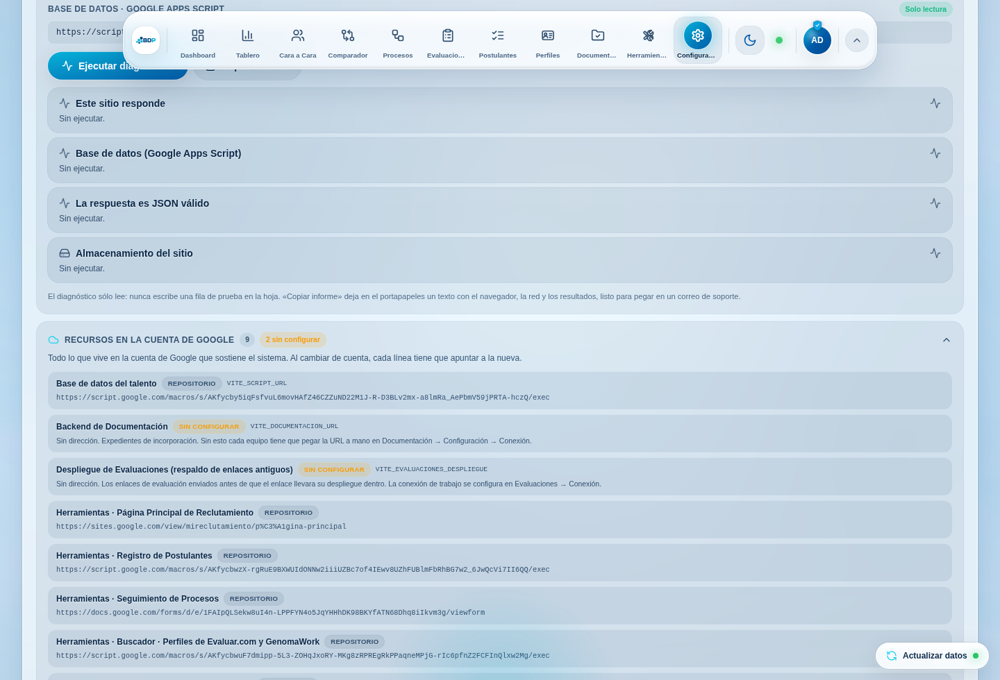
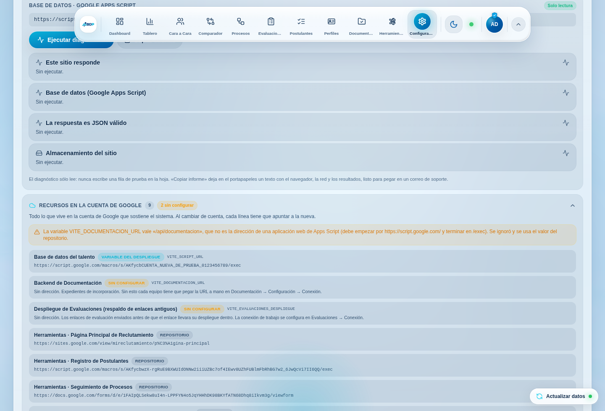
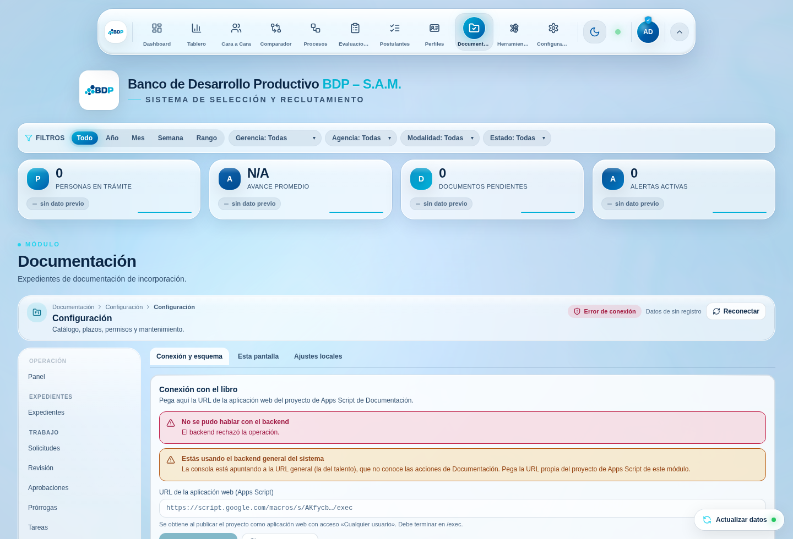
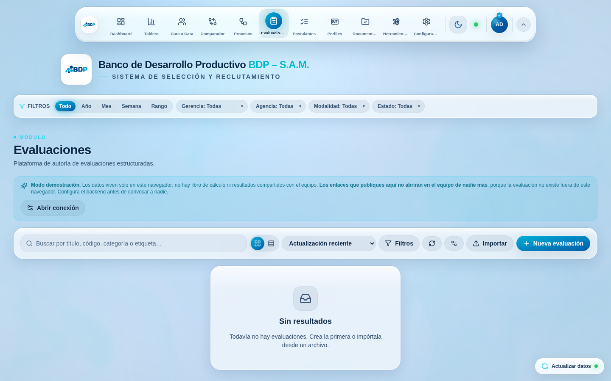

# Migración del sistema a otra cuenta de Google

Guía para mover **todo lo que hace funcionar este sistema** desde una cuenta de
Google a otra: los libros de cálculo que son su base de datos, los proyectos de
Apps Script que son su servidor, los despliegues que los publican, los
disparadores que ejecutan las tareas diarias y los seis accesos externos del
panel «Herramientas».

Está escrita para seguirse de arriba abajo sin saber programar. Cada paso dice
**qué hacer** y **qué se debe ver** cuando sale bien. Se puede parar en cualquier
punto antes del paso 14 sin consecuencias: hasta ahí nada ha cambiado en la
cuenta antigua.

- Qué hay que mover, en forma de lista de control: [`INVENTARIO.md`](INVENTARIO.md)
- Cómo comprobar el resultado: `npm run migracion:verificar`

---

## Índice

1. [Lo que hay que entender antes de tocar nada](#parte-0)
2. [Preparación · pasos 1 a 8](#parte-1)
3. [Rescatar el código del backend del talento · pasos 9 a 13](#parte-2)
4. [Elegir la estrategia](#parte-3)
5. [Mover el talento · pasos 14 a 21](#parte-4)
6. [Mover Documentación · pasos 22 a 32](#parte-5)
7. [Mover Evaluaciones · pasos 33 a 41](#parte-6)
8. [Los seis accesos externos · pasos 42 a 45](#parte-7)
9. [Apuntar el frontend a la cuenta nueva · pasos 46 a 50](#parte-8)
10. [El navegador de cada persona · pasos 51 a 53](#parte-9)
11. [Verificación final · pasos 54 a 60](#parte-10)
12. [Volver atrás](#rollback)
13. [Cerrar la cuenta antigua](#cierre)
14. [Tabla de síntomas](#sintomas)
15. [Lista imprimible](#checklist)

---

<a id="parte-0"></a>

## Parte 0 · Lo que hay que entender antes de tocar nada

### Este sistema no tiene servidor propio

Lo que se ve en el navegador es un sitio estático: no guarda nada. Todo lo que se
registra viaja a **Google Apps Script**, que es un programa que vive dentro de
una cuenta de Google y escribe en **hojas de cálculo de Google Sheets**. Las
hojas son la base de datos. No hay ninguna otra.

Eso tiene una consecuencia que manda sobre toda esta guía: **el sistema está
atado a la cuenta de Google que creó esos archivos**, y cambiar de cuenta no es
volver a desplegar el sitio. Es mover archivos, volver a publicar programas y
volver a apuntar el sitio a las direcciones nuevas.

### Son tres backends, no uno

Es lo primero que sorprende a quien no ha mantenido el sistema:

| Backend | Qué guarda | Su código |
|---|---|---|
| **Talento** | Postulantes, competencias, arquetipos DISC, catálogos, perfiles de acceso, perfiles de cargo, procesos, referencias, indicadores | ⚠️ Solo existe dentro de la cuenta de Google |
| **Documentación** | Expedientes de incorporación | `apps-script/documentacion/` |
| **Evaluaciones** | Evaluaciones, intentos y resultados | `apps-script/evaluaciones/` |

Cada uno tiene **su propio libro, su propio proyecto de Apps Script y su propia
dirección `…/exec`**. Confundir dos de esas direcciones es el fallo más frecuente
del sistema, y tiene su propio mensaje en pantalla: «Estás usando el backend
general del sistema».

### Tres cosas que Apps Script hace y que conviene saber de antemano

**1. Cuando un despliegue pierde permisos, responde `200` con una página web.**
No responde `401` ni `403`: responde una página HTML de autorización, con código
de éxito. Un programa ingenuo lo interpreta como «todo bien». El sistema ya sabe
detectarlo —por eso existe `src/lib/backendWrite.ts`— y el verificador de esta
guía lo comprueba explícitamente. Si después de migrar el sistema dice
«El servidor respondió con una página de autorización», es exactamente esto.

**2. Guardar el código no publica el código.** El editor de Apps Script guarda,
pero el enlace `…/exec` sigue sirviendo **la versión publicada**. Hay que ir a
`Implementar → Gestionar implementaciones → editar → Versión: Nueva`. Sin ese
paso todo responde y falla justo lo que se acaba de cambiar. Es el error que el
módulo de Documentación detecta comparando la lista de acciones que el backend
declara con las que la pantalla necesita.

**3. «Ejecutar como: Yo» significa la cuenta que publicó el despliegue.** Es lo
que permite que el área trabaje sin que cada persona autorice nada, y también lo
que hace que un despliegue publicado por la cuenta antigua siga ejecutándose con
los permisos de esa cuenta aunque el archivo ya pertenezca a otra. Por eso el
paso 26 comprueba **contra qué libro** está escribiendo el backend, y no solo si
responde.

### Cuánto dura y quién tiene que estar

Necesita dos accesos que no se pueden delegar:

- alguien con la **contraseña de la cuenta antigua** (o sesión abierta en ella);
- alguien con la **contraseña de la cuenta nueva**.

Si son dos personas distintas, tienen que estar a la vez: la mitad de los pasos
salta de una cuenta a la otra. Y hace falta una **ventana sin actividad**: nadie
registrando postulantes ni expedientes mientras se copia, porque lo que se
escriba en el libro viejo después de la copia no aparecerá en el nuevo.

---

<a id="parte-1"></a>

## Parte 1 · Preparación (pasos 1 a 8)

**1.** Abra el sistema, entre con un perfil de administrador y vaya a
**Configuración → Integraciones**. Despliegue **«Recursos en la cuenta de
Google»**.

Verá la lista completa de direcciones que el sistema usa y de dónde salió cada
una. Haga una captura de pantalla: es el estado «antes» y sirve para volver
atrás.



Cuando una dirección viene de una variable del despliegue, la etiqueta lo dice; y
una variable mal escrita aparece como aviso en lugar de romper la aplicación:



**2.** En la misma pantalla, pulse **«Ejecutar diagnóstico»** y luego **«Copiar
informe»**. Pegue el texto en un documento. Anote el número de postulantes y de
competencias que declara: son las cifras que tendrán que coincidir al final.

**3.** Vaya a **Documentación → Configuración → Conexión y esquema**. Anote:

- la URL `…/exec` que aparece como «Endpoint activo»;
- el nombre del libro;
- la versión de esquema y la de catálogo.

**4.** Vaya a **Evaluaciones**. Si dice «Modo demostración», este equipo no tiene
la conexión configurada: pídala a quien la tenga. Si está conectado, abra
**Conexión** y anote la URL `…/exec`. La llave **no** se anota en un documento
compartido: va al gestor de contraseñas del área.

**5.** Abra el panel **Herramientas** del dock y compruebe que los seis accesos
abren. Los que no abran ya estaban roto antes de migrar, y conviene saberlo ahora
para no atribuirlo después a la migración.

**6.** Entre a Google Drive **con la cuenta antigua** y localice los tres libros.
Para cada uno, `Archivo → Crear una copia` con el nombre
`<nombre> — RESPALDO PREVIO <fecha>`, y déjela en la cuenta antigua. Este es el
seguro: si algo sale mal en el paso 24 o en el 36, se vuelve a esta copia.

**7.** Anuncie la ventana de mantenimiento al área. Mientras dure, nadie registra
postulantes, nadie crea expedientes y nadie convoca evaluaciones. Lo que se
escriba en el libro viejo después de la copia se perderá al cambiar de cuenta.

**8.** Desde el repositorio, deje el estado de partida por escrito:

```bash
npm run migracion:verificar
```

Todavía apunta a la cuenta antigua, y eso es lo correcto: es la línea base.
Guarde la salida.

---

<a id="parte-2"></a>

## Parte 2 · Rescatar el código del backend del talento (pasos 9 a 13)

> **Este es el paso que no se puede saltar.** El código de Documentación y de
> Evaluaciones está en el repositorio: si se perdiera la cuenta, se vuelve a
> pegar. El del talento —el que atiende postulantes, comparador, perfiles,
> perfiles de cargo y procesos— **solo existe dentro de la cuenta de Google**. Si
> la cuenta antigua se cierra antes de extraerlo, hay que reescribirlo desde el
> contrato documentado en [`apps-script/talento/README.md`](../../apps-script/talento/README.md).

**9.** Con la cuenta antigua, abra el libro del talento y entre en
`Extensiones → Apps Script`.

**10.** En el editor, mire la lista de archivos de la izquierda. Anote cuántos
son y cómo se llaman. Lo normal es que sea uno solo (`Code.gs` o `Código.gs`),
pero puede haber varios.

**11.** Abra cada archivo, seleccione todo (`Ctrl+A`), copie (`Ctrl+C`) y péguelo
en un archivo nuevo dentro de `apps-script/talento/` del repositorio, **con el
mismo nombre**. Si el editor muestra `Code.gs`, el archivo se llama
`apps-script/talento/Code.gs`.

**12.** En el mismo editor, active `⚙️ Configuración del proyecto → Mostrar el
archivo de manifiesto «appsscript.json»`, abra `appsscript.json` y copie su
contenido a `apps-script/talento/appsscript.json`. Ahí está la zona horaria, los
permisos que pide y cómo está publicado.

**13.** En `⚙️ Configuración del proyecto → Propiedades del script`, anote las
que haya (nombre y valor). Si la lista está vacía, no hay ninguna que copiar.
**Los valores no se suben al repositorio**: van al gestor de contraseñas.

Confirme el rescate con un `commit`. A partir de aquí, aunque la cuenta antigua
desaparezca, el sistema se puede reconstruir.

---

<a id="parte-3"></a>

## Parte 3 · Elegir la estrategia

Hay dos formas de mover un archivo de Google de una cuenta a otra, y dan
resultados distintos.

### A · Copiar (recomendada)

Desde la cuenta **nueva**, `Archivo → Crear una copia` de cada libro. La copia
nace siendo propiedad de la cuenta nueva.

| A favor | En contra |
|---|---|
| El archivo nuevo es de la cuenta nueva desde el primer segundo | El **id del libro cambia**: hay que actualizar `DOC_SPREADSHEET_ID` y `EV_SPREADSHEET_ID` |
| La cuenta antigua conserva su copia intacta: volver atrás es no hacer nada | La **URL `…/exec` cambia**: hay que actualizar el repositorio y cada navegador |
| El código de un proyecto ligado al libro viaja con la copia | **No** viajan los disparadores, ni las propiedades del script, ni el historial de revisiones |
| No depende de que la cuenta antigua acepte nada | Los enlaces de evaluación ya enviados apuntan al despliegue viejo |
| Es predecible: siempre se comporta igual | Hay que volver a autorizar los permisos en la cuenta nueva |

### B · Transferir la propiedad

Desde la cuenta antigua, compartir el archivo con la nueva y `Transferir
propiedad`. La cuenta nueva acepta.

| A favor | En contra |
|---|---|
| El id del libro **no** cambia | Entre cuentas personales de Gmail hay que aceptar la transferencia, y no siempre está disponible según el tipo de cuenta |
| El historial de revisiones se conserva | El despliegue sigue publicado **por la cuenta antigua**: aunque el archivo ya sea de otra, el programa sigue ejecutándose con los permisos de la anterior hasta que la nueva publique una versión |
| Los enlaces de evaluación ya enviados pueden seguir abriendo | Volver atrás exige otra transferencia en sentido contrario |
| Menos cambios en el repositorio | Los disparadores siguen perteneciendo a la cuenta antigua y se apagan cuando esa cuenta se cierre |

### Cuál usar

**Use A (copiar) salvo que tenga una razón concreta para lo contrario.** Es
predecible, deja intacto el origen y no depende de una aceptación entre cuentas.
El precio —las URL cambian— es justamente lo que el archivo
`src/config/google.ts` y el verificador de esta guía convierten en dos cambios
verificables.

Si elige B, **no se salte los pasos de publicación**: hasta que la cuenta nueva
publique una versión nueva de cada despliegue, sigue trabajando la cuenta
antigua. El paso 26 lo detecta.

Los pasos que siguen están escritos para la estrategia A, y señalan lo que cambia
con la B.

---

<a id="parte-4"></a>

## Parte 4 · Mover el backend del talento (pasos 14 a 21)

**14.** Inicie sesión con la **cuenta nueva**. Con la cuenta antigua, comparta el
libro del talento con la cuenta nueva dando permiso de **Editor** (hace falta ser
editor para que la copia incluya el programa).

**15.** Con la cuenta nueva, abra el libro compartido y haga
`Archivo → Crear una copia`. Nómbrela sin la palabra «copia»: el nombre que
tendrá de aquí en adelante. Guárdela en una carpeta del Drive de la cuenta nueva.

**16.** Abra la copia y compruebe que están **todas las pestañas**: la de
postulantes, `Auxiliar`, `perfil_cargo_bdp`, `perfiles`, `Procesos` y las demás
que anotó en el paso 2. Compare el número de filas de la pestaña de postulantes
con la cifra del diagnóstico.

> Si falta alguna pestaña, no siga: la copia salió incompleta. Bórrela y repita
> el paso 15.

**17.** En la copia, `Extensiones → Apps Script`. Debe abrirse el editor **con
los mismos archivos** que anotó en el paso 10. Si el editor aparece vacío, el
programa no viajó con la copia: cree los archivos a mano pegando lo que rescató
en el paso 11.

**18.** Si el paso 13 encontró propiedades del script, vuelva a escribirlas en
`⚙️ Configuración del proyecto → Propiedades del script`. Si alguna era el id de
un libro, **use el id de la copia nueva**, no el viejo.

**19.** Ejecute una función cualquiera desde el editor (por ejemplo `doGet`) para
que Google pida los permisos. Acepte. Aparecerá un aviso de «aplicación no
verificada»: es normal en un programa propio; entre por `Configuración avanzada →
Ir a (nombre del proyecto)`.

**20.** `Implementar → Nueva implementación → Aplicación web`:

- **Descripción:** `migración <fecha>`
- **Ejecutar como:** `Yo` (la cuenta nueva)
- **Quién tiene acceso:** `Cualquier usuario`

Pulse `Implementar` y **copie la URL que termina en `/exec`**. Esta es la nueva
dirección del backend del talento.

**21.** Compruébela antes de seguir, desde el repositorio:

```bash
npm run migracion:verificar -- --talento=https://script.google.com/macros/s/…/exec
```

Debe decir que responde JSON, que el payload trae las cuatro claves y **cuántos
postulantes** hay. Si el número no coincide con el del paso 2, el script está
leyendo otro libro.

> Si dice «respondió HTTP 200 con una página HTML», el despliegue quedó sin
> acceso público: vuelva al paso 20 y revise los dos desplegables.

---

<a id="parte-5"></a>

## Parte 5 · Mover Documentación (pasos 22 a 32)

**22.** Con la cuenta antigua, comparta el libro de Documentación con la cuenta
nueva como **Editor**. Con la cuenta nueva, `Archivo → Crear una copia`.

**23.** Abra la copia y compruebe que están las 19 hojas normalizadas
(`Expedientes`, `ExpedienteDocumentos`, `CatalogoDocumentos`, …), las pestañas
anuales `CONTROL INGRESOS <año>` y las hojas de sistema. Las que empiezan por
guion bajo están ocultas: `Ver → Hojas ocultas`.

**24.** `Extensiones → Apps Script`. Actualice el código desde el repositorio,
que es la referencia: para cada archivo de `apps-script/documentacion/`, en el
orden en que están numerados, reemplace el contenido del archivo del mismo nombre
o créelo si no existe (`Archivo → Nuevo → Script`, nombre **exacto** y sin la
extensión: `11_Domain`, no `11_Domain.gs`).

> **El número del nombre no es decorativo.** Apps Script junta todos los archivos
> en uno solo antes de ejecutar, en orden alfabético: las constantes de
> `11_Domain` tienen que existir antes de que `15_Expedientes` las use.

**25.** Pegue el contenido de `apps-script/documentacion/appsscript.json` en el
manifiesto (`⚙️ Configuración del proyecto → Mostrar el archivo de manifiesto`).
Guarde con `Ctrl+S` y confirme que ningún archivo queda con el punto naranja de
«sin guardar».

**26.** `⚙️ Configuración del proyecto → Propiedades del script`:

- `DOC_SPREADSHEET_ID` = **el id de la copia nueva** (el trozo largo de la barra
  de direcciones entre `/d/` y `/edit`).
- `DOC_ADMIN_KEY` = una frase larga **nueva**, guardada en el gestor de
  contraseñas del área. No reutilice la de la cuenta antigua.

> Este es el paso que produce el fallo más desconcertante de una migración: con
> el id viejo aquí, **todo funciona** y todo se escribe en el libro de la cuenta
> que se quería abandonar.

**27.** Vuelva a la pestaña del libro y recárguela (`F5`). Debe aparecer el menú
**Documentacion** junto a `Ayuda`.

**28.** `Documentacion → Diagnosticar`. Lea el informe: dirá qué falta y con qué
gravedad. **Solo lee.**

**29.** `Documentacion → Instalar o actualizar modelo`. Google pedirá permisos:
revise que son para la cuenta nueva y acepte.

**30.** `Documentacion → Simular migración`. No escribe nada: devuelve lo que
haría. Compruebe que no propone crear expedientes desde cero (eso indicaría que
no está viendo los datos copiados). Si el informe es razonable,
`Documentacion → Migrar al modelo normalizado`.

**31.** `Implementar → Nueva implementación → Aplicación web`, con
**Ejecutar como: Yo** y **Quién tiene acceso: Cualquier usuario**. Copie la URL
`…/exec`.

**32.** Instale la tarea diaria: `Documentacion → Tarea diaria`. Un disparador
pertenece a la cuenta que lo creó, así que **la copia llegó sin ninguno** y nada
lo avisa. Sin él no hay respaldo diario, ni recálculo de avances, ni avisos de
prórroga.

Compruebe:

```bash
npm run migracion:verificar -- --documentacion=https://script.google.com/macros/s/…/exec
```

Debe decir el nombre del libro —**el nuevo**—, que el modelo está instalado, que
el esquema alcanza el que el frontend espera y que atiende las acciones que la
pantalla necesita.

> **Antes de encender el correo**, revise la hoja `_CONFIG`: `cuenta_remitente` y
> `correo_copia` traen valores de la cuenta anterior. Y tenga presente que ahora
> los avisos saldrán **desde la cuenta nueva**, con su dirección y su cuota
> diaria. Deje `avisos_automaticos` en `FALSE` hasta terminar la migración.

---

<a id="parte-6"></a>

## Parte 6 · Mover Evaluaciones (pasos 33 a 41)

**33.** Compruebe que **no hay ningún intento en curso**: Evaluaciones →
Resultados. Un postulante a mitad de una prueba durante esta parte la pierde.

**34.** Comparta el libro de Evaluaciones con la cuenta nueva como **Editor** y,
desde la cuenta nueva, `Archivo → Crear una copia`.

**35.** En la copia, `Extensiones → Apps Script`. Actualice los 24 archivos desde
`apps-script/evaluaciones/` respetando los nombres y el orden numérico, y pegue
`appsscript.json.example` en el manifiesto.

**36.** `⚙️ Configuración del proyecto → Propiedades del script`:

- `EV_SPREADSHEET_ID` = id de la copia nueva (o déjelo vacío si el proyecto está
  creado desde el propio libro).
- `EV_ADMIN_KEY`: la genera el menú en el paso 38. Déjela para entonces.

> **`EV_ATTEMPT_SECRET` no se copia a mano.** Lo genera la instalación y firma
> los tokens de intento. Reutilizar el viejo no aporta nada y equivocarse
> invalida intentos.

**37.** Recargue el libro. Debe aparecer el menú **⚙️ Evaluaciones**.

**38.** En ese menú, por este orden:

1. **Instalar o reparar estructura** — crea las trece hojas y el secreto de
   firma.
2. **Generar llave de administración** — cópiela ahora: no se vuelve a mostrar.
   Guárdela en el gestor de contraseñas.
3. **Ejecutar pruebas del backend** — 15 pruebas contra el libro real. Deben
   pasar todas.

**39.** `Implementar → Nueva implementación → Aplicación web`, con **Ejecutar
como: Yo** y **Quién tiene acceso: Cualquier usuario**.

> Aquí el segundo desplegable no es una formalidad: **un postulante anónimo tiene
> que poder abrir la prueba**. Con «usuario que accede», Google le devuelve su
> pantalla de inicio de sesión en lugar de la evaluación.

Copie la URL `…/exec`.

**40.** Instale la tarea diaria: `⚙️ Evaluaciones → Instalar disparador diario`.

**41.** Compruebe:

```bash
npm run migracion:verificar -- --evaluaciones=https://script.google.com/macros/s/…/exec --llave=LA_LLAVE
```

Debe decir el nombre del libro nuevo, que la estructura está instalada y cuántas
evaluaciones, versiones e intentos hay. Si avisa de «modo abierto», falta pegar
la llave en la propiedad `EV_ADMIN_KEY`.

### Los enlaces de evaluación ya enviados

Cada enlace público lleva dentro la referencia del despliegue al que pertenece
(`…#/evaluacion/EV-XXXX-1234?b=AKfycb…`). Los enlaces enviados **antes** de la
migración apuntan al despliegue **antiguo**:

- mientras la cuenta antigua siga activa y su despliegue exista, **siguen
  funcionando**;
- el día que se borre el despliegue o se cierre la cuenta, **dejan de abrir**.

Dos opciones, y se pueden combinar:

1. **Volver a copiar y reenviar el enlace** de cada evaluación viva. El código de
   la evaluación no cambia: es literalmente copiar y pegar otra vez. El botón
   «Comprobar» del módulo verifica cada enlace antes de enviarlo.
2. Dejar el despliegue viejo en pie unas semanas, hasta que las convocatorias en
   curso terminen.

---

<a id="parte-7"></a>

## Parte 7 · Los seis accesos externos (pasos 42 a 45)

El panel **Herramientas** abre seis cosas que también viven en la cuenta antigua
y que una migración olvida siempre, porque no fallan: simplemente un día dejan de
abrir.

**42. Las dos aplicaciones web** (Registro de Postulantes, los dos buscadores).
Cada una es una migración pequeña con los mismos pasos: copiar su libro, revisar
las propiedades del script, autorizar, publicar como aplicación web con
«Cualquier usuario» y copiar la URL `…/exec` nueva.

**43. Los dos formularios** (Seguimiento de Procesos, Registro de Lista Negra).
Desde la cuenta nueva, `Crear una copia` de cada formulario.

> Una copia de un formulario **no trae las respuestas ya recibidas**. Lleve
> aparte la hoja de respuestas de la cuenta antigua y decida si el formulario
> nuevo escribe en una hoja nueva.

**44. El sitio de Google** (`sites.google.com/view/mireclutamiento`). Se puede
copiar o transferir. Al copiarlo, **la dirección pública cambia**: si está
publicada en otro sitio o impresa en algún material, conviene transferir la
propiedad en lugar de copiar.

**45.** Actualice las seis direcciones en `UTILIDADES`, dentro de
`src/config/google.ts`. Si alguna no se migra, déjela como está y anótelo: es
mejor un enlace que se sabe viejo que uno que se cree nuevo.

---

<a id="parte-8"></a>

## Parte 8 · Apuntar el frontend a la cuenta nueva (pasos 46 a 50)

Todas las direcciones están en un solo archivo. No hay ningún otro sitio donde
buscarlas, y el verificador lo comprueba.

**46.** Abra `src/config/google.ts` y sustituya:

```ts
export const SCRIPT_URL = resolverExec(
  "VITE_SCRIPT_URL",
  "https://script.google.com/macros/s/AQUÍ_LA_URL_NUEVA_DEL_TALENTO/exec",
);

export const URL_DOCUMENTACION = resolverExec(
  "VITE_DOCUMENTACION_URL",
  "https://script.google.com/macros/s/AQUÍ_LA_URL_NUEVA_DE_DOCUMENTACION/exec",
);
```

Rellenar `URL_DOCUMENTACION` es opcional pero muy recomendable: es lo que evita
que las cinco personas del área tengan que pegar la URL a mano en su equipo.

**47.** Si quiere que los enlaces de evaluación antiguos resuelvan contra el
despliegue nuevo, pegue también su identificador —el trozo `AKfycb…` de la URL,
**sin** `https://` ni `/exec`— en `DESPLIEGUE_EVALUACIONES`.

**48.** Actualice las seis `UTILIDADES` con lo que resultó de la parte 7.

**49.** Compruebe que el repositorio sigue sano:

```bash
npm run typecheck
npm test
npm run migracion:verificar
```

El verificador ya no necesita argumentos: toma las direcciones del propio
archivo. Las tres órdenes tienen que terminar sin errores.

**50.** Publique el frontend (el `push` a la rama principal, si Vercel está
conectado). Cuando termine, abra el sitio y confirme en **Configuración →
Integraciones → Recursos en la cuenta de Google** que cada línea apunta a la
cuenta nueva.

> **Alternativa sin tocar el código:** definir `VITE_SCRIPT_URL` y
> `VITE_DOCUMENTACION_URL` como variables de entorno en el proyecto de Vercel.
> Mandan sobre el archivo, así que sirven para ensayar la cuenta nueva antes de
> hacer el cambio definitivo. El inventario de Configuración muestra
> «variable del despliegue» cuando el valor viene de ahí, para que no haya duda
> de cuál está ganando.

---

<a id="parte-9"></a>

## Parte 9 · El navegador de cada persona (pasos 51 a 53)

Esta parte es la que se olvida, y produce el clásico «a mí me sigue funcionando
raro». Dos cosas del sistema viven en el navegador de cada persona y **tienen
prioridad sobre el repositorio**.

**51.** En cada equipo del área, abra **Documentación → Configuración → Conexión
y esquema** y compruebe el «Endpoint activo». Si es la URL antigua, pegue la
nueva y pulse «Comprobar conexión».

**52.** En cada equipo, abra **Evaluaciones → Conexión**, pegue la URL nueva y la
llave nueva, y pulse «Guardar y probar».

**53.** Si un equipo se comporta de forma extraña, déjelo limpio: `F12 →
Application → Local Storage`, borre las claves que empiezan por `bdp-` y
recargue. Se pierden preferencias locales —tema, disposición del tablero—, nunca
datos: los datos están en las hojas.

---

<a id="parte-10"></a>

## Parte 10 · Verificación final (pasos 54 a 60)

Responder «sí» a las seis primeras y hacer la séptima es lo que permite dar la
migración por terminada.

**54. Las tres direcciones responden y apuntan al libro correcto.**

```bash
npm run migracion:verificar -- \
  --talento=https://script.google.com/macros/s/…/exec \
  --documentacion=https://script.google.com/macros/s/…/exec \
  --evaluaciones=https://script.google.com/macros/s/…/exec --llave=LA_LLAVE
```

Sin ningún `✗`, y con los nombres de los libros **nuevos**.

**55. El diagnóstico del sistema está en verde.** Configuración → Integraciones →
Ejecutar diagnóstico: las cuatro comprobaciones en verde y el número de
postulantes igual al del paso 2.

**56. El punto del dock está verde.** Verde es sincronizado; rojo significa que
lo que se ve es una copia local y nada de lo que se registre llegará a la base.

**57. Una escritura real llega a la hoja nueva.** Registre un postulante de
prueba con un identificador reconocible, ábralo en el libro **nuevo**,
compruebe que la fila está ahí y bórrela. Es la única prueba que demuestra que la
escritura funciona de verdad: el diagnóstico solo lee.

**58. Documentación abre un expediente y lo guarda.** Debe aparecer en la pestaña
`CONTROL INGRESOS <año>` del libro nuevo.

**59. Una evaluación se publica y su enlace abre en otro equipo.** Publique una
evaluación de prueba, copie el enlace y ábralo en un teléfono o en una ventana de
incógnito **sin sesión de Google**. Tiene que abrir. Si pide iniciar sesión, el
despliegue no está publicado con acceso «Cualquier usuario» (paso 39).

**60. Los seis accesos de Herramientas abren.**

---

<a id="rollback"></a>

## Volver atrás

Mientras no se cierre la cuenta antigua, volver atrás es rápido, porque la
estrategia de copia **no tocó el origen**.

1. **El frontend.** Revierta el cambio de `src/config/google.ts` (o borre las
   variables de Vercel) y vuelva a publicar. En cuanto el sitio vuelva a apuntar
   a las direcciones antiguas, el sistema trabaja otra vez contra la cuenta
   anterior.
2. **Los navegadores.** Vuelva a pegar las URL antiguas en Documentación →
   Conexión y en Evaluaciones → Conexión de cada equipo, o borre las claves
   `bdp-`.
3. **Los datos escritos en medio.** Lo que se haya registrado en los libros
   nuevos durante el ensayo **no está** en los viejos. Es el motivo de la ventana
   sin actividad del paso 7: si hubo escrituras, hay que pasarlas a mano.
4. **Los disparadores.** Si desactivó las tareas diarias en la cuenta antigua,
   vuelva a activarlas desde los menús de sus libros.

No hay que borrar nada de la cuenta nueva para volver atrás. Los libros nuevos
pueden quedarse ahí mientras se decide.

---

<a id="cierre"></a>

## Cerrar la cuenta antigua

**No cierre la cuenta antigua el mismo día.** Deje pasar al menos un ciclo
completo de trabajo del área —un mes cubre el informe mensual y las prórrogas— y
compruebe antes:

- **Los enlaces de evaluación en circulación.** Cierre la cuenta solo cuando no
  quede ninguna convocatoria abierta con un enlace antiguo, o después de
  reenviarlos todos.
- **Las tareas diarias.** Que los disparadores de la cuenta **nueva** hayan
  corrido varios días: mire la hoja `_DIARIO` de Documentación.
- **El correo.** Que haya salido al menos un aviso desde la cuenta nueva y que
  llegue bien, sin ir a la carpeta de no deseados por el cambio de remitente.
- **Los respaldos.** Descargue los libros de la cuenta antigua
  (`Archivo → Descargar → Excel`) y guárdelos donde el área guarda sus archivos
  históricos. Es el último punto en el que esos datos existen fuera de Google.

Y desactive las tareas diarias de la cuenta antigua (`Documentacion → Quitar
tarea diaria`, y el disparador de Evaluaciones), para que los dos sistemas no
estén trabajando a la vez sobre libros distintos.

---

<a id="sintomas"></a>

## Tabla de síntomas

| Lo que se ve | Lo que pasa | Qué hacer |
|---|---|---|
| «El servidor respondió con una página de autorización» | El despliegue no tiene acceso público | Implementar → Gestionar implementaciones → editar → «Cualquier usuario» → versión Nueva |
| El sistema carga pero no hay postulantes | El script apunta a un libro vacío o a otro libro | Revisar la propiedad del id del libro; verificar con `migracion:verificar` |
| Todo funciona, pero los datos nuevos no aparecen en el libro nuevo | El frontend sigue apuntando a la cuenta antigua | Configuración → Integraciones → Recursos en la cuenta de Google |
| «Estás usando el backend general del sistema» | La URL de Documentación es la del talento | Pegar la URL del proyecto de Documentación en su panel de Conexión |
| «La acción X no existe en este backend» | Se pegaron los `.gs` y no se publicó una versión nueva | Implementar → Gestionar implementaciones → editar → Versión: Nueva |
| Documentación va bien en un equipo y mal en otro | El `localStorage` del segundo guarda la URL antigua | Pasos 51 a 53 |
| «Esta evaluación no está disponible» en el teléfono del postulante | El enlace apunta al despliegue antiguo, ya borrado | Volver a copiar el enlace desde el módulo y reenviarlo |
| El postulante ve la pantalla de inicio de sesión de Google | El despliegue de Evaluaciones no es «Cualquier usuario» | Paso 39 |
| Dejaron de llegar avisos de prórroga | El disparador diario no se instaló en la cuenta nueva | Paso 32 |
| El punto del dock está rojo | No hay conexión con el backend: lo que se ve es una copia local | Diagnóstico de Configuración → Integraciones |

### Los dos síntomas que más confunden

**La URL de Documentación es la del talento.** El módulo lo dice con estas
palabras, y el remedio está en la misma pantalla:



**Evaluaciones en modo demostración.** Significa que ESTE navegador no tiene la
conexión configurada. Lo que se publique aquí no existe para nadie más, así que
los enlaces que se envíen no abrirán:



---

<a id="checklist"></a>

## Lista imprimible

```
PREPARACIÓN
[ ]  1 Captura del inventario de Configuración → Integraciones
[ ]  2 Informe de diagnóstico guardado (nº de postulantes: ______)
[ ]  3 URL, libro y versiones de Documentación anotadas
[ ]  4 URL de Evaluaciones anotada · llave al gestor de contraseñas
[ ]  5 Los seis accesos de Herramientas abren hoy
[ ]  6 Copia de respaldo de los tres libros en la cuenta antigua
[ ]  7 Ventana de mantenimiento anunciada
[ ]  8 `npm run migracion:verificar` de referencia guardado

RESCATE DEL CÓDIGO DEL TALENTO      ← no se puede saltar
[ ]  9-13 Código, manifiesto y propiedades en apps-script/talento/ + commit

TALENTO
[ ] 14-16 Libro copiado a la cuenta nueva · pestañas y filas comprobadas
[ ] 17-19 Programa presente · propiedades escritas · permisos aceptados
[ ] 20    Publicado como aplicación web (Yo / Cualquier usuario)
[ ] 21    Verificado: responde, claves completas, nº de postulantes correcto

DOCUMENTACIÓN
[ ] 22-23 Libro copiado · 19 hojas y pestañas anuales presentes
[ ] 24-25 Los 22 archivos .gs y el manifiesto actualizados
[ ] 26    DOC_SPREADSHEET_ID = id del libro NUEVO · DOC_ADMIN_KEY nueva
[ ] 27-30 Diagnosticar → Instalar → Simular → Migrar
[ ] 31    Publicado como aplicación web
[ ] 32    Tarea diaria instalada · _CONFIG revisada · correo apagado
[ ]       Verificado con migracion:verificar

EVALUACIONES
[ ] 33-34 Sin intentos en curso · libro copiado
[ ] 35-36 Los 24 archivos y el manifiesto · EV_SPREADSHEET_ID del libro nuevo
[ ] 37-38 Instalar estructura · generar llave · 15 pruebas en verde
[ ] 39-40 Publicado (Yo / Cualquier usuario) · disparador diario
[ ] 41    Verificado · plan de enlaces antiguos decidido

ACCESOS EXTERNOS
[ ] 42-45 Dos web apps · dos formularios · sitio · UTILIDADES actualizadas

FRONTEND
[ ] 46-48 src/config/google.ts con las direcciones nuevas
[ ] 49    typecheck + test + migracion:verificar en verde
[ ] 50    Publicado · inventario en pantalla apunta a la cuenta nueva

NAVEGADORES
[ ] 51-53 Conexión de Documentación y de Evaluaciones en cada equipo

VERIFICACIÓN FINAL
[ ] 54 Verificador sin ningún ✗
[ ] 55 Diagnóstico en verde · nº de postulantes igual al del paso 2
[ ] 56 Punto del dock en verde
[ ] 57 Postulante de prueba escrito en la hoja nueva y borrado
[ ] 58 Expediente de prueba en CONTROL INGRESOS del libro nuevo
[ ] 59 Enlace de evaluación abierto sin sesión de Google
[ ] 60 Los seis accesos de Herramientas abren

CIERRE (semanas después)
[ ] Enlaces de evaluación antiguos reenviados o agotados
[ ] Tareas diarias de la cuenta nueva corriendo (hoja _DIARIO)
[ ] Un aviso de correo enviado y recibido desde la cuenta nueva
[ ] Libros descargados y archivados
[ ] Tareas diarias de la cuenta antigua desactivadas
```
