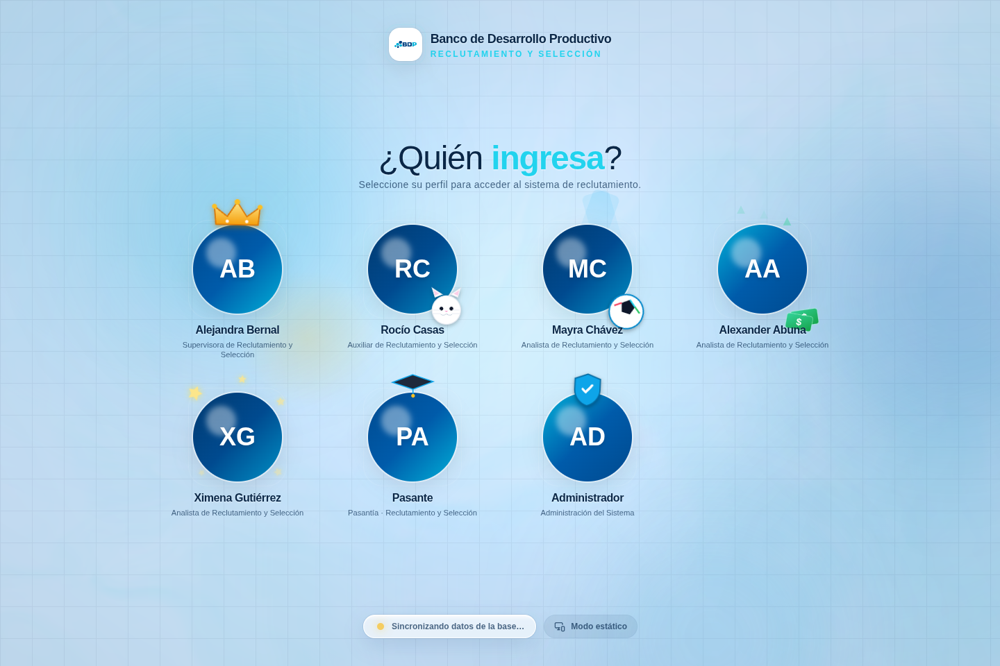
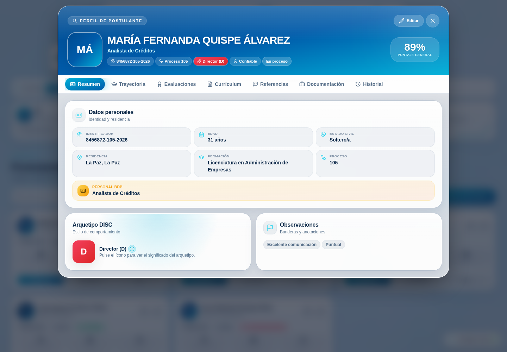
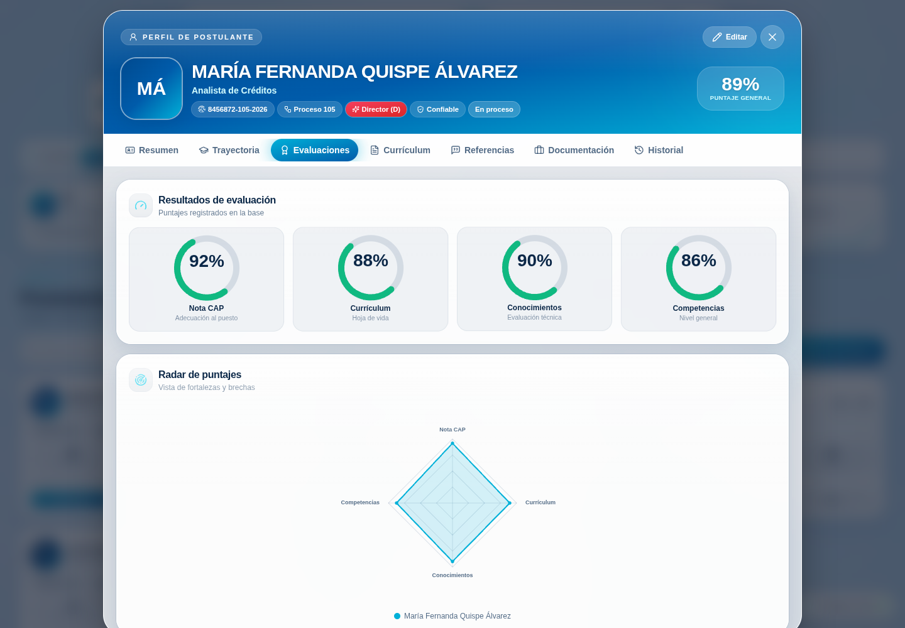
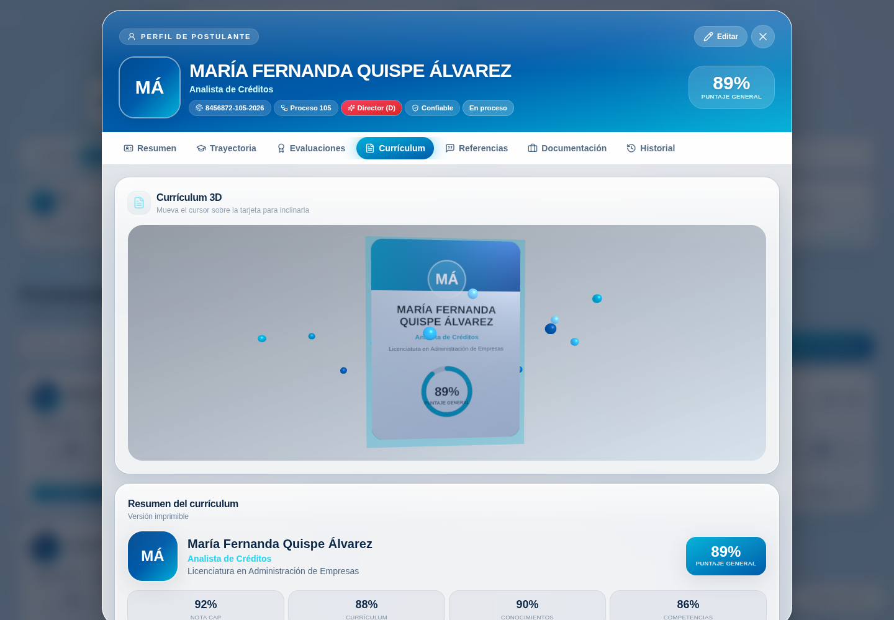
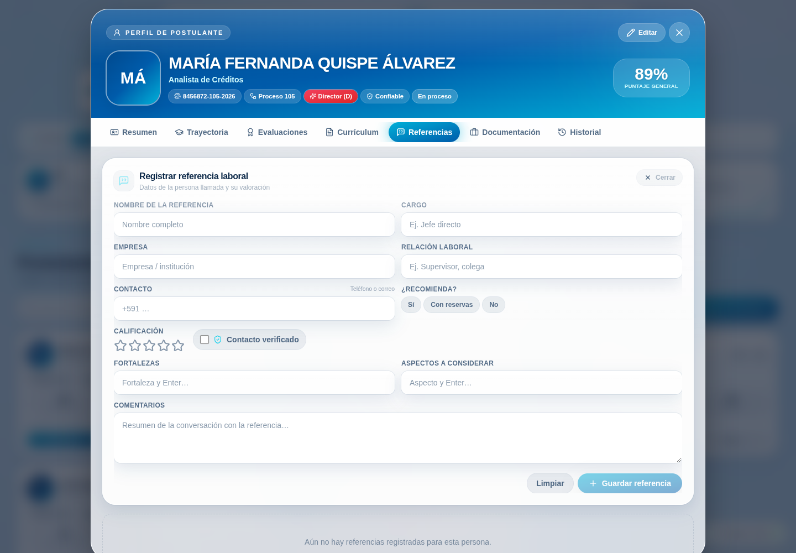
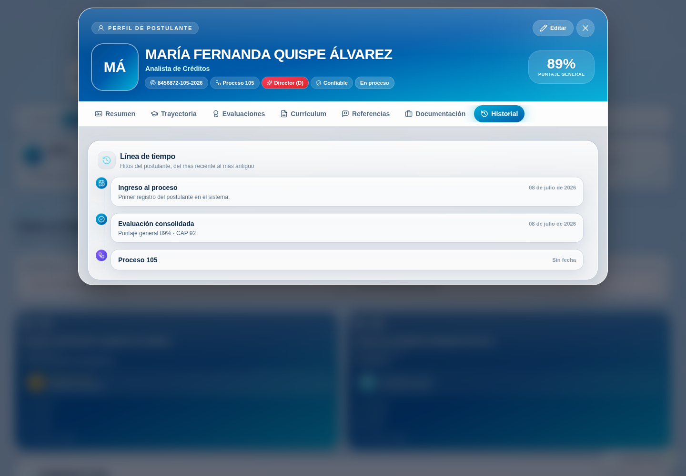
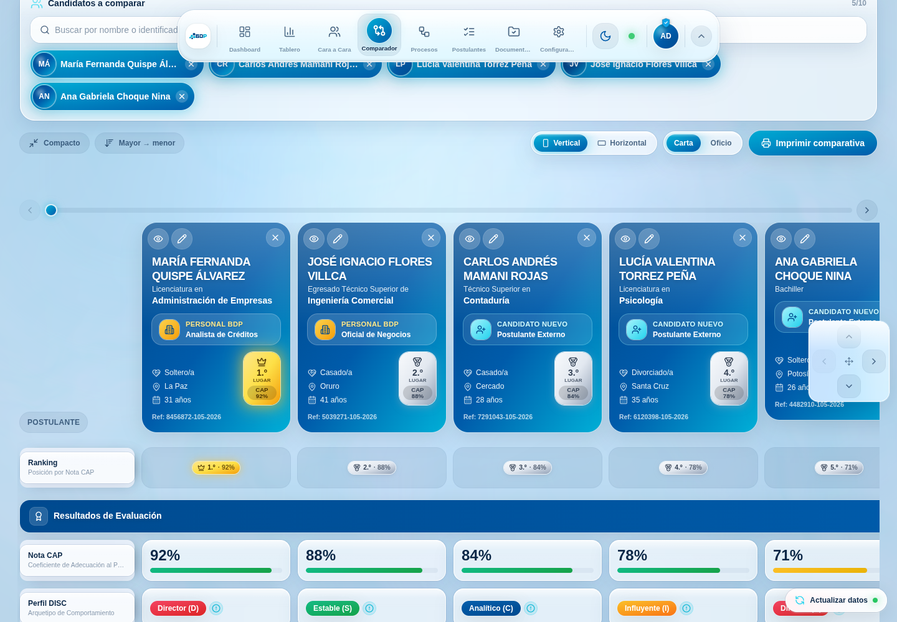
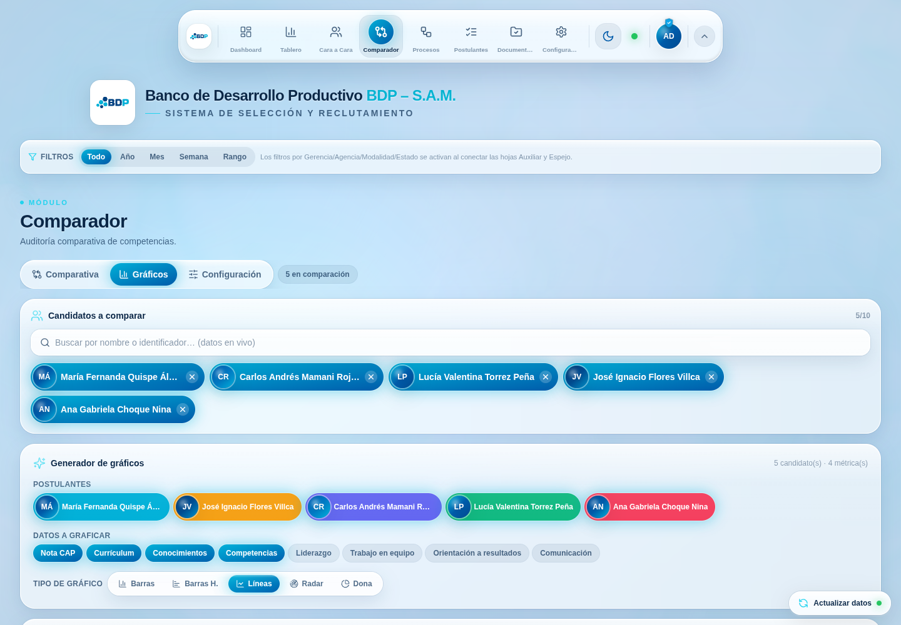
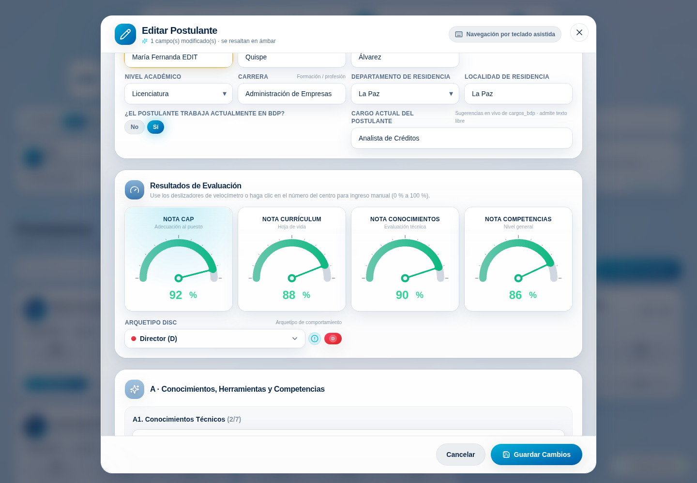
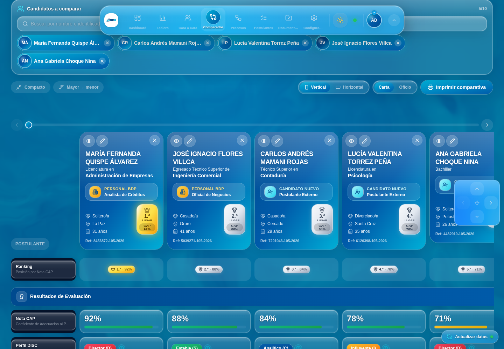

# Perfil de Postulante, edición global y mejoras del Comparador — Explicación técnica

> [!NOTE]
> Este documento acompaña al PR que introduce la **Vista Completa de Perfil**, la
> **edición global de postulantes**, un rediseño de la **pantalla de perfiles**,
> más tipos de **gráficos** y varios cambios en el **Comparador**. Está escrito
> para que cualquiera del equipo —conozca o no el código— pueda entender qué
> cambió y por qué.

---

## 1 · Contexto (Background)

### Para quien recién llega

La aplicación es un **panel de Recursos Humanos** (React 18 + TypeScript + Vite,
estética *Liquid Glass*) que integra el proceso de reclutamiento del BDP. Cada
persona nace de un **identificador único** con el formato `CI - Nro Proceso - Año`
(por ejemplo `8456872-105-2026`). Toda la data vive en una hoja de Google Sheets
(`Registro_Postulantes`) y se lee/escribe a través de un **Web App de Google
Apps Script** (`docs/backend/Code.gs`).

En el frontend, un único hook global —`useTalentData` (Context API)— descarga,
normaliza y distribuye los datos. Cada registro crudo (`RawCandidate`) se
convierte en un `Candidate` con campos "seguros" (`fullName`,
`competenciasList`, etc.). Los módulos (Dashboard, Comparador, Postulantes…) se
alimentan de ese contexto.

> [!TIP]
> **Concepto clave — Store externo.** Varias piezas de estado que deben ser
> reactivas pero vivir fuera de React usan `useSyncExternalStore` sobre un
> objeto en memoria + `localStorage`/`sessionStorage`. Así funcionan
> `configStore`, `comparatorStore`, `docStore`, `hiringStore` y los stores nuevos
> de este PR. Es un patrón barato: cualquier componente se suscribe con un hook y
> se re-renderiza cuando el estado cambia, sin *prop drilling*.

### El punto de partida de este cambio

Antes de este PR **no existía una vista centralizada** de una persona: sus datos
estaban repartidos entre el Comparador (competencias), Documentación
(expediente), el listado (notas) y las hojas espejo (proceso). Tampoco se podía
**editar** un postulante ya guardado desde el frontend, y el Comparador tenía un
ranking poco visible, un indicador de "empate" que estorbaba y una primera
columna que se solapaba al desplazarse.

---

## 2 · Intuición (Intuition)

La idea central es sencilla: **un postulante es una entidad; su identificador es
la llave; todo lo demás cuelga de esa llave.** Si logramos "abrir" a esa persona
desde cualquier punto de la app y reunir sus fuentes de datos en un solo lugar,
el resto son detalles de presentación.

Para lograrlo sin cablear callbacks por toda la aplicación, usamos **dos señales
globales** minúsculas:

```ts
// profileViewerStore.ts — "¿qué perfil está abierto?"
openProfile("8456872-105-2026");   // cualquier módulo lo llama
// candidateEditStore.ts — "¿a quién estoy editando?"
openEdit("8456872-105-2026");
```

Dos componentes montados **una sola vez** en la raíz (`<CandidateProfileViewer/>`
y `<CandidateEditModal/>`) escuchan esas señales y aparecen sobre todo lo demás.
Es el mismo patrón que ya usaba `dockOverrideStore`: una señal efímera en memoria.

> [!IMPORTANT]
> **Ejemplo concreto.** En el Comparador, la tarjeta de "María Fernanda" muestra
> un ✏️. Al hacer clic, `openEdit("8456872-105-2026")` cambia una variable; el
> modal global —que ya estaba montado— resuelve el candidato por id, precarga el
> formulario y se abre. La tarjeta no sabe nada del modal: solo "grita" un id.

Para **editar** reutilizamos el formulario de registro que ya existía. La única
diferencia es que en modo edición: (a) precargamos el formulario con los datos de
la persona, (b) guardamos una *fotografía base* y comparamos campo por campo para
**resaltar en ámbar lo que cambió**, y (c) al guardar enviamos
`POST { action:"update", … }`, que en Apps Script localiza la fila por
`identificador` y reescribe **solo** las celdas correspondientes.

---

## 3 · Recorrido por el código (Code)

### 3.1 Señales globales y el store de referencias

```ts
// src/lib/profileViewerStore.ts  (y candidateEditStore.ts, gemelo)
let openId: string | null = null;
export function openProfile(id: string) { openId = id; emit(); }
export function closeProfile() { openId = null; emit(); }
export function useProfileViewer() {           // binding React
  return useSyncExternalStore(subscribe, () => openId, () => openId);
}
```

`referencesStore.ts` guarda las **referencias laborales** por identificador en
`localStorage` y las sincroniza *best-effort* al backend
(`type:"referencia_laboral"`), igual que `docStore`/`hiringStore`.

### 3.2 La Vista Completa de Perfil

Un shell (`CandidateProfileViewer.tsx`) monta un *portal* a pantalla completa con
un **hero** (avatar, nombre en mayúsculas, DISC, puntaje general, estado) y una
barra de **siete pestañas** con transición de píldora (`layoutId`):

```tsx
{tab === "resumen" && <ResumenTab candidate={candidate} />}
{tab === "evaluaciones" && <EvaluacionesTab candidate={candidate} />}
{tab === "curriculum" && <CurriculumTab candidate={candidate} />}
// … trayectoria, referencias, documentación, historial
```

Cada pestaña es un componente autónomo que recibe el `Candidate` y extrae lo que
necesita (con helpers de `profileData.ts`, p. ej. `overallScore`, `buildTimeline`).
El **Currículum 3D** carga Three.js de forma diferida (`import("three")`), dibuja
la CV sobre un `CanvasTexture` y hace que la tarjeta siga al cursor; si WebGL no
está disponible, cae con gracia a una CV estática (también imprimible).

### 3.3 Edición global en el formulario

```tsx
// RegistrationForm.tsx — el mismo formulario, dos modos
const isEdit = Boolean(editing);
const changed = useMemo(
  () => (isEdit && baseline ? changedKeys(baseline, form) : new Set()),
  [isEdit, baseline, form],
);
// cada campo se envuelve para el resaltado ámbar:
<EditHL on={changed.has("nombres")}> <TextField … /> </EditHL>
```

Al guardar, `updateCandidate` (en `TalentDataContext`) hace el POST, refleja el
cambio localmente (rápido) y luego `load()` vuelve a sincronizar toda la base
(completo). El diff de campos se envía a la bitácora con `logActivity`.

### 3.4 Comparador

- **Orden y ranking** salen de `configStore` (`comparatorOrder`,
  `rankPlacement`, `rankingEnabled`). `sortByCap(list, order)` reemplazó a
  `sortByCapDesc` y admite dirección.
- Se **eliminó el empate** (`tieThreshold`, `tieGroups`, chip "Empate CAP" y CSS
  `.cmp-tie`).
- `RankBadge`/`RankChip` pintan la chapa **dorada** (con destello y aura) para el
  1.º y **plateada** para el resto, en tarjeta y/o en una fila dedicada.
- La columna congelada usa `.cmp-freeze` (fondo **opaco**) para no solaparse, y
  `MarqueeText` revela las etiquetas recortadas con un vaivén suave.
- `ComparatorNavHelper` es un **d-pad fijo** que aparece con >4 candidatos.
- Los nombres del chip de datos personales se muestran con `upperName()`.

### 3.5 Gráficos y backend

`components/charts/index.tsx` gana `HorizontalBars` y `LineChart` (multiserie con
leyenda). En `Code.gs`, `doPost` ahora enruta `referencia_laboral` a su propia
hoja y **solo invalida la caché** en escrituras que cambian datos (no en
bitácora/login), para que las ediciones se sientan instantáneas.

---

## 4 · Verificación (Verification)

**Automática (por el agente):**

- `npm run typecheck` y `npm run build` pasan en verde.
- Recorrido con navegador headless (Playwright + Chromium): se navegaron **todos
  los módulos**, se abrió el perfil y **sus siete pestañas**, y se ejecutó el
  flujo de edición. **Cero errores de JS/React** en consola (solo fallan las
  llamadas de red al Apps Script, esperado en el entorno aislado).

**QA manual sugerido:**

1. Abra la app; en la pantalla de perfiles elija uno (login).
2. Vaya a **Postulantes** → clic en el 👁 de una tarjeta → recorra las pestañas
   del perfil. En **Currículum**, mueva el cursor sobre la tarjeta 3D.
3. Pulse **Editar** (✏️), cambie un campo → debe **resaltarse en ámbar**; el
   botón dice **Guardar Cambios**. Guarde y confirme que la base se refresca.
4. En **Comparador**, agregue 5+ postulantes: verifique el **ranking** (1.º
   dorado), el **d-pad** fijo, la **columna congelada** sin solapamiento y la
   **marquesina** en etiquetas largas. Cambie el orden **asc/desc**.
5. En **Gráficos**, pruebe *Barras H.* y *Líneas*.
6. Repita en **tema oscuro** y con el **Modo ligero** (Configuración).












---

## 5 · Alternativas (Alternatives)

**A. Señales globales (elegida) vs. enrutador con URL (`/perfil/:id`)**

| Señal global en memoria (elegida) | Ruta dedicada por URL |
| --- | --- |
| ✅ Cero dependencias; encaja con los stores existentes | ✅ Perfiles enlazables/compartibles y navegación atrás |
| ✅ Se abre como *overlay* sin perder el módulo de fondo | ✅ Estado en la URL, ideal para *deep links* |
| ❌ No es enlazable por URL | ❌ Requiere añadir `react-router` y reestructurar `App` |

**B. Reutilizar el formulario para editar (elegida) vs. formulario de edición aparte**

| Reutilizar el intake (elegida) | Formulario separado |
| --- | --- |
| ✅ Una sola fuente de verdad de campos/validación | ✅ Libertad total de layout para edición |
| ✅ Menos código y menos deriva entre alta y edición | ✅ No arriesga el flujo de alta |
| ❌ El componente crece y maneja dos modos | ❌ Duplicación y doble mantenimiento |

**C. Motor de gráficos propio (elegido) vs. librería (Recharts/visx/nivo)**

| SVG + Framer Motion propio (elegido) | Librería de terceros |
| --- | --- |
| ✅ Cero peso extra; anima con el mismo lenguaje del resto | ✅ Muchos tipos listos y probados |
| ✅ Control total del look Liquid Glass y de la impresión | ✅ Menos código a mantener a largo plazo |
| ❌ Cada tipo nuevo se implementa a mano | ❌ +peso de bundle y estilos a domar |

---

## 6 · Personas con contexto (Suggested people to talk to)

El historial de git de los archivos tocados (`NuevoComparador.tsx`,
`RegistrationForm.tsx`, `LoginScreen.tsx`, `TalentDataContext.tsx`, `Code.gs`)
muestra que **todos** los commits previos fueron generados por el asistente de IA
en PRs anteriores; no hay otros colaboradores humanos con conocimiento a nivel de
archivo.

- **AlekeyRC (dueño del repo, `elliot.i@centermono.com`).** Es quien dirige el
  producto y conoce las reglas de negocio (identificadores, hoja
  `Registro_Postulantes`, integración con Evaluar.com y el flujo de acefalías).
  Es la referencia obligada para validar criterios de negocio y despliegue del
  Apps Script.

Como el código fue escrito por IA, conviene una revisión humana con foco en las
reglas de negocio antes de fusionar.

---

## 7 · Quiz de comprensión

<details>
<summary>1. ¿Cómo abre un módulo cualquiera la Vista Completa de Perfil?</summary>

- **A.** Renderiza `<CandidateProfileViewer/>` dentro de sí mismo.
- **B.** Llama a `openProfile(id)`, que cambia un store global escuchado por un viewer montado en la raíz. ✅
- **C.** Cambia la URL a `/perfil/:id`.
- **D.** Emite un evento del DOM.

**Correcto: B.** El módulo solo "grita" un id vía `profileViewerStore`; el viewer,
montado una vez en `App`, reacciona. Por eso el acceso es universal sin *prop
drilling*. (A es falso: hay un único viewer; C no existe, no hay router; D no es
el mecanismo usado.)
</details>

<details>
<summary>2. ¿Qué envía el frontend al guardar una edición y qué hace el backend?</summary>

- **A.** `POST` sin `type` con la fila completa; Apps Script hace `appendRow`.
- **B.** `POST { action:"update", … }`; Apps Script localiza la fila por `identificador` y reescribe columna por columna. ✅
- **C.** Un `PUT` REST a `/candidatos/:id`.
- **D.** Reescribe toda la hoja.

**Correcto: B.** `updateCandidate` manda `action:"update"`; `handlePostulante_`
busca por identificador y setea solo las celdas presentes en el cuerpo, por eso
las columnas no incluidas (p. ej. `correo`) se preservan.
</details>

<details>
<summary>3. ¿Por qué la columna congelada del Comparador dejó de solaparse?</summary>

- **A.** Se le subió el `z-index`.
- **B.** Se le puso un fondo **opaco** (`.cmp-freeze`) para que el contenido que se desplaza no se vea a través del vidrio translúcido. ✅
- **C.** Se desactivó el desplazamiento horizontal.
- **D.** Se movió el dock.

**Correcto: B.** El vidrio (`.glass`) es translúcido; al desplazar, las columnas
pasaban por debajo y "se veían". Un fondo opaco tema-consciente lo resuelve (con
override a blanco en impresión).
</details>

<details>
<summary>4. ¿Qué pasa en el Currículum 3D si WebGL no está disponible?</summary>

- **A.** La pestaña queda en blanco.
- **B.** Se lanza un error y se cierra el perfil.
- **C.** `webglFailed` pasa a `true` y se muestra la CV estática (también imprimible). ✅
- **D.** Se recarga la página.

**Correcto: C.** El `try/catch` alrededor del `WebGLRenderer` (y el `.catch` del
`import("three")`) activan el respaldo estático — un bug que se corrigió en este
mismo PR.
</details>

<details>
<summary>5. Tras quitar el "Empate CAP", ¿qué controla ahora el orden de columnas?</summary>

- **A.** `tieThreshold` en `configStore`.
- **B.** `config.sortByCapDesc` (activar orden) + `config.comparatorOrder` (`"desc"`/`"asc"`), aplicados por `sortByCap(list, order)`. ✅
- **C.** El orden de inserción, siempre.
- **D.** Un algoritmo aleatorio.

**Correcto: B.** `tieThreshold`/`tieGroups` se eliminaron. El orden por defecto es
`desc` (mayor CAP a la izquierda) y hay un filtro en la barra para invertirlo.
</details>
