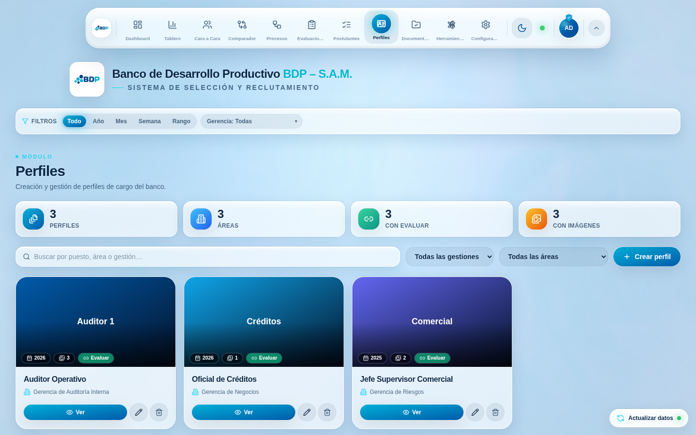
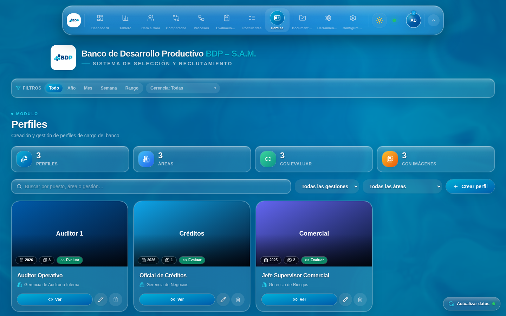
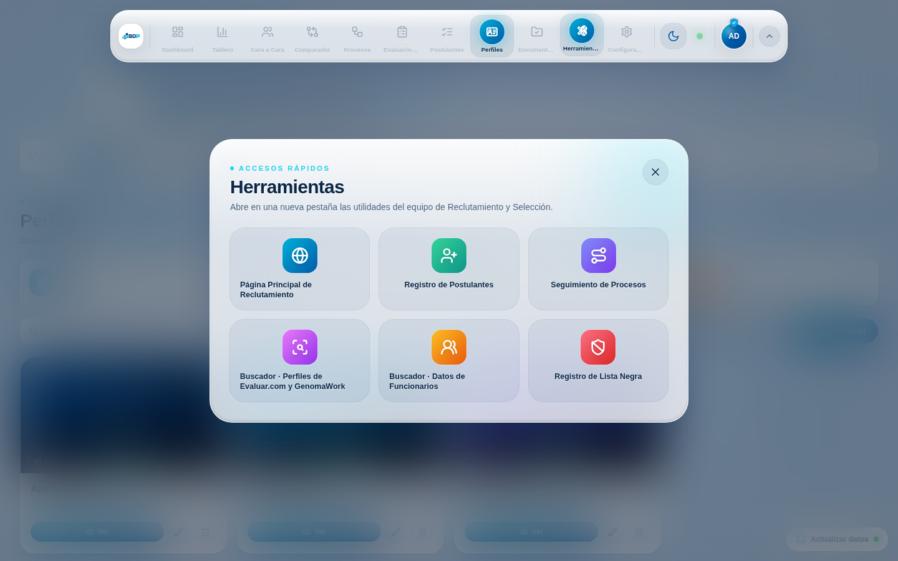
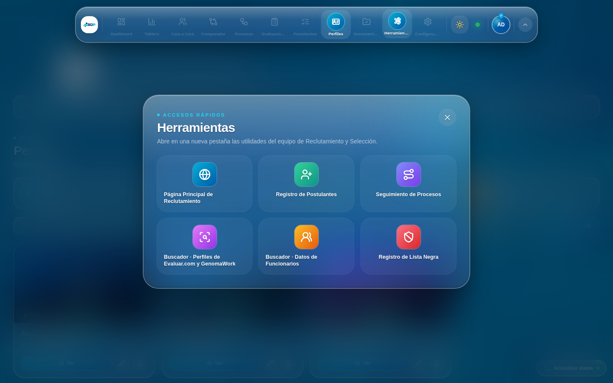
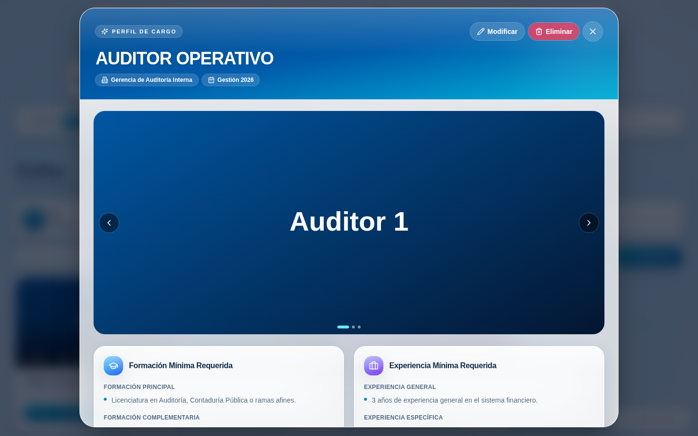
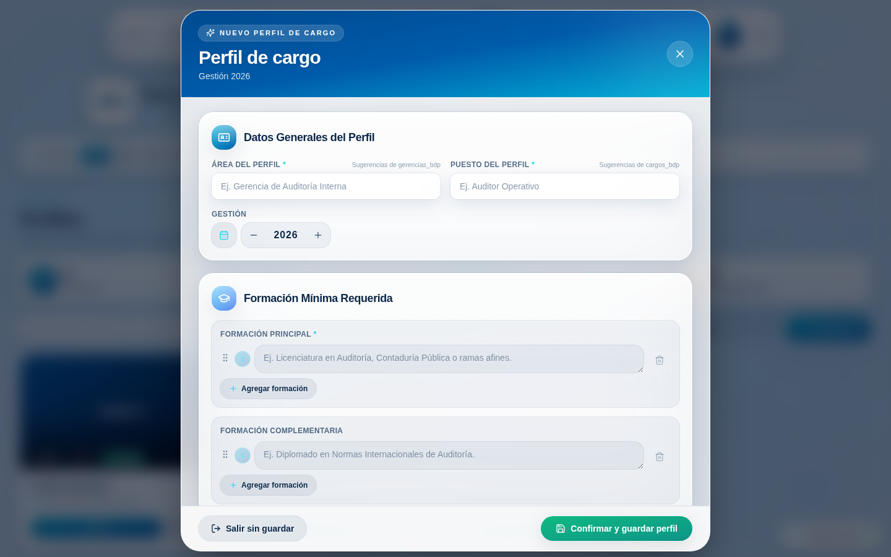
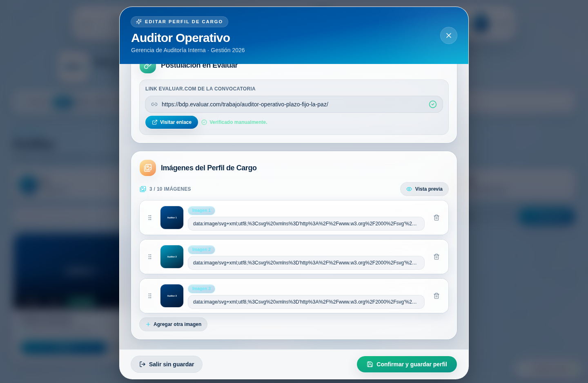
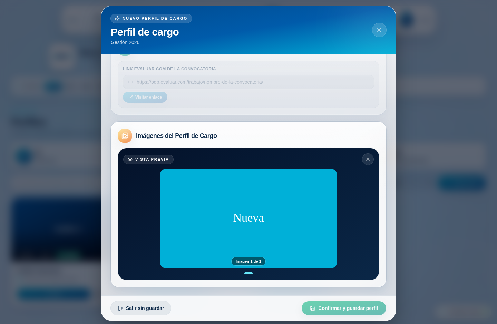

# Perfiles de Cargo + Acceso directo «Herramientas»

> Documento explicativo del cambio. Pensado para leerse de arriba a abajo: primero el
> contexto, luego la intuición, después un recorrido por el código, cómo se verificó,
> las alternativas consideradas, a quién consultar y, al final, un breve cuestionario
> para comprobar la comprensión.

Este cambio agrega **dos cosas** al dashboard BDP «Liquid Glass»:

1. **Un módulo nuevo, *Perfiles de Cargo*** — crea, edita, visualiza, elimina y mide los
   *perfiles de cargo* del banco, persistiéndolos en una hoja de Google Sheets llamada
   `perfil_cargo_bdp`.
2. **Un acceso directo *Herramientas*** en el dock superior — un panel translúcido estilo
   *Quick Settings* de iOS con seis utilidades externas.

| Módulo *Perfiles* (claro) | Módulo *Perfiles* (oscuro) |
| --- | --- |
|  |  |

---

## Contexto

> [!NOTE]
> **Para lectores nuevos en el repositorio (puedes saltar esta parte si ya lo conoces).**
> El dashboard es una SPA de **React 18 + TypeScript + Vite**, con **Tailwind** y **Framer
> Motion**. Toda la estética es un sistema de vidrio esmerilado («Liquid Glass») manejado
> por *CSS custom properties* que cambian entre tema claro y oscuro. Los datos viven en una
> hoja de Google Sheets y se leen/escriben a través de un único **Web App de Google Apps
> Script** (`SCRIPT_URL` en `src/constants.ts`). El hook global `useTalentData`
> (Context API) hace el `GET`, normaliza el payload y lo reparte a los módulos; para
> escribir, se hace `POST` con cuerpo `text/plain` (así se evita el *preflight* CORS que el
> despliegue por defecto de Apps Script no responde). Cada `fetch` usa
> `redirect: "follow"` porque Google responde con un `302` que, sin seguir, rompe en
> producción (Vercel).

Lo relevante para este cambio, ya en concreto:

- **El dock** (`src/components/FloatingDock.tsx`) recorre `DOCK_ITEMS` (definido en
  `src/constants.ts`) y pinta un botón por módulo. El ícono activo **se dibuja solo** con
  `DrawIcon` (`src/components/DrawIcon.tsx`), que anima el `stroke-dashoffset` de cada
  trazo del SVG.
- **La hoja es un contrato compartido.** Un *segundo frontend* (de sólo lectura) muestra
  estos perfiles de cargo. Ese lector espera **encabezados exactos** y una **regla de
  texto**: dentro de una celda, el separador `" | "` (espacio, barra vertical, espacio)
  se interpreta como salto de viñeta. Por eso nuestro nuevo módulo debe **escribir** esa
  regla al guardar y **leerla** al mostrar.
- **Los perfiles de cargo no tienen columna de `id`.** El contrato de cabeceras es fijo
  (22 columnas, dos con tilde: `formación_complementaria` y `conocimientos_genéricos`), así
  que no podemos añadir un identificador sin arriesgar al otro frontend.

---

## Intuición

La idea central es un **mapeo bidireccional** entre dos formas de los mismos datos:

```
 Fila de la hoja (texto plano)                     Modelo del formulario (arreglos)
 ─────────────────────────────                     ───────────────────────────────
 conocimientos_tecnicos:                            conocimientosTecnicos: [
   "NAGA | NIA | Código de Comercio"     ⇄            "NAGA", "NIA", "Código de Comercio"
                                                     ]
 link_img_1: "https://…/1.jpg"                      imagenes: ["https://…/1.jpg",
 link_img_2: "https://…/2.jpg"          ⇄                      "https://…/2.jpg"]
 link_img_3: ""  (ranura vacía)
```

Todo ese mapeo vive en **un solo lugar** (`src/lib/perfilCargo.ts`) para que el diseño de
la hoja nunca se filtre a los componentes. El formulario trabaja con arreglos cómodos; al
guardar, `toRawPerfilCargo` los une con `" | "` y compacta las imágenes en las diez
ranuras `link_img_1…10`; al leer, `normalisePerfilCargo` hace el camino inverso.

> [!IMPORTANT]
> **¿Cómo se edita/elimina una fila sin `id`?** El backend inyecta en cada fila un campo
> `_fila` con su **número real de fila** en la hoja. El frontend lo trata como una llave
> opaca: para editar envía `{ action:"update", fila, row }`, y para borrar
> `{ action:"delete", fila }`. `deleteRow` de Apps Script **desplaza las filas hacia
> arriba**, así que no quedan huecos; tras cada escritura, la app **vuelve a sincronizar**
> para refrescar esos números.

Dos decisiones de producto que se apoyan en esta intuición:

- **«Borrador» vs «activo».** Como la hoja no tiene columna de estado, un perfil *activo*
  es simplemente **una fila guardada**; un *borrador* es **progreso local** que aún no se
  confirmó. El formulario autoguarda ese borrador en `localStorage` y lo ofrece para
  continuar; el módulo muestra un aviso cuando hay uno pendiente.
- **«Herramientas» no es un módulo.** Es un botón que abre un panel superpuesto y **no
  cambia** el módulo activo. Mientras está abierto, el dock se conserva arriba, las demás
  opciones se atenúan (como deshabilitadas) y sólo *Herramientas* queda encendido.

---

## Código

### 1 · El modelo de dominio — `src/lib/perfilCargo.ts`

El corazón del cambio. Define el contrato de cabeceras, el (de)serializado y las
validaciones.

```ts
export const PIPE = " | ";
export const MAX_IMAGENES = 10;
export const PERFIL_CARGO_HEADERS = [
  "area_cargo", "puesto_bdp", "gestion_bdp",
  "formacion_principal", "formación_complementaria",
  /* … */ "link_evaluar",
  "link_img_1", /* … */ "link_img_10",
] as const;

export function splitPipes(value: unknown): string[] { /* divide por "|", limpia, sin vacíos */ }
export function joinPipes(items: string[]): string   { /* une con " | ", descarta vacíos */ }
```

`toRawPerfilCargo` escribe la regla del separador y llena **siempre** las diez ranuras de
imagen (las sobrantes quedan en `""`); `normalisePerfilCargo` reconstruye los arreglos y
**compacta** las imágenes ignorando ranuras vacías. La validación (`validateForm`) exige
Área, Puesto, una Gestión de cuatro dígitos, al menos una Formación Principal y una
Experiencia General, y comprueba el formato del enlace de Evaluar con:

```ts
const EVALUAR_RE = /^https:\/\/[a-z0-9-]+\.evaluar\.com\/trabajo\/[a-z0-9-]+\/?$/i;
```

### 2 · Datos y CRUD — `src/context/TalentDataContext.tsx`

El payload ahora incluye `perfiles_cargo`, y el contexto expone tres métodos que siguen el
mismo patrón que `submitCandidate`/`updateCandidate`: `POST` con `text/plain` y luego
`load()` para re-sincronizar desde la única fuente de verdad.

```ts
submitPerfilCargo(row)         // { type:"perfil_cargo", action:"create", row }
updatePerfilCargo(fila, row)   // { type:"perfil_cargo", action:"update", fila, row }
deletePerfilCargo(fila)        // { type:"perfil_cargo", action:"delete", fila }
```

### 3 · Backend Apps Script — `docs/backend/Code.gs`

Se añadió la hoja `perfil_cargo_bdp` al contrato:

- `hojaPerfilCargo_` la **crea con sus 22 cabeceras** si no existe.
- `leerPerfilCargo_` la lee inyectando `_fila` (número real de fila) y se incluye en el
  `GET` como `perfiles_cargo`.
- `handlePerfilCargo_` implementa `create` (append), `update` (escribe celda por celda la
  fila indicada, mapeando por los encabezados reales de la hoja) y `delete` (`deleteRow`,
  que reacomoda hacia arriba).
- Se agregó `perfil_cargo` al conjunto `MUTATES` para **invalidar la caché** del `GET`
  tras cada escritura.

> [!WARNING]
> **Acción manual necesaria.** El frontend no puede desplegar Apps Script por ti. Debes
> pegar el `Code.gs` actualizado en el editor de Apps Script y volver a implementar
> (*Implementar → Administrar implementaciones → Editar → Nueva versión*), manteniendo
> «Cualquiera con el enlace». Si la hoja `perfil_cargo_bdp` no existe, el script la crea
> con las cabeceras correctas en la primera lectura.

### 4 · Íconos animados y el dock

- `src/components/icons/CustomIcons.tsx` — dos íconos **de trazo** compatibles con el motor
  de dibujo: `PerfilCargoIcon` (una credencial con persona y líneas de datos) y
  `HerramientasIcon` (dos llaves inglesas cruzadas).
- `src/components/DrawIcon.tsx` — ahora acepta cualquier ícono `className`+`strokeWidth`
  (no sólo de Lucide) y suma `redrawOnHover`, que redibuja el trazo al montar y al pasar el
  cursor (lo usan los mosaicos de Herramientas).
- `src/components/FloatingDock.tsx` — inserta el botón *Herramientas* **entre**
  Documentación y Configuración, y **atenúa/deshabilita** los módulos mientras el panel
  está abierto.

### 5 · El panel Herramientas — `src/components/tools/HerramientasPanel.tsx`

Un overlay en portal, por **debajo** del dock (`z-90`) para que éste siga flotando encima.
Rejilla de seis mosaicos con gradiente e ícono que se **redibuja e ilumina** al pasar el
cursor, título con **revelado por palabras/letras**, cierre por *backdrop*, botón o
`Escape`. Su estado abierto vive en un pequeño store (`src/lib/toolsStore.ts`) que comparte
con el dock.

| Herramientas (claro) | Herramientas (oscuro) |
| --- | --- |
|  |  |

### 6 · El módulo y sus piezas — `src/modules/Perfiles.tsx` + `src/components/perfiles/*`

- **`Perfiles.tsx`** — KPIs, buscador, filtros por gestión y área, rejilla de tarjetas,
  estado vacío animado, aviso de borrador local y orquestación de formulario/visor/borrado.
- **`PerfilCargoForm.tsx`** — el formulario a pantalla completa por secciones, con
  autoguardado (`useFormDraft`), validación y los botones *Confirmar y guardar perfil* /
  *Salir sin guardar*.
- **`MultiFieldList.tsx`** — la lista dinámica «Agregar …» que materializa la regla `" | "`.
- **`EvaluarLinkField.tsx`** — validación de formato + *Visitar enlace* + pop-up de
  confirmación humana («El enlace funciona» / «Cambiar el enlace»).
- **`ImageManager.tsx`** — carga/verificación de imágenes, miniaturas editables,
  reordenamiento por arrastre (Framer `Reorder`) y **carrusel de vista previa** que congela
  el resto del formulario.
- **`PerfilCargoViewer.tsx`** — el visor premium a pantalla completa (galería + secciones
  con viñetas reveladas), distinto del formulario.
- **`YearField.tsx`**, **`PerfilCargoCard.tsx`** — selector de año y tarjeta de la rejilla.

| Visor de perfil | Formulario (datos) | Evaluar + Imágenes | Vista previa |
| --- | --- | --- | --- |
|  |  |  |  |

---

## Verificación

- **Tipos:** `npm run typecheck` sin errores.
- **Pruebas:** `npm run test` → **89 pruebas** en verde, incluidas **12 nuevas** en
  `src/lib/perfilCargo.test.ts` (regla del `" | "`, ida y vuelta de (de)serializado,
  contrato de 22 cabeceras, formatos de enlace de Evaluar y validación).
- **Build:** `npm run build` compila producción.
- **Sintaxis del backend:** `node --check` sobre `Code.gs`.
- **En vivo (offline):** como el sandbox no alcanza Google, se hidrató la app desde caché
  con un payload de ejemplo y se recorrió el flujo con un navegador headless: módulo, visor,
  formulario (agregar formación, cargar imagen por enlace, activar vista previa) y panel de
  Herramientas, en **tema claro y oscuro**, **sin errores en consola**. Las capturas de este
  documento provienen de ese recorrido.

**QA manual sugerido (ya conectado al backend):**

1. Despliega el `Code.gs` actualizado (ver aviso arriba). Confirma que aparece la hoja
   `perfil_cargo_bdp` con sus cabeceras.
2. En la app, entra al módulo **Perfiles** → **Crear perfil**. Completa Área y Puesto
   (verifica el autocompletado con `gerencias_bdp` y `cargos_bdp`), deja la Gestión en el
   año actual, agrega varias formaciones/experiencias con **Agregar …**.
3. Pega un enlace de Evaluar, pulsa **Visitar enlace**, regresa y confirma en el pop-up.
4. Agrega una o más imágenes por URL, reordénalas arrastrando y prueba **Vista previa**.
5. **Confirmar y guardar perfil** → revisa que la fila aparezca en la hoja con el texto
   separado por `" | "` y las imágenes en `link_img_1…N`.
6. **Editar** el perfil, cambia un campo y guarda: debe modificarse **sólo esa fila**.
   **Eliminar** el perfil: la fila desaparece y las siguientes suben (sin huecos).
7. Cierra sesión y vuelve a entrar (o recarga a mitad de un formulario) para ver la
   **recuperación de borrador**.
8. Prueba **Herramientas** en el dock: se atenúan los módulos, cada mosaico abre su enlace
   en una pestaña nueva, y el panel cierra con *backdrop*/botón/`Escape`.

---

## Alternativas

**A) CRUD por el contexto directo (elegido) vs. la abstracción de proveedores.**

| A favor del contexto directo | En contra |
| --- | --- |
| Consistente con `submitCandidate`/`updateCandidate` ya existentes | No reutiliza la capa `providers/repositories` de ProcessOS |
| Menos superficie de código; una sola fuente de verdad (`useTalentData`) | Acopla el CRUD al contexto global |
| La hoja es simple (una fila = un perfil); no necesita versionado | Si mañana se migra a Supabase habrá que portar estos métodos |

**B) Estado local para «borrador» (elegido) vs. una columna `estado` en la hoja.**

| A favor del borrador local | En contra |
| --- | --- |
| Respeta el contrato exacto de 22 cabeceras del otro frontend | «Borrador» no se comparte entre dispositivos |
| Cero riesgo de romper al lector de sólo lectura | El estado no queda auditado en la hoja |
| Autoguardado instantáneo sin viajes de red | Si se limpia el navegador, se pierde el borrador |

---

## Personas sugeridas para consultar

- **Alex Jhonson** (`reese.a@axisnimbus.com`) — hizo los últimos cambios en
  `src/constants.ts` y amplió el backend de Apps Script (`docs/backend/Code.gs`) para
  ProcessOS/AssessmentOS; es la persona con más contexto sobre el contrato del Web App y el
  esquema de hojas.
- **AlexD5427** (dueño del repositorio) — conoce la hoja de cálculo real, los enlaces de
  Evaluar y el segundo frontend de sólo lectura que consume `perfil_cargo_bdp`.

> La mayor parte del código anterior de estos archivos fue generado por el agente, así que
> conviene revisar con criterio propio los detalles del contrato con la hoja.

---

## Cuestionario

<details>
<summary><b>1.</b> ¿Cómo separa el sistema, dentro de una celda, dos viñetas de un mismo campo?</summary>

- **A)** Con un salto de línea `\n`.
- **B)** Con el token `" | "` (espacio, barra vertical, espacio). ✅
- **C)** Guardando un arreglo JSON.
- **D)** Con punto y coma `;`.

**Explicación:** El segundo frontend (de sólo lectura) interpreta `" | "` como separador de
viñetas. `joinPipes` lo escribe y `splitPipes` lo lee. No se usa JSON ni `\n` porque
romperían al lector existente. El `;` no forma parte del contrato.
</details>

<details>
<summary><b>2.</b> Sin columna de <code>id</code>, ¿cómo se edita o elimina exactamente una fila?</summary>

- **A)** Por coincidencia del texto completo de la fila.
- **B)** Por el trío (área, puesto, gestión).
- **C)** Por `_fila`, el número real de fila que el backend inyecta. ✅
- **D)** Reescribiendo toda la hoja en cada cambio.

**Explicación:** `leerPerfilCargo_` añade `_fila` (fila real de la hoja). El frontend lo
reenvía en `update`/`delete`. `deleteRow` reacomoda hacia arriba y la app re-sincroniza
para refrescar esos números. Coincidir por texto o por trío sería frágil ante duplicados.
</details>

<details>
<summary><b>3.</b> ¿Por qué «Herramientas» se dibuja en el dock con <code>z-index</code> mayor que el panel?</summary>

- **A)** Por casualidad del orden del DOM.
- **B)** Para que el dock siga flotando encima mientras el panel atenúa y bloquea el resto. ✅
- **C)** Para que el panel tape el dock por completo.
- **D)** No hay relación entre ambos `z-index`.

**Explicación:** El panel usa `z-90` y el dock `z-100`. Así el dock permanece visible y
manejable (con los módulos atenuados y *Herramientas* encendido), mientras el *backdrop* del
panel restringe la navegación del resto de la página hasta cerrarlo.
</details>

<details>
<summary><b>4.</b> ¿Qué significa que un perfil esté «en borrador» frente a «activo»?</summary>

- **A)** Hay una columna `estado` en la hoja.
- **B)** «Borrador» es progreso local en <code>localStorage</code>; «activo» es una fila guardada. ✅
- **C)** «Borrador» se guarda en otra hoja.
- **D)** No existe tal distinción.

**Explicación:** Para no alterar el contrato de 22 cabeceras, no se añadió columna de
estado. El borrador es autoguardado local (recuperable); al **Confirmar y guardar** se
escribe la fila y pasa a ser un perfil activo.
</details>

<details>
<summary><b>5.</b> ¿Qué pasa tras un <code>POST</code> de perfil de cargo respecto a la caché del backend?</summary>

- **A)** Nada; la caché sirve datos viejos hasta expirar.
- **B)** Se invalida la caché del <code>GET</code> porque <code>perfil_cargo</code> está en <code>MUTATES</code>, y el frontend re-sincroniza. ✅
- **C)** Se borra toda la hoja de caché de Google.
- **D)** El frontend deja de usar <code>redirect: "follow"</code>.

**Explicación:** El backend cachea el `GET` completo por tramos. Como `perfil_cargo` se
agregó a `MUTATES`, cada escritura invalida esa caché; además el contexto llama a `load()`
para repintar desde la fuente de verdad. `redirect: "follow"` se mantiene siempre.
</details>
